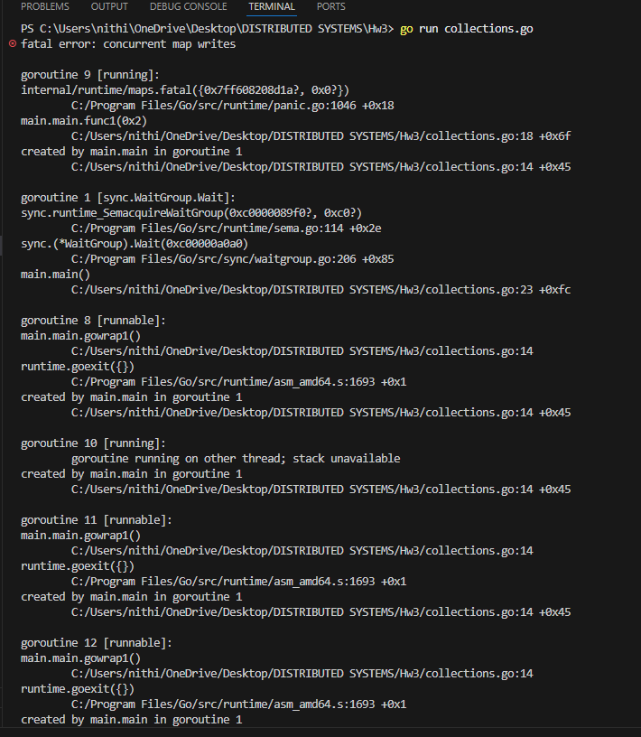
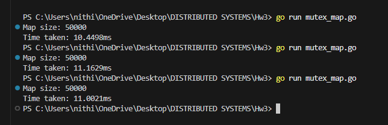
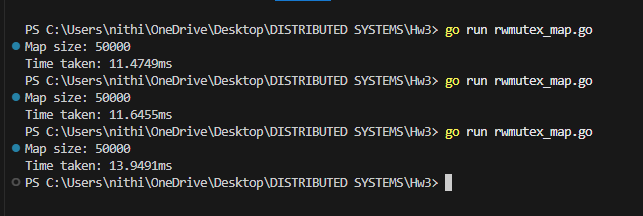

# Go Concurrency and Performance Experiments

## Table of Contents

- [1. Atomicity in Go](#1-atomicity-in-go)
- [2. Collections Experiment Report](#2-collections-experiment-report)
- [3. Mutex and RWMutex Experiment Report](#3-mutex-and-rwmutex-experiment-report)
- [4. sync.Map Experiment Report](#4-syncmap-experiment-report)
- [5. Context Switching Experiment Report](#5-context-switching-experiment-report)
- [6. File Access Experiment Report](#6-file-access-experiment-report)
- [7. Load Testing with Locust](#7-load-testing-with-locust)

---

# 1. Atomicity in Go

A demonstration of race conditions and atomic operations using concurrent counter increments.

## Experiment Setup

This example creates:

- A shared counter variable
- 50 goroutines, each incrementing the counter 1000 times
- **Expected final value:** 50 × 1000 = **50,000**

We compare two approaches:

1. Regular integer increment (unsafe)
2. Atomic increment using `sync/atomic` (safe)

---

## Version 1: Regular Integer (Non-Atomic)

```go
var counter int

for i := 0; i < 50; i++ {
    go func() {
        for j := 0; j < 1000; j++ {
            counter++
        }
    }()
}
```

### Observed Behavior

Running multiple times produces inconsistent results:

```
48321
49788
50000  ← rare, accidental success
46902
```

The value is often **less than 50,000**.

### Why This Happens

The operation `counter++` is **not atomic**. It expands to three steps:

1. Read `counter` from memory
2. Add 1
3. Write result back to memory

Two goroutines can interleave like this:

| Step | Goroutine A | Goroutine B | Counter in Memory |
|------|-------------|-------------|-------------------|
| 1 | Reads 100 | | 100 |
| 2 | | Reads 100 | 100 |
| 3 | Writes 101 | | 101 |
| 4 | | Writes 101 | 101 |

**Result:** One increment is lost. This is a classic **race condition**.

---

## Version 2: Atomic Integer

```go
var counter int64

for i := 0; i < 50; i++ {
    go func() {
        for j := 0; j < 1000; j++ {
            atomic.AddInt64(&counter, 1)
        }
    }()
}
```

### Observed Behavior


### Why This Works

`atomic.AddInt64` provides guarantees that regular operations cannot:

- Performs read, modify, and write as **one indivisible operation**
- Uses CPU-level atomic instructions
- Prevents other goroutines from seeing intermediate states

This gives you **linearizable behavior** at the variable level.

---

## Running with the Race Detector

```bash
go run -race main.go
```

### What the Race Detector Does

The `-race` flag:

- Instruments your program at compile time
- Tracks all memory reads and writes at runtime
- Detects when two goroutines access the same memory location concurrently
- Reports violations when at least one access is a write **and** there is no synchronization

This is **dynamic race detection**—it only catches races that actually occur during execution.

### Race Detector Output: Regular Integer

This tells you:

- Multiple goroutines accessed `counter`
- At least one performed a write
- No mutex or atomic operation was protecting it

> **Important:** Even if the program prints `50000`, the race detector still flags it as unsafe. **Correct output does not imply correct synchronization.**

### Race Detector Output: Atomic Integer

- No warnings
- Program exits cleanly

```
Running non-atomic version
==================
WARNING: DATA RACE
Read at 0x00c00008c088 by goroutine 9:
  main.nonAtomicCounter.func1()
      C:/Users/nithi/OneDrive/Desktop/DISTRIBUTED SYSTEMS/Hw3/atomicity.go:18 +0x99

Previous write at 0x00c00008c088 by goroutine 8:
  main.nonAtomicCounter.func1()
      C:/Users/nithi/OneDrive/Desktop/DISTRIBUTED SYSTEMS/Hw3/atomicity.go:18 +0xab

Goroutine 9 (running) created at:
  main.nonAtomicCounter()
      C:/Users/nithi/OneDrive/Desktop/DISTRIBUTED SYSTEMS/Hw3/atomicity.go:15 +0x78
  main.main()
      C:/Users/nithi/OneDrive/Desktop/DISTRIBUTED SYSTEMS/Hw3/atomicity.go:47 +0x74

Goroutine 8 (finished) created at:
  main.nonAtomicCounter()
      C:/Users/nithi/OneDrive/Desktop/DISTRIBUTED SYSTEMS/Hw3/atomicity.go:15 +0x78
  main.main()
      C:/Users/nithi/OneDrive/Desktop/DISTRIBUTED SYSTEMS/Hw3/atomicity.go:47 +0x74
==================
==================
WARNING: DATA RACE
Write at 0x00c00008c088 by goroutine 9:
  main.nonAtomicCounter.func1()
      C:/Users/nithi/OneDrive/Desktop/DISTRIBUTED SYSTEMS/Hw3/atomicity.go:18 +0xab

Previous write at 0x00c00008c088 by goroutine 10:
  main.nonAtomicCounter.func1()
      C:/Users/nithi/OneDrive/Desktop/DISTRIBUTED SYSTEMS/Hw3/atomicity.go:18 +0xab

Goroutine 9 (running) created at:
  main.nonAtomicCounter()
      C:/Users/nithi/OneDrive/Desktop/DISTRIBUTED SYSTEMS/Hw3/atomicity.go:15 +0x78
  main.main()
      C:/Users/nithi/OneDrive/Desktop/DISTRIBUTED SYSTEMS/Hw3/atomicity.go:47 +0x74

Goroutine 10 (finished) created at:
  main.nonAtomicCounter()
      C:/Users/nithi/OneDrive/Desktop/DISTRIBUTED SYSTEMS/Hw3/atomicity.go:15 +0x78
  main.main()
      C:/Users/nithi/OneDrive/Desktop/DISTRIBUTED SYSTEMS/Hw3/atomicity.go:47 +0x74
==================
Non-atomic counter value: 48142
Running atomic version
Atomic counter value: 50000
Found 2 data race(s)
exit status 66
```

The race detector recognizes atomic operations as valid synchronization primitives.

### Exit Status 66

When races are detected, you'll see:
```
Found 2 data race(s)
exit status 66
```

Go intentionally exits with a non-zero status code when races are found. This is by design:

- **Treats data races as fatal during testing**
- **Forces you to fix them before shipping**

This philosophy reflects Go's stance that data races are serious bugs, not warnings to be ignored.

---

# 2. Collections Experiment Report

## Concurrent Writes to a Shared Map in Go

## Experiment Setup

A shared `map[int]int` was created and accessed concurrently by 50 goroutines. Each goroutine performed 1,000 iterations and inserted unique key-value pairs into the map using:

```go
m[g*1000 + i] = i
```

After all goroutines completed, the program attempted to print `len(m)`. The expected size of the map was 50,000.

## Experimental Results

The program was executed three times with identical code.

| Run | Outcome |
|-----|---------|
| 1 | Program terminated with `fatal error: concurrent map writes` |
| 2 | Program terminated with `fatal error: concurrent map writes` |
| 3 | Program terminated with `fatal error: concurrent map writes` |

In all executions, the program crashed before reaching the measurement point. As a result, no numeric map size was produced.



## Explanation of Behavior

Go maps are not safe for concurrent writes, even when goroutines write to distinct keys. Each write operation may modify shared internal structures such as hash buckets, resize metadata, and rehashing state. When multiple goroutines attempt to mutate the map simultaneously, these internal invariants are violated.

Go detects this condition at runtime and terminates the program to prevent memory corruption and undefined behavior.

## Concepts Learned

- Shared collections require synchronization even when logical key access does not overlap.
- Concurrency bugs can manifest as catastrophic system failure, not just incorrect results.
- Safety must apply to the internal structure of a data structure, not only to the values stored.

## Evidence Supporting These Concepts

- Reproducible runtime crashes across multiple executions
- Explicit error message indicating concurrent map writes
- Stack traces showing internal map rehashing during concurrent access

---

# 3. Mutex and RWMutex Experiment Report

## Synchronizing Concurrent Access to a Shared Map in Go

## Experiment Overview

This experiment explores how mutual exclusion mechanisms ensure correctness when multiple goroutines access a shared map concurrently. Two synchronization strategies were evaluated:

1. `sync.Mutex`
2. `sync.RWMutex`

For both experiments, 50 goroutines were spawned, and each goroutine performed 1,000 write operations to a shared `map[int]int` using unique keys. The program measured the final map size and the total execution time.

The expected map size in all cases was 50,000.

---

## Mutex Experiment

### Setup

The shared map was wrapped inside a struct containing a `sync.Mutex`. Before every write operation, the mutex was locked and unlocked immediately after the write. This ensured that only one goroutine could modify the map at any given time.

### Results

The experiment was run three times.

- The program completed successfully in all runs.
- The map size was consistently 50,000.
- The execution times observed were:

| Run | Execution Time |
|-----|----------------|
| 1   | 10.489 ms      |
| 2   | 11.1629 ms     |
| 3   | 11.0021 ms     |

**Mean execution time: ~10.88 ms**



### Interpretation

The mutex guarantees correctness by enforcing strict mutual exclusion. This prevents concurrent structural modification of the map and preserves its internal consistency. However, this safety comes at the cost of serialized access, reducing parallelism and increasing overall execution time compared to an unsafe implementation.

---

## RWMutex Experiment

### Setup

The mutex was replaced with a `sync.RWMutex`. Since all operations in this experiment were writes, each goroutine acquired an exclusive write lock (`Lock` / `Unlock`) for every map update.

### Results

The experiment was again run three times.

- The map size was consistently 50,000.
- The execution times observed were:

| Run | Execution Time |
|-----|----------------|
| 1   | 11.4749 ms     |
| 2   | 11.6455 ms     |
| 3   | 13.9491 ms     |

**Mean execution time: ~12.36 ms**



### Interpretation

The RWMutex did not improve performance in this workload. Because all operations were writes, the RWMutex still required exclusive access, providing no additional concurrency. The extra internal bookkeeping associated with RWMutex resulted in slightly higher execution times compared to the regular mutex.

---

## Lessons Learned

- Synchronization is required to safely share data structures across concurrent goroutines.
- A mutex guarantees correctness by serializing access, but limits concurrency.
- RWMutex only provides performance benefits in read-heavy workloads.
- Choosing synchronization primitives without considering access patterns can introduce unnecessary overhead.

---

# 4. sync.Map Experiment Report

## Concurrent Writes Using Go's sync.Map

## Experiment Setup

In this experiment, the shared map was replaced with Go's `sync.Map`, a concurrency-optimized map implementation. Fifty goroutines were spawned, and each goroutine performed 1,000 write operations using:

```go
m.Store(g*1000 + i, i)
```

After all goroutines completed, the total number of entries was counted using `m.Range`. The expected map size was 50,000. The total execution time was measured.

## Experimental Results

The program was executed three times.

- The map size was consistently 50,000 in all runs.
- The observed execution times were:

| Run | Execution Time |
|-----|----------------|
| 1   | 6.1413 ms      |
| 2   | 6.0012 ms      |
| 3   | 6.0990 ms      |

**Mean execution time: ~6.08 ms**


## Explanation of Behavior

Unlike a plain map protected by a mutex, `sync.Map` is specifically designed for concurrent access. Internally, it reduces lock contention by using atomic operations and separating read-optimized and write-optimized paths. This allows multiple goroutines to store values concurrently with minimal coordination overhead.

Because each goroutine in this experiment writes to distinct keys, `sync.Map` can efficiently handle concurrent inserts without serializing access through a single global lock.

## Lessons Learned

- `sync.Map` provides significantly better performance for highly concurrent workloads with disjoint key access.
- It eliminates the need for explicit locking while maintaining correctness.
- The performance improvement comes at the cost of increased implementation complexity and memory overhead.
- `sync.Map` is most effective when entries are written once and read many times or when access is highly concurrent.

---

# 5. Context Switching Experiment Report

## Goroutine Scheduling and Handoff Cost in Go

## Experiment Setup

This experiment measures the cost of goroutine context switching in Go using a controlled "ping-pong" communication pattern.

Two goroutines repeatedly send an empty signal back and forth over an unbuffered channel for 1,000,000 iterations. Each iteration involves two handoffs, one in each direction.

The experiment was run in two configurations:

1. **Single OS thread** — The Go runtime was restricted to one operating-system thread using:

```go
runtime.GOMAXPROCS(1)
```

2. **Multiple OS threads** — The restriction was removed, allowing Go to schedule goroutines across multiple OS threads.

The total execution time was measured, and the average handoff time was calculated as:

```
average handoff time = total duration / (2 × number of iterations)
```

## Experimental Results

The experiment was executed three times.

### Single OS Thread (GOMAXPROCS = 1)

| Run | Avg Handoff Time |
|-----|------------------|
| 1   | 164 ns           |
| 2   | 166 ns           |
| 3   | 165 ns           |

**Mean average handoff time: ~165 ns**

### Multiple OS Threads (GOMAXPROCS > 1)

| Run | Avg Handoff Time |
|-----|------------------|
| 1   | 256 ns           |
| 2   | 257 ns           |
| 3   | 281 ns           |

**Mean average handoff time: ~265 ns**


## Comparison and Analysis

The single OS thread configuration consistently produced lower average handoff times than the multi-threaded configuration.

This occurs because when restricted to a single OS thread:

- Goroutine scheduling happens entirely in user space
- No OS-level thread migration occurs
- CPU cache locality is preserved

When multiple OS threads are allowed:

- Goroutines may migrate between threads
- CPU cache lines may move between cores
- Additional synchronization is required inside the Go runtime

As a result, while multi-threading improves throughput and parallelism, it introduces additional overhead for fine-grained synchronization.

## Lessons Learned

- Goroutine context switching is extremely cheap, occurring on the order of hundreds of nanoseconds.
- Restricting execution to a single OS thread can reduce latency for tightly synchronized workloads.
- Increasing parallelism does not always reduce latency, especially for synchronization-heavy operations.
- Scheduler and cache effects become visible even at the nanosecond scale.

---

# 6. File Access Experiment Report

## Buffered vs Unbuffered File Writes in Go

## Experiment Setup

This experiment investigates the performance impact of buffering when writing data to persistent storage.

Two file write approaches were implemented:

1. **Unbuffered writes** — The file is opened and each loop iteration directly calls `f.Write(...)` to write a single line to disk.
2. **Buffered writes** — The file is wrapped in a `bufio.Writer`, and each iteration writes to an in-memory buffer using `WriteString(...)`. After all writes complete, the buffer is flushed once using `Flush()`.

In both cases, the program writes 100,000 lines to a file and measures the total execution time.

## Experimental Results

The program was executed three times. The observed timings were:

### Unbuffered Writes

| Run | Execution Time |
|-----|----------------|
| 1   | 374.45 ms      |
| 2   | 362.45 ms      |
| 3   | 374.14 ms      |

**Mean unbuffered time: ~370 ms**

### Buffered Writes

| Run | Execution Time |
|-----|----------------|
| 1   | 18.99 ms       |
| 2   | 17.78 ms       |
| 3   | 17.35 ms       |

**Mean buffered time: ~18 ms**


## Output Files Generated

| File | Description |
|------|-------------|
| `unbuffered.txt` | Contains 100,000 lines written using direct file writes |
| `buffered.txt` | Contains the same 100,000 lines written using buffered I/O |

> Attach these two files alongside the report submission to demonstrate correctness of the output in both cases.

[unbuffered.txt](./unbuffered.txt)
[buffered.txt](./buffered.txt)

## Explanation of Results

The dramatic performance difference arises from the cost of system calls and disk I/O.

In the unbuffered approach, every call to `Write` results in a system call that transfers control from user space to kernel space. Performing tens of thousands of such calls introduces significant overhead due to repeated context switching and I/O coordination.

In contrast, the buffered approach accumulates data in memory and performs far fewer system calls. By writing larger chunks of data at once, the overhead of disk I/O is amortized across many logical write operations, resulting in substantially better performance.

## Lessons Learned and Tradeoffs

- Buffering significantly improves file write performance by reducing system call frequency.
- Unbuffered writes provide immediacy and simplicity but scale poorly for large volumes of data.
- Buffered writes trade slightly increased memory usage and delayed persistence for dramatically higher throughput.
- Explicit flushing is required to guarantee durability when using buffered writers.

---

# 7. Load Testing with Locust

## Overview

In this part of the assignment, we used Locust, a distributed load-testing tool based on green threads (user-level threads) in Python, to stress test a Go HTTP server running on AWS EC2.

The goal of these experiments was to:

- Understand how concurrency, worker count, and request type (GET vs POST) affect throughput and latency
- Observe failures, percentiles, and scaling behavior
- Relate results to Amdahl's Law, synchronization costs, and context switching
- Compare `HttpUser` vs `FastHttpUser` implementations in Locust

The server under test exposed the endpoints:

```
GET  /albums
POST /albums
```

Hosted at:

```
http://ec2-107-21-153-216.compute-1.amazonaws.com:8080
```

---

## Test Matrix

| Test ID | Users | Workers | User Type |
|---------|-------|---------|-----------|
| Test 1  | 1     | 1       | HttpUser  |
| Test 2  | 50    | 1       | HttpUser  |
| Test 3  | 50    | 4       | HttpUser  |
| Test 4  | 50    | 4       | FastHttpUser |

Each test included both GET and POST requests, with a 3:1 GET to POST ratio.

---

## Test 1: Baseline (1 User, 1 Worker, HttpUser)

### What Was Tested

- Single user
- Single worker
- Establish baseline latency and correctness

### Observations

- No failures
- Low throughput (expected)
- Stable response times
- Percentiles closely matched the average latency

This test establishes a correctness baseline and confirms that both GET and POST handlers work properly under minimal load.

### Results


---

## Test 2: Increased Load (50 Users, 1 Worker, HttpUser)

### What Was Tested

- Same single worker
- Increased concurrency from 1 to 50 users

### Observations

- Throughput increased compared to Test 1
- Response times increased noticeably
- Percentiles (95th, 99th) diverged more from the median
- Still no failures after fixing POST payload issues

This test demonstrates queueing effects and contention when concurrency increases without increasing worker capacity.

### Results


---

## Test 3: Scaling Workers (50 Users, 4 Workers, HttpUser)

### What Was Tested

- Same user load as Test 2
- Worker count increased from 1 to 4

### Observations

- Throughput improved slightly but did not scale linearly
- Response times for GET requests increased significantly
- POST requests remained relatively faster
- No failures after JSON payload fix

This is a direct demonstration of **Amdahl's Law**:

- Some parts of the system (shared data structures, request handling) are not parallelizable
- Adding workers increases overhead from synchronization and contention

### Results


---

## Test 4: FastHttpUser (50 Users, 4 Workers, FastHttpUser)

### What Was Tested

- Same load and worker count as Test 3
- Switched Locust user class from `HttpUser` to `FastHttpUser`

### Observations

- Higher and more stable throughput
- Lower median and percentile latencies
- Reduced overhead in request handling
- CPU usage was better utilized

`FastHttpUser` is faster because:

- It uses a C-based HTTP client instead of Python's `requests`
- Fewer Python context switches
- More efficient connection reuse

This highlights how client-side overhead matters, not just server performance.

### Results


---

## GET vs POST Behavior

Across all tests:

- GET requests became slower under high concurrency
- POST requests were often faster but initially failed due to missing `id` field in JSON
- After fixing the POST payload, failures dropped to zero

**Reasoning:**

- GET requests return larger payloads and involve more serialization
- POST requests write data but return smaller responses
- Shared in-memory data structures (like maps) amplify contention under concurrent reads

---

## Amdahl's Law in Practice

These experiments clearly show that:

- Throughput does not scale linearly with worker count
- Shared resources (hashmaps, locks, Go scheduler) limit scalability
- Past a point, adding workers increases overhead more than performance

---

## Context Switching and Concurrency

- Locust uses green threads, which are cheaper than OS threads
- However, Python-level overhead still matters
- `FastHttpUser` reduces per-request overhead, improving performance
- This mirrors earlier experiments with goroutines vs OS threads

---

## Lessons Learned

- Load testing exposes bottlenecks invisible at small scale
- Worker scaling is limited by shared state and synchronization
- Percentiles are more meaningful than averages under load
- Client implementation (`HttpUser` vs `FastHttpUser`) affects results
- GET vs POST performance depends on payload size and contention
- Amdahl's Law applies directly to real systems, not just theory
