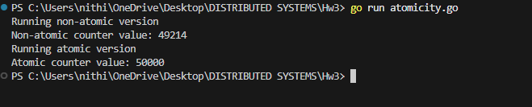
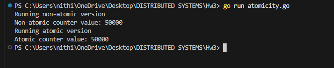

# Atomicity in Go

A demonstration of race conditions and atomic operations using concurrent counter increments.

## Experiment Setup

This example creates:

- A shared counter variable
- 50 goroutines, each incrementing the counter 1000 times
- **Expected final value:** 50 × 1000 = **50,000**

We compare two approaches:

1. Regular integer increment (unsafe)
2. Atomic increment using `sync/atomic` (safe)

---

## Version 1: Regular Integer (Non-Atomic)

```go
var counter int

for i := 0; i < 50; i++ {
    go func() {
        for j := 0; j < 1000; j++ {
            counter++
        }
    }()
}
```

### Observed Behavior

Running multiple times produces inconsistent results:

```
48321
49788
50000  ← rare, accidental success
46902
```

The value is often **less than 50,000**.

### Why This Happens

The operation `counter++` is **not atomic**. It expands to three steps:

1. Read `counter` from memory
2. Add 1
3. Write result back to memory

Two goroutines can interleave like this:

| Step | Goroutine A | Goroutine B | Counter in Memory |
|------|-------------|-------------|-------------------|
| 1 | Reads 100 | | 100 |
| 2 | | Reads 100 | 100 |
| 3 | Writes 101 | | 101 |
| 4 | | Writes 101 | 101 |

**Result:** One increment is lost. This is a classic **race condition**.

---

## Version 2: Atomic Integer

```go
var counter int64

for i := 0; i < 50; i++ {
    go func() {
        for j := 0; j < 1000; j++ {
            atomic.AddInt64(&counter, 1)
        }
    }()
}
```

### Observed Behavior






### Why This Works

`atomic.AddInt64` provides guarantees that regular operations cannot:

- Performs read, modify, and write as **one indivisible operation**
- Uses CPU-level atomic instructions
- Prevents other goroutines from seeing intermediate states

This gives you **linearizable behavior** at the variable level.

---

## Running with the Race Detector

```bash
go run -race main.go
```

### What the Race Detector Does

The `-race` flag:

- Instruments your program at compile time
- Tracks all memory reads and writes at runtime
- Detects when two goroutines access the same memory location concurrently
- Reports violations when at least one access is a write **and** there is no synchronization

This is **dynamic race detection**—it only catches races that actually occur during execution.

### Race Detector Output: Regular Integer

This tells you:

- Multiple goroutines accessed `counter`
- At least one performed a write
- No mutex or atomic operation was protecting it

> **Important:** Even if the program prints `50000`, the race detector still flags it as unsafe. **Correct output does not imply correct synchronization.**

### Race Detector Output: Atomic Integer

- No warnings
- Program exits cleanly

```
Running non-atomic version
==================
WARNING: DATA RACE
Read at 0x00c00008c088 by goroutine 9:
  main.nonAtomicCounter.func1()
      C:/Users/nithi/OneDrive/Desktop/DISTRIBUTED SYSTEMS/Hw3/atomicity.go:18 +0x99

Previous write at 0x00c00008c088 by goroutine 8:
  main.nonAtomicCounter.func1()
      C:/Users/nithi/OneDrive/Desktop/DISTRIBUTED SYSTEMS/Hw3/atomicity.go:18 +0xab

Goroutine 9 (running) created at:
  main.nonAtomicCounter()
      C:/Users/nithi/OneDrive/Desktop/DISTRIBUTED SYSTEMS/Hw3/atomicity.go:15 +0x78
  main.main()
      C:/Users/nithi/OneDrive/Desktop/DISTRIBUTED SYSTEMS/Hw3/atomicity.go:47 +0x74

Goroutine 8 (finished) created at:
  main.nonAtomicCounter()
      C:/Users/nithi/OneDrive/Desktop/DISTRIBUTED SYSTEMS/Hw3/atomicity.go:15 +0x78
  main.main()
      C:/Users/nithi/OneDrive/Desktop/DISTRIBUTED SYSTEMS/Hw3/atomicity.go:47 +0x74
==================
==================
WARNING: DATA RACE
Write at 0x00c00008c088 by goroutine 9:
  main.nonAtomicCounter.func1()
      C:/Users/nithi/OneDrive/Desktop/DISTRIBUTED SYSTEMS/Hw3/atomicity.go:18 +0xab

Previous write at 0x00c00008c088 by goroutine 10:
  main.nonAtomicCounter.func1()
      C:/Users/nithi/OneDrive/Desktop/DISTRIBUTED SYSTEMS/Hw3/atomicity.go:18 +0xab

Goroutine 9 (running) created at:
  main.nonAtomicCounter()
      C:/Users/nithi/OneDrive/Desktop/DISTRIBUTED SYSTEMS/Hw3/atomicity.go:15 +0x78
  main.main()
      C:/Users/nithi/OneDrive/Desktop/DISTRIBUTED SYSTEMS/Hw3/atomicity.go:47 +0x74

Goroutine 10 (finished) created at:
  main.nonAtomicCounter()
      C:/Users/nithi/OneDrive/Desktop/DISTRIBUTED SYSTEMS/Hw3/atomicity.go:15 +0x78
  main.main()
      C:/Users/nithi/OneDrive/Desktop/DISTRIBUTED SYSTEMS/Hw3/atomicity.go:47 +0x74
==================
Non-atomic counter value: 48142
Running atomic version
Atomic counter value: 50000
Found 2 data race(s)
exit status 66
```

The race detector recognizes atomic operations as valid synchronization primitives.

### Exit Status 66

When races are detected, you'll see:
```
Found 2 data race(s)
exit status 66
```

Go intentionally exits with a non-zero status code when races are found. This is by design:

- **Treats data races as fatal during testing**
- **Forces you to fix them before shipping**

This philosophy reflects Go's stance that data races are serious bugs, not warnings to be ignored.