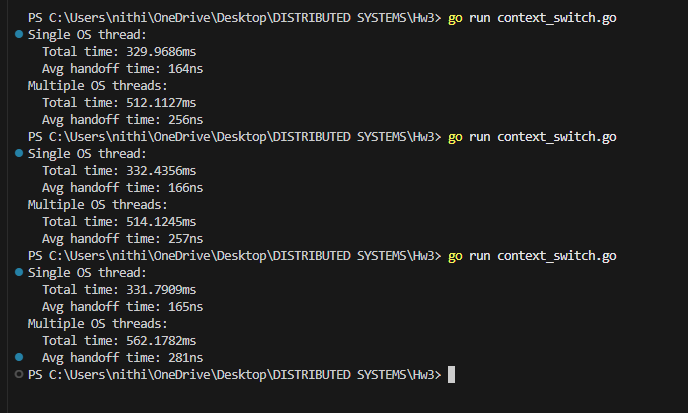

# Context Switching Experiment Report

## Goroutine Scheduling and Handoff Cost in Go

## Experiment Setup

This experiment measures the cost of goroutine context switching in Go using a controlled "ping-pong" communication pattern.

Two goroutines repeatedly send an empty signal back and forth over an unbuffered channel for 1,000,000 iterations. Each iteration involves two handoffs, one in each direction.

The experiment was run in two configurations:

1. **Single OS thread** — The Go runtime was restricted to one operating-system thread using:

```go
runtime.GOMAXPROCS(1)
```

2. **Multiple OS threads** — The restriction was removed, allowing Go to schedule goroutines across multiple OS threads.

The total execution time was measured, and the average handoff time was calculated as:

```
average handoff time = total duration / (2 × number of iterations)
```

## Experimental Results

The experiment was executed three times.

### Single OS Thread (GOMAXPROCS = 1)

| Run | Avg Handoff Time |
|-----|------------------|
| 1   | 164 ns           |
| 2   | 166 ns           |
| 3   | 165 ns           |

**Mean average handoff time: ~165 ns**

### Multiple OS Threads (GOMAXPROCS > 1)

| Run | Avg Handoff Time |
|-----|------------------|
| 1   | 256 ns           |
| 2   | 257 ns           |
| 3   | 281 ns           |

**Mean average handoff time: ~265 ns**



## Comparison and Analysis

The single OS thread configuration consistently produced lower average handoff times than the multi-threaded configuration.

This occurs because when restricted to a single OS thread:

- Goroutine scheduling happens entirely in user space
- No OS-level thread migration occurs
- CPU cache locality is preserved

When multiple OS threads are allowed:

- Goroutines may migrate between threads
- CPU cache lines may move between cores
- Additional synchronization is required inside the Go runtime

As a result, while multi-threading improves throughput and parallelism, it introduces additional overhead for fine-grained synchronization.

## Lessons Learned

- Goroutine context switching is extremely cheap, occurring on the order of hundreds of nanoseconds.
- Restricting execution to a single OS thread can reduce latency for tightly synchronized workloads.
- Increasing parallelism does not always reduce latency, especially for synchronization-heavy operations.
- Scheduler and cache effects become visible even at the nanosecond scale.
