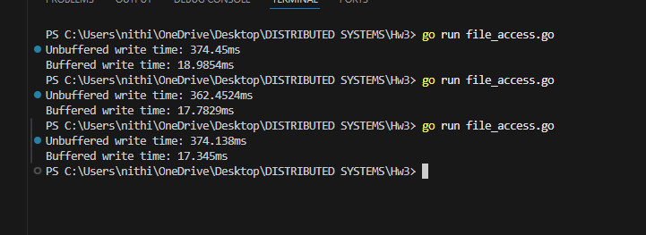

# File Access Experiment Report

## Buffered vs Unbuffered File Writes in Go

## Experiment Setup

This experiment investigates the performance impact of buffering when writing data to persistent storage.

Two file write approaches were implemented:

1. **Unbuffered writes** — The file is opened and each loop iteration directly calls `f.Write(...)` to write a single line to disk.
2. **Buffered writes** — The file is wrapped in a `bufio.Writer`, and each iteration writes to an in-memory buffer using `WriteString(...)`. After all writes complete, the buffer is flushed once using `Flush()`.

In both cases, the program writes 100,000 lines to a file and measures the total execution time.

## Experimental Results

The program was executed three times. The observed timings were:

### Unbuffered Writes

| Run | Execution Time |
|-----|----------------|
| 1   | 374.45 ms      |
| 2   | 362.45 ms      |
| 3   | 374.14 ms      |

**Mean unbuffered time: ~370 ms**

### Buffered Writes

| Run | Execution Time |
|-----|----------------|
| 1   | 18.99 ms       |
| 2   | 17.78 ms       |
| 3   | 17.35 ms       |

**Mean buffered time: ~18 ms**

## Output Files Generated

| File | Description |
|------|-------------|
| `unbuffered.txt` | Contains 100,000 lines written using direct file writes |
| `buffered.txt` | Contains the same 100,000 lines written using buffered I/O |

> 📂 Attach these two files alongside the report submission to demonstrate correctness of the output in both cases.
[Download unbuffered.txt](./unbuffered.txt)
[Download buffered.txt](./buffered.txt)

## Explanation of Results

The dramatic performance difference arises from the cost of system calls and disk I/O.

In the unbuffered approach, every call to `Write` results in a system call that transfers control from user space to kernel space. Performing tens of thousands of such calls introduces significant overhead due to repeated context switching and I/O coordination.

In contrast, the buffered approach accumulates data in memory and performs far fewer system calls. By writing larger chunks of data at once, the overhead of disk I/O is amortized across many logical write operations, resulting in substantially better performance.

## Lessons Learned and Tradeoffs

- Buffering significantly improves file write performance by reducing system call frequency.
- Unbuffered writes provide immediacy and simplicity but scale poorly for large volumes of data.
- Buffered writes trade slightly increased memory usage and delayed persistence for dramatically higher throughput.
- Explicit flushing is required to guarantee durability when using buffered writers.
