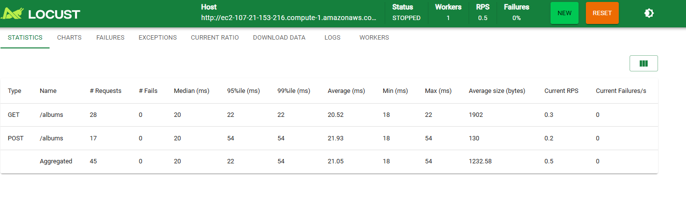
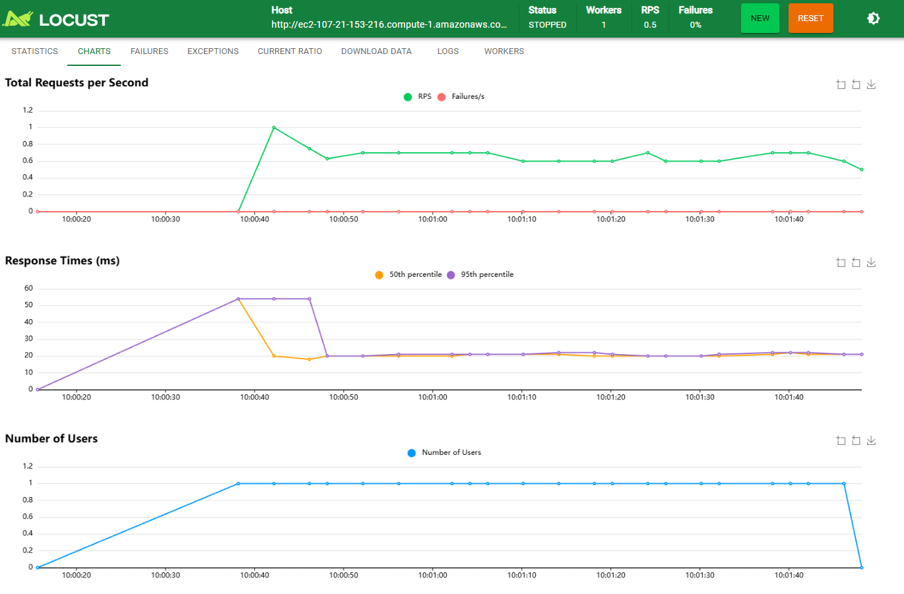
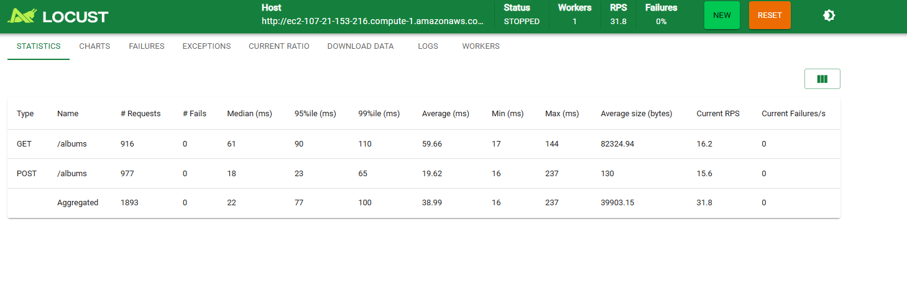
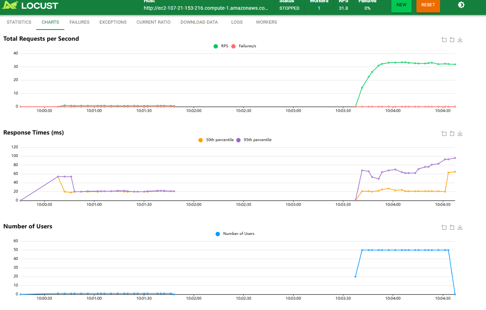
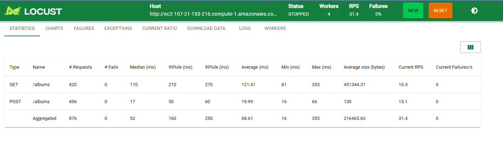
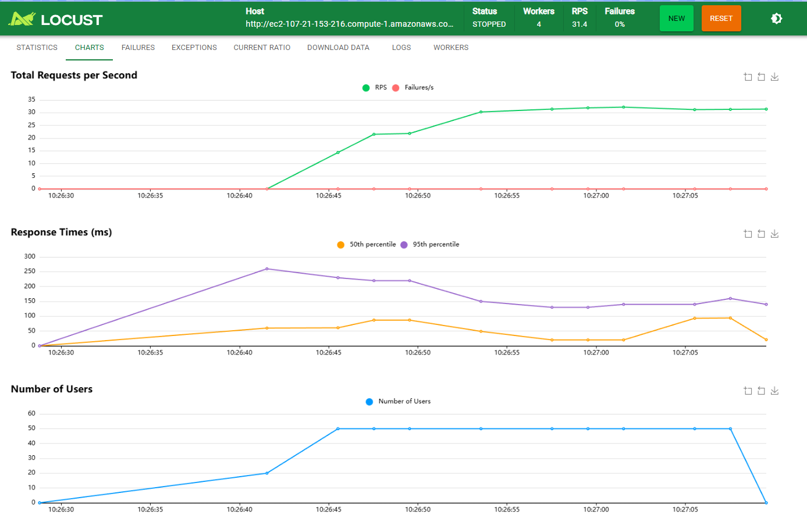
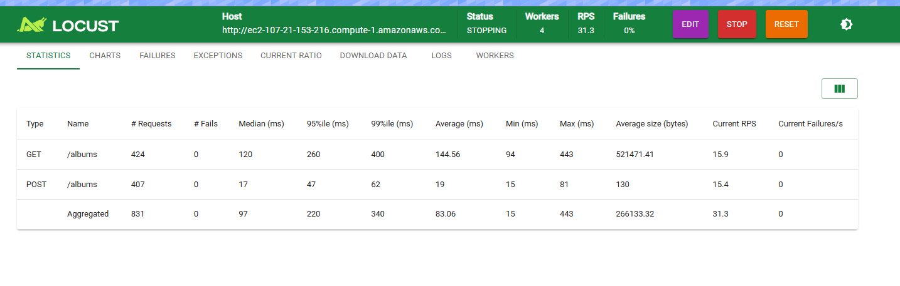
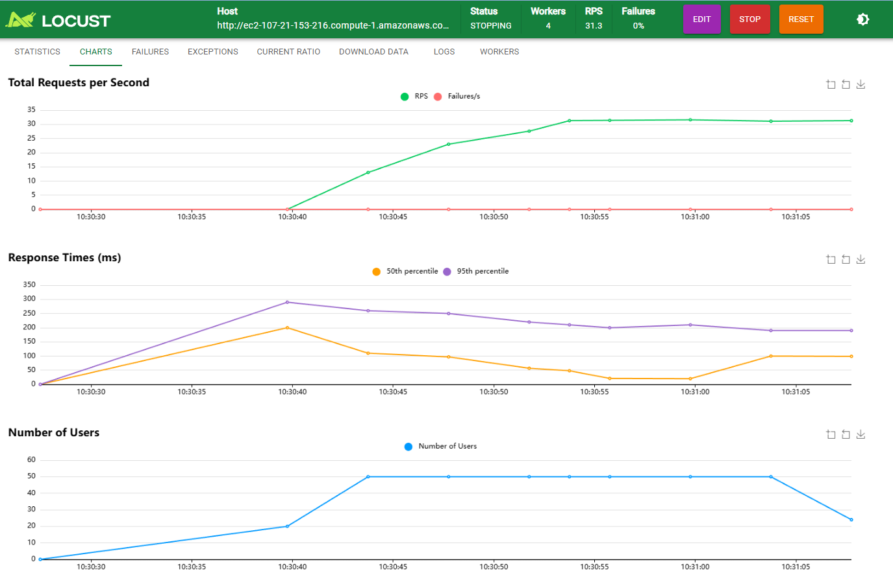

# Part III: Making Threads Work Hard with Load Testing (Locust)

## Overview

In this part of the assignment, we used Locust, a distributed load-testing tool based on green threads (user-level threads) in Python, to stress test a Go HTTP server running on AWS EC2.

The goal of these experiments was to:

- Understand how concurrency, worker count, and request type (GET vs POST) affect throughput and latency
- Observe failures, percentiles, and scaling behavior
- Relate results to Amdahl's Law, synchronization costs, and context switching
- Compare `HttpUser` vs `FastHttpUser` implementations in Locust

The server under test exposed the endpoints:

```
GET  /albums
POST /albums
```

Hosted at:

```
http://ec2-107-21-153-216.compute-1.amazonaws.com:8080
```

---

## Test Matrix

| Test ID | Users | Workers | User Type |
|---------|-------|---------|-----------|
| Test 1  | 1     | 1       | HttpUser  |
| Test 2  | 50    | 1       | HttpUser  |
| Test 5  | 50    | 4       | HttpUser  |
| Test 6  | 50    | 4       | FastHttpUser |

Each test included both GET and POST requests, with a 3:1 GET to POST ratio.

---

## Test 1: Baseline (1 User, 1 Worker, HttpUser)

### What Was Tested

- Single user
- Single worker
- Establish baseline latency and correctness

### Observations

- No failures
- Low throughput (expected)
- Stable response times
- Percentiles closely matched the average latency

This test establishes a correctness baseline and confirms that both GET and POST handlers work properly under minimal load.

### Results




---

## Test 2: Increased Load (50 Users, 1 Worker, HttpUser)

### What Was Tested

- Same single worker
- Increased concurrency from 1 to 50 users

### Observations

- Throughput increased compared to Test 1
- Response times increased noticeably
- Percentiles (95th, 99th) diverged more from the median
- Still no failures after fixing POST payload issues

This test demonstrates queueing effects and contention when concurrency increases without increasing worker capacity.

### Results




---

## Test 3: Scaling Workers (50 Users, 4 Workers, HttpUser)

### What Was Tested

- Same user load as Test 2
- Worker count increased from 1 to 4

### Observations

- Throughput improved slightly but did not scale linearly
- Response times for GET requests increased significantly
- POST requests remained relatively faster
- No failures after JSON payload fix

This is a direct demonstration of **Amdahl's Law**:

- Some parts of the system (shared data structures, request handling) are not parallelizable
- Adding workers increases overhead from synchronization and contention

### Results




---

## Test 4: FastHttpUser (50 Users, 4 Workers, FastHttpUser)

### What Was Tested

- Same load and worker count as Test 3
- Switched Locust user class from `HttpUser` to `FastHttpUser`

### Observations

- Higher and more stable throughput
- Lower median and percentile latencies
- Reduced overhead in request handling
- CPU usage was better utilized

`FastHttpUser` is faster because:

- It uses a C-based HTTP client instead of Python's `requests`
- Fewer Python context switches
- More efficient connection reuse

This highlights how client-side overhead matters, not just server performance.

### Results




---

## GET vs POST Behavior

Across all tests:

- GET requests became slower under high concurrency
- POST requests were often faster but initially failed due to missing `id` field in JSON
- After fixing the POST payload, failures dropped to zero

**Reasoning:**

- GET requests return larger payloads and involve more serialization
- POST requests write data but return smaller responses
- Shared in-memory data structures (like maps) amplify contention under concurrent reads

---

## Amdahl's Law in Practice

These experiments clearly show that:

- Throughput does not scale linearly with worker count
- Shared resources (hashmaps, locks, Go scheduler) limit scalability
- Past a point, adding workers increases overhead more than performance

---

## Context Switching and Concurrency

- Locust uses green threads, which are cheaper than OS threads
- However, Python-level overhead still matters
- `FastHttpUser` reduces per-request overhead, improving performance
- This mirrors earlier experiments with goroutines vs OS threads

---

## Lessons Learned

- Load testing exposes bottlenecks invisible at small scale
- Worker scaling is limited by shared state and synchronization
- Percentiles are more meaningful than averages under load
- Client implementation (`HttpUser` vs `FastHttpUser`) affects results
- GET vs POST performance depends on payload size and contention
- Amdahl's Law applies directly to real systems, not just theory
