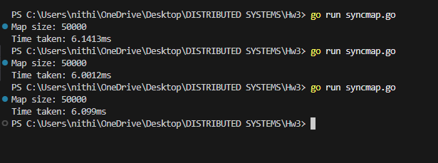

# sync.Map Experiment Report

## Concurrent Writes Using Go's sync.Map

## Experiment Setup

In this experiment, the shared map was replaced with Go's `sync.Map`, a concurrency-optimized map implementation. Fifty goroutines were spawned, and each goroutine performed 1,000 write operations using:

```go
m.Store(g*1000 + i, i)
```

After all goroutines completed, the total number of entries was counted using `m.Range`. The expected map size was 50,000. The total execution time was measured.

## Experimental Results

The program was executed three times.

- The map size was consistently 50,000 in all runs.
- The observed execution times were:

| Run | Execution Time |
|-----|----------------|
| 1   | 6.1413 ms      |
| 2   | 6.0012 ms      |
| 3   | 6.0990 ms      |

**Mean execution time: ~6.08 ms**



## Explanation of Behavior

Unlike a plain map protected by a mutex, `sync.Map` is specifically designed for concurrent access. Internally, it reduces lock contention by using atomic operations and separating read-optimized and write-optimized paths. This allows multiple goroutines to store values concurrently with minimal coordination overhead.

Because each goroutine in this experiment writes to distinct keys, `sync.Map` can efficiently handle concurrent inserts without serializing access through a single global lock.

## Lessons Learned

- `sync.Map` provides significantly better performance for highly concurrent workloads with disjoint key access.
- It eliminates the need for explicit locking while maintaining correctness.
- The performance improvement comes at the cost of increased implementation complexity and memory overhead.
- `sync.Map` is most effective when entries are written once and read many times or when access is highly concurrent.
