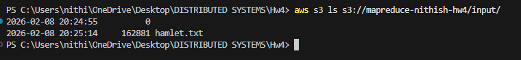
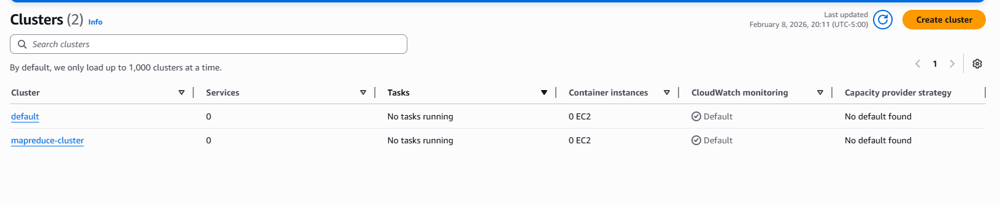
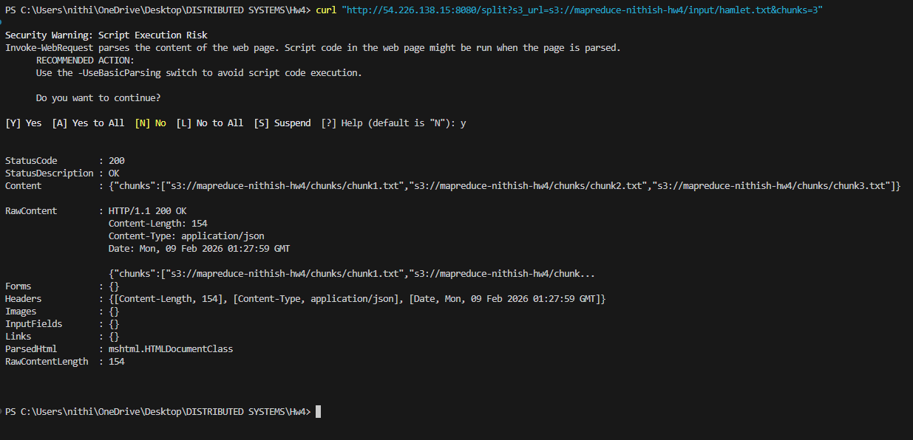
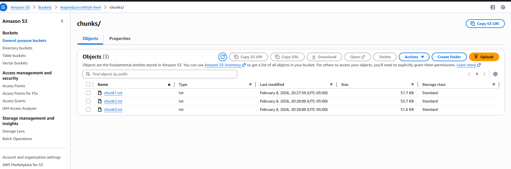
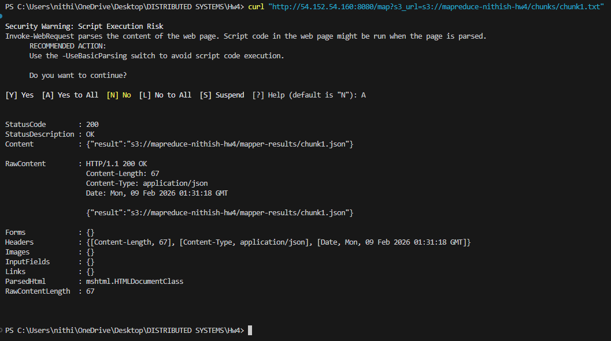
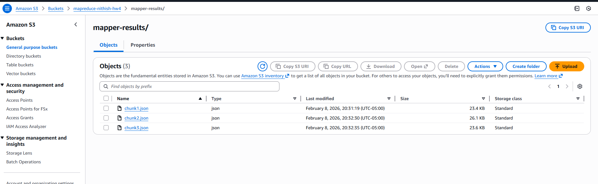
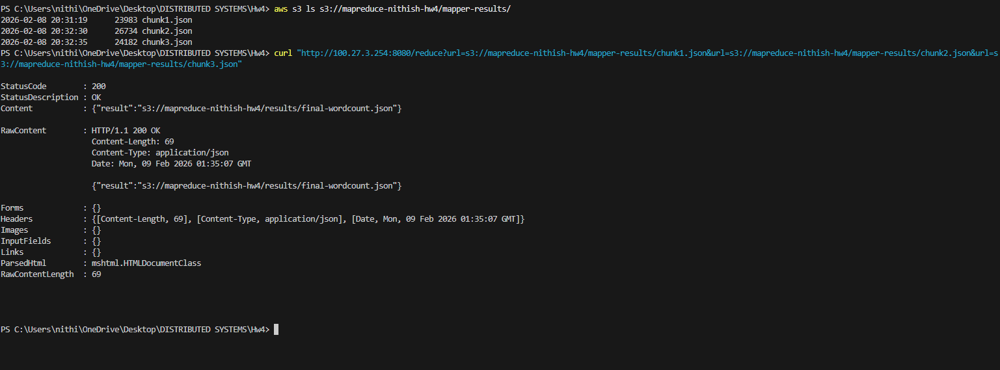
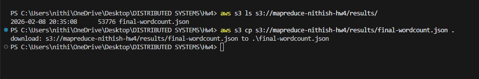
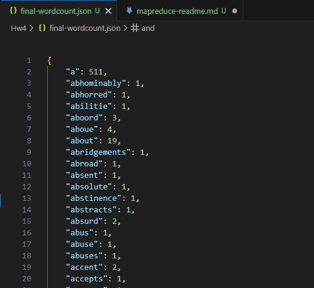

# MapReduce Pipeline Documentation

## Step 1: Input Data Upload to S3
We downloaded the Hamlet text file and uploaded it to an S3 bucket under the `input/` prefix.

**S3 Input Path**

```
s3://mapreduce-nithish-hw4/input/hamlet.txt
```

This file served as the input to the splitter task.


* S3 bucket showing `input/hamlet.txt`

## Step 2: ECS Cluster Setup
We created an ECS cluster named `mapreduce-cluster` using the Fargate launch type, allowing us to run containers without managing EC2 instances.

The cluster was used to run all tasks in the pipeline.


* ECS clusters page showing `mapreduce-cluster`

## Step 3: Splitter Task Execution
The splitter task was invoked via HTTP with the S3 input file URL and a chunk count of 3.

**Request**

```
http://<splitter-ip>:8080/split?s3_url=s3://mapreduce-nithish-hw4/input/hamlet.txt&chunks=3
```

**Response**

```
{
  "chunks": [
    "s3://mapreduce-nithish-hw4/chunks/chunk1.txt",
    "s3://mapreduce-nithish-hw4/chunks/chunk2.txt",
    "s3://mapreduce-nithish-hw4/chunks/chunk3.txt"
  ]
}
```

The splitter successfully:
* Read the input file from S3
* Split it into three roughly equal-sized chunks
* Uploaded each chunk back to S3




* Curl output showing splitter response
* S3 `chunks/` folder with `chunk1.txt`, `chunk2.txt`, `chunk3.txt`

## Step 4: Mapper Task Execution
Three mapper tasks were executed independently, each processing one chunk.

Each mapper:
* Read its assigned chunk from S3
* Counted word occurrences
* Wrote results as a JSON file to S3

**Example Mapper Request**

```
http://<mapper-ip>:8080/map?s3_url=s3://mapreduce-nithish-hw4/chunks/chunk1.txt
```

**Mapper Output**

```
{
  "result": "s3://mapreduce-nithish-hw4/mapper-results/chunk1.json"
}
```

After running all three mappers, the following files were produced:

```
s3://mapreduce-nithish-hw4/mapper-results/chunk1.json
s3://mapreduce-nithish-hw4/mapper-results/chunk2.json
s3://mapreduce-nithish-hw4/mapper-results/chunk3.json
```




* Curl output for mapper invocation
* S3 `mapper-results/` folder showing all three JSON files
* CLI `aws s3 ls` output verifying mapper results

## Step 5: Reducer Task Execution
The reducer task was invoked with the three mapper result URLs as query parameters.

**Request**

```
http://<reducer-ip>:8080/reduce?url=s3://mapreduce-nithish-hw4/mapper-results/chunk1.json
&url=s3://mapreduce-nithish-hw4/mapper-results/chunk2.json
&url=s3://mapreduce-nithish-hw4/mapper-results/chunk3.json
```

**Response**

```
{
  "result": "s3://mapreduce-nithish-hw4/results/final-wordcount.json"
}
```

The reducer:
* Read all mapper outputs from S3
* Aggregated word counts
* Wrote the final combined result back to S3




* Curl output for reducer request
* S3 `results/` folder showing `final-wordcount.json`

## Step 6: Result Verification
The final result file was downloaded locally and formatted using VS Code for readability.

**Final Output Location**

```
s3://mapreduce-nithish-hw4/results/final-wordcount.json
```

The JSON correctly reflects aggregated word counts across all chunks, validating the correctness of the MapReduce pipeline.



* Beautified `final-wordcount.json` opened in VS Code

## Observations and Learnings
* The workload was embarrassingly parallel, making it ideal for MapReduce.
* ECS Fargate made scaling trivial by running multiple mappers independently.
* S3 acted as a reliable shared storage medium for coordination.
* Manual orchestration highlighted the complexity of scheduling and fault handling in distributed systems.