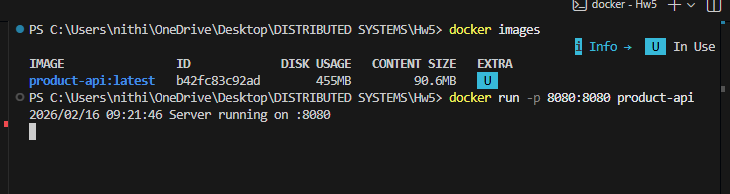
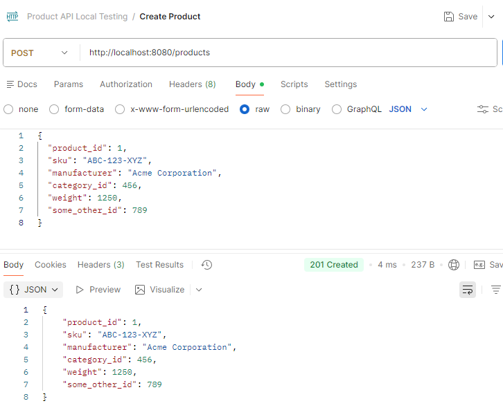
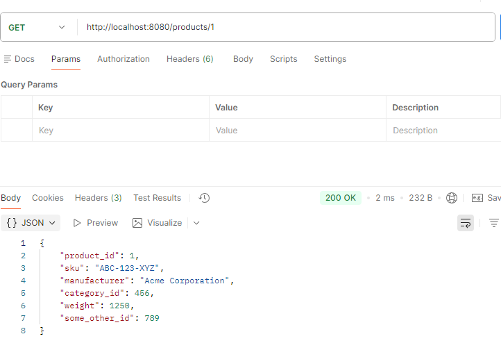
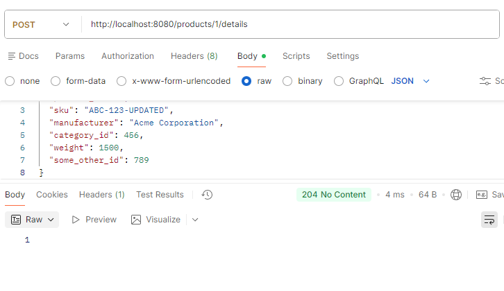
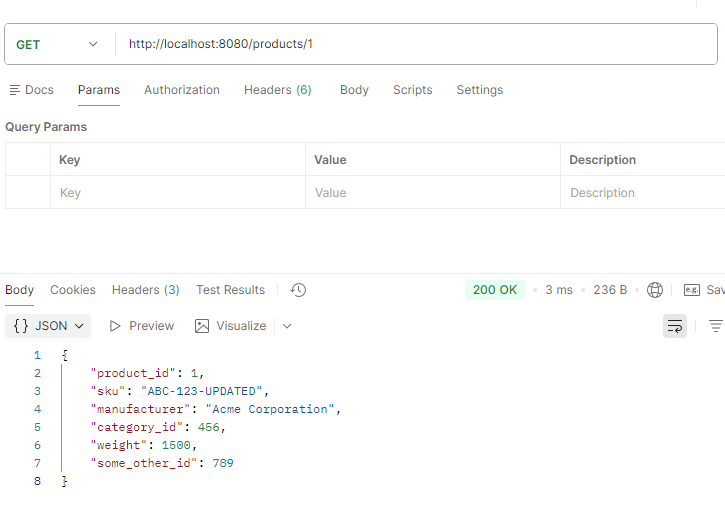
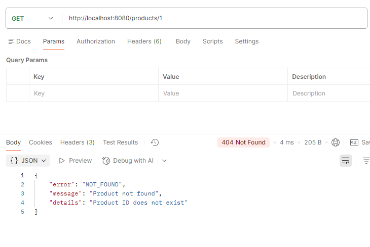

# Product API – Hw5

This project implements the Product API based on the provided OpenAPI specification. The server is built using Go and stores product data in memory using a hashmap.

##  How to Run Locally

###  Run with Go

```bash
go run main.go
```

Server runs on:
```
http://localhost:8080
```

### Run with Docker

Build image:
```bash
docker build -t product-api .
```

Run container:
```bash
docker run -p 8080:8080 product-api
```

Server will be available at:
```
http://localhost:8080
```



## API Endpoints

###  Create Product

**`POST /products`**

Creates a new product.

**Request Body (JSON):**
```json
{
  "product_id": 1,
  "sku": "ABC-123-XYZ",
  "manufacturer": "Acme Corporation",
  "category_id": 456,
  "weight": 1250,
  "some_other_id": 789
}
```

**Success Response:**

Status: `201 Created`
```json
{
  "product_id": 1,
  "sku": "ABC-123-XYZ",
  "manufacturer": "Acme Corporation",
  "category_id": 456,
  "weight": 1250,
  "some_other_id": 789
}
```



**Possible Errors:**
- `400 Bad Request` - Invalid input
- `409 Conflict` - Product already exists

---

###  Get Product by ID

**`GET /products/{productId}`**

**Example:**
```bash
GET /products/1
```

**Success Response:**

Status: `200 OK`
```json
{
  "product_id": 1,
  "sku": "ABC-123-XYZ",
  "manufacturer": "Acme Corporation",
  "category_id": 456,
  "weight": 1250,
  "some_other_id": 789
}
```


**Possible Errors:**
- `400 Bad Request` - Invalid ID
- `404 Not Found` - Product does not exist

---

### Update Product Details

**`POST /products/{productId}/details`**

**Example:**
```bash
POST /products/1/details
```

**Request Body:**
```json
{
  "product_id": 1,
  "sku": "ABC-123-UPDATED",
  "manufacturer": "Acme Corporation",
  "category_id": 456,
  "weight": 1500,
  "some_other_id": 789
}
```



**Success Response:**

Status: `204 No Content`

(No body returned)

**Possible Errors:**
- `400 Bad Request`
- `404 Not Found`

## Data Storage

Product data is stored **in memory** using:

```go
map[int]Product
```

No database is used as per assignment requirements.

## Validation

**Input validation includes:**
- `product_id` must be `>= 1`
- `sku` must be 1–100 characters
- `manufacturer` must be 1–200 characters
- `category_id` must be `>= 1`
- `weight` must be `>= 0`
- `some_other_id` must be `>= 1`
- Path ID must match body `product_id`

**Error Response Format:**
```json
{
  "error": "ERROR_CODE",
  "message": "Description",
  "details": "Optional details"
}
```



## Notes

- This is a homework assignment (Hw5) implementing an in-memory product management system
- The API follows RESTful conventions
- All data is volatile and will be lost when the server restarts