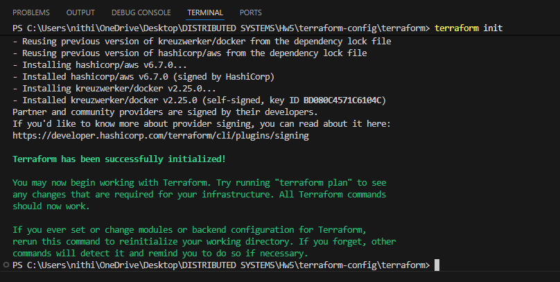
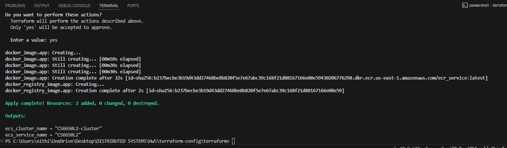
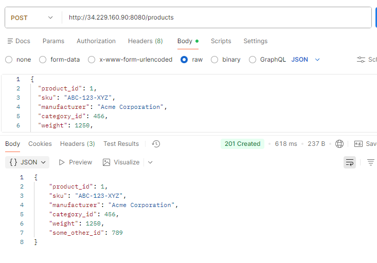
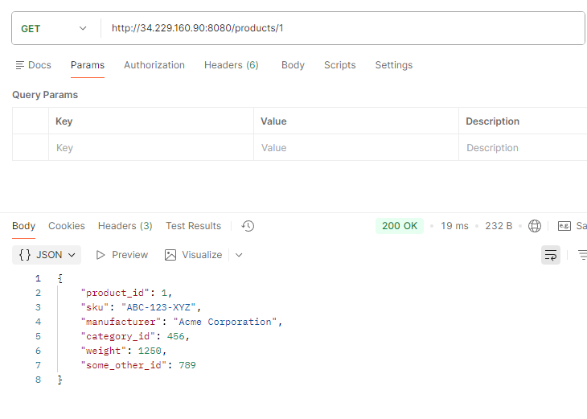
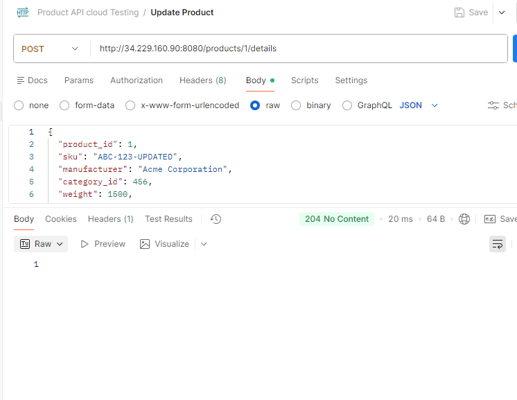
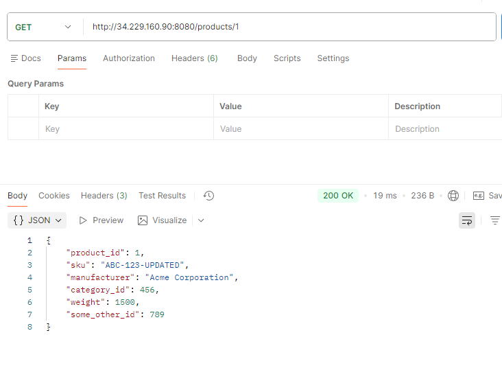
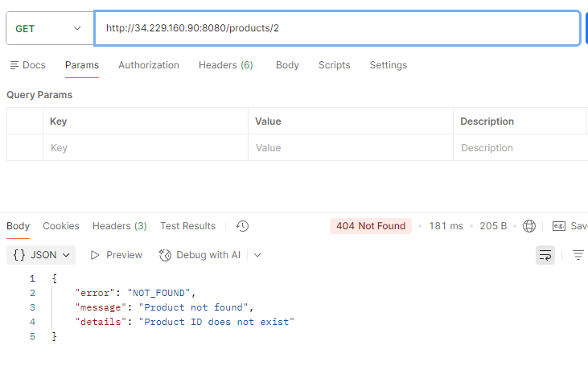
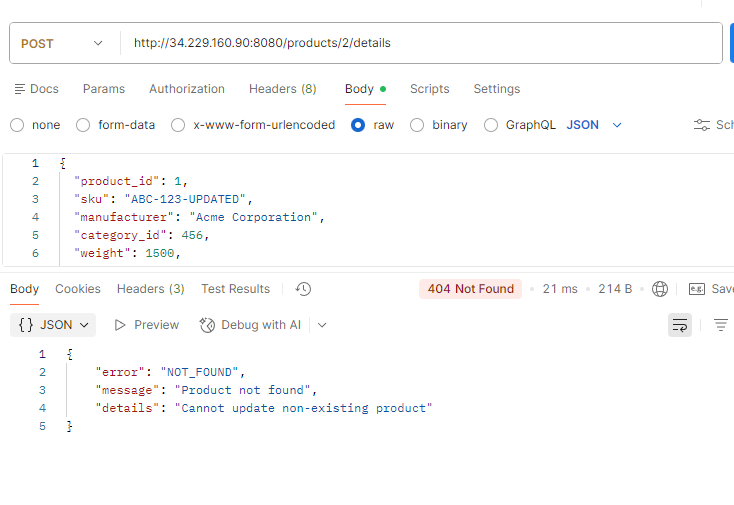

# Product API – Infrastructure Deployment (Hw5)

This project implements the Product API defined in the provided OpenAPI specification and deploys it to AWS using Docker, ECR, ECS (Fargate), and Terraform.

The infrastructure is **fully automated** using Terraform and can be deployed on any machine with minimal setup.

## Repository Structure

```
Hw5/
│
├── main.go                      # Product API server implementation
├── go.mod
├── go.sum
├── Dockerfile                   # Docker image for local testing
│
└── terraform-config/
      ├── src/                   # Server code used for ECS deployment
      │     ├── main.go
      │     ├── go.mod
      │     ├── go.sum
      │     └── Dockerfile
      │
      └── terraform/
            ├── provider.tf
            ├── variables.tf
            ├── main.tf
            ├── output.tf
            └── modules/
```

## How to Deploy on a Different Machine

Anyone in the group can deploy this system by following these steps.

### Step 1: Install Requirements

Install:
- **Docker Desktop**
- **Terraform**
- **AWS CLI**
- **Git**

Verify installation:
```bash
docker version
terraform -version
aws --version
git --version
```

### Step 2: Clone Repository

```bash
git clone <your-repo-url>
cd Hw5/terraform-config/terraform
```

### Step 3: Configure AWS Credentials

```bash
aws configure
```

Enter:
- AWS Access Key
- AWS Secret Key
- Region (e.g., `us-east-1`)
- Output format: `json`

Verify credentials:
```bash
aws sts get-caller-identity
```

### Step 4: Initialize Terraform

```bash
terraform init
```

### Step 5: Deploy Infrastructure

```bash
terraform apply
```

Type:
```
yes
```

Terraform will automatically:
- ✓ Create ECR repository
- ✓ Build Docker image
- ✓ Push image to ECR
- ✓ Create ECS cluster
- ✓ Create ECS task definition
- ✓ Launch ECS Fargate service
- ✓ Create security group (port 8080 open)
- ✓ Create CloudWatch log group

### Step 6: Retrieve Public IP

After deployment:
```bash
terraform output
```

Then retrieve the ECS task public IP using AWS CLI or AWS Console.

Your API will be accessible at:
```
http://<public-ip>:8080
```

## API Endpoints

###  Create Product

**`POST /products`**

**Example Request:**
```bash
POST http://<public-ip>:8080/products
```

**Body:**
```json
{
  "product_id": 1,
  "sku": "ABC-123-XYZ",
  "manufacturer": "Acme Corporation",
  "category_id": 456,
  "weight": 1250,
  "some_other_id": 789
}
```

**Possible Responses:**
- `201 Created`
- `400 Bad Request`
- `409 Conflict`

---

### Get Product

**`GET /products/{productId}`**

**Example:**
```bash
GET http://<public-ip>:8080/products/1
```

**Possible Responses:**
- `200 OK`
- `400 Bad Request`
- `404 Not Found`

---

### Update Product Details

**`POST /products/{productId}/details`**

**Example:**
```bash
POST http://<public-ip>:8080/products/1/details
```

**Body:**
```json
{
  "product_id": 1,
  "sku": "ABC-123-UPDATED",
  "manufacturer": "Acme Corporation",
  "category_id": 456,
  "weight": 1500,
  "some_other_id": 789
}
```

**Possible Responses:**
- `204 No Content`
- `400 Bad Request`
- `404 Not Found`

## Server Response Examples

The following response codes were verified using **Postman**:

- ✓ `201 Created` – Product successfully created
- ✓ `200 OK` – Product successfully retrieved
- ✓ `204 No Content` – Product successfully updated
- ✓ `400 Bad Request` – Invalid input
- ✓ `404 Not Found` – Non-existent product
- ✓ `409 Conflict` – Duplicate product











## Data Storage

Product data is stored **in memory** using:
```go
map[int]Product
```

No database is used as per assignment requirements. Data is volatile and will reset on container restart.

## Infrastructure Components

### AWS Services Used
- **ECR (Elastic Container Registry)** – Docker image storage
- **ECS (Elastic Container Service)** – Container orchestration
- **Fargate** – Serverless compute for containers
- **CloudWatch** – Logging and monitoring
- **Security Groups** – Network access control

### Infrastructure as Code
- **Terraform** – Automated infrastructure provisioning
- **Docker** – Containerization

## Cleanup

To destroy all AWS resources:
```bash
terraform destroy
```

Type:
```
yes
```

This will remove all created resources and prevent ongoing charges.

## Notes

- This is a homework assignment (Hw5) implementing cloud infrastructure deployment
- The API follows RESTful conventions
- All infrastructure is provisioned via Terraform for reproducibility
- The application runs on ECS Fargate (serverless containers)
- Logs are available in CloudWatch for debugging