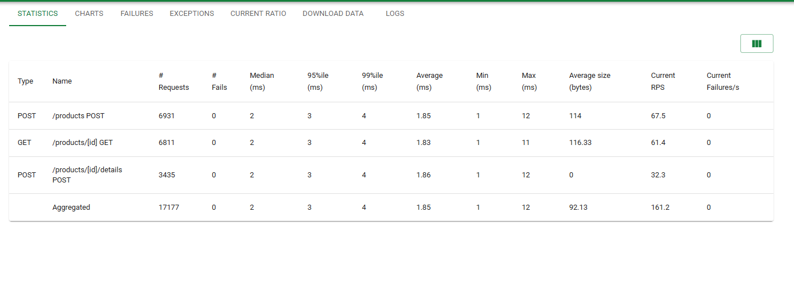
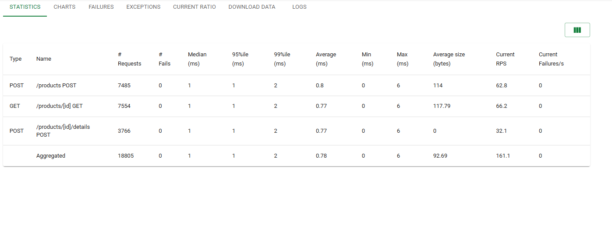
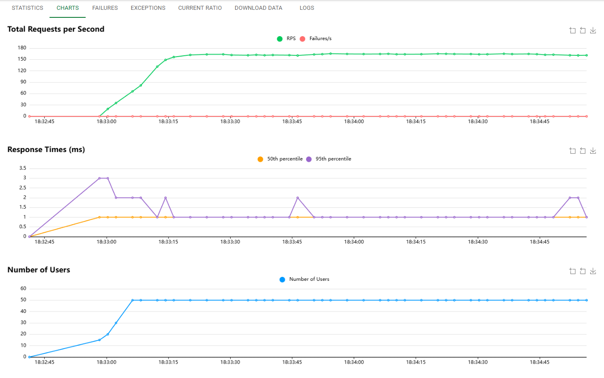
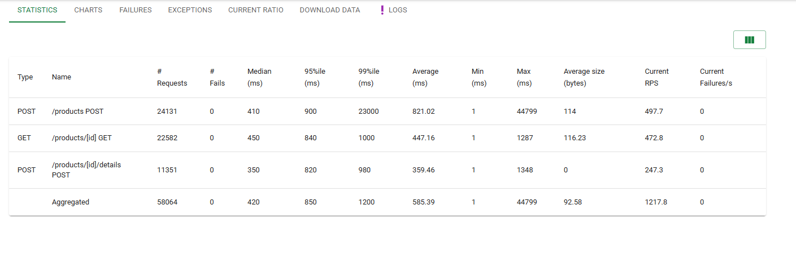
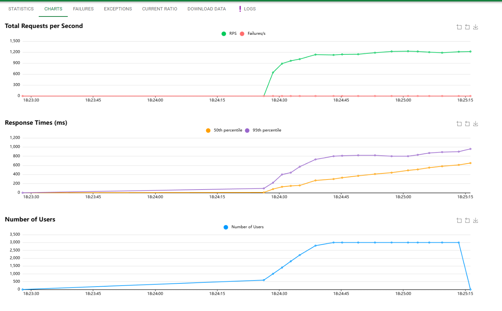
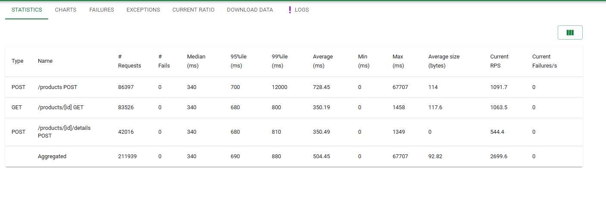
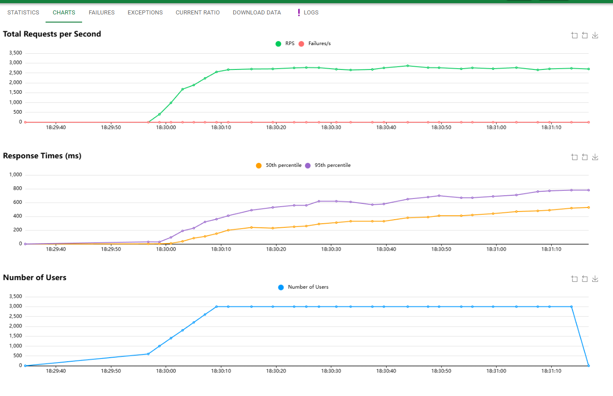

# Part IV – Load Testing Report

## Overview

Load testing was performed using **Locust** to evaluate the performance and scalability of the Product API. Two types of users were tested:

- `HttpUser`
- `FastHttpUser`

Two load levels were executed for each:

| Test | Users | Spawn Rate |
|------|-------|------------|
| Test 1 | 50 | 5 users/sec |
| Test 2 | 300 | 200 users/sec |

All tests were executed **locally** against the corrected, concurrency-safe Go server.

---

## Test Configuration

### Test 1 – Moderate Load

| Parameter | Value |
|-----------|-------|
| Users | 50 |
| Spawn Rate | 5 users/sec |
| Workload | Balanced create, read, update |
| Duration | ~2–3 minutes |

**Screenshots:**





---

### Test 2 – High Load

| Parameter | Value |
|-----------|-------|
| Users | 300 |
| Spawn Rate | 200 users/sec |
| Workload | Balanced create, read, update |
| Duration | ~1 minutes |

**Screenshots:**





>  **Warning observed during Test 2:**
> ```
> CPU usage above 90%! This may constrain your throughput and may even give
> inconsistent response time measurements.
> ```
> This indicates the **Locust load generator machine itself was CPU-bound** — the client-side machine generating requests became a bottleneck.

---

## Results

### Test 1 – 50 Users

| Metric | Value |
|--------|-------|
| Average RPS | ~160 req/sec |
| Median Latency | ~1–2 ms |
| 95th Percentile | ~3 ms |
| Failures | 0 |

**Interpretation:**
Under moderate load, the server handled all requests without failure. Latency remained extremely low. The in-memory hashmap with `RWMutex` performed efficiently, with no resource saturation — indicating the system performs well for small to medium traffic levels.

---

### Test 2 – 300 Users

| Metric | Value |
|--------|-------|
| Aggregated RPS | ~2600–2700 req/sec |
| Median Latency | ~340–420 ms |
| 95th Percentile | ~680–900 ms |
| 99th Percentile (outliers) | Up to 12–23 seconds |
| Failures | 0 |

**Interpretation:**
Under high load, throughput increased significantly while response times grew substantially. Tail latency (95th and 99th percentile) spiked rapidly. Because Locust reported CPU usage above 90%, the load generator itself became saturated — meaning results under Test 2 are **partially constrained by the client machine**, not only the server.

---

## HttpUser vs FastHttpUser Comparison

### At 50 Users
- Performance difference was **minimal**
- Latency and RPS were nearly identical
- The server was the dominant bottleneck

### At 300 Users
- `FastHttpUser` showed slightly higher sustained RPS
- Tail latency remained similar
- Differences were still small overall

**Why the gap is small:**
`FastHttpUser` reduces client-side HTTP overhead, but when the backend is CPU-bound, improvements are marginal. HTTP client efficiency matters less once backend CPU is saturated.

---

## System Behavior Analysis

### Why Latency Increased Under High Load

The Product API uses:
- In-memory hashmap
- `RWMutex` for synchronization
- Single Go process on a single CPU core (local)

As concurrency increases:
- Lock contention increases
- CPU utilization increases
- Context switching increases
- Tail latency grows

Although individual map operations are `O(1)`, **lock contention introduces queuing delays** under high concurrency.

---

### CPU Saturation Warning

During Test 2, the Locust process reached CPU limits on the client machine, meaning:
- Reported latency may include **client-side scheduling delays**
- Measured throughput may be **artificially constrained**

**To improve measurement accuracy in future tests:**
- Run Locust in **distributed mode** with multiple worker nodes
- Use a more powerful or dedicated machine for load generation

---

## Tradeoff Analysis

In real-world e-commerce systems, **reads are far more frequent than writes**. This design reflects that:

| Workload Type | Performance | Reason |
|---------------|-------------|--------|
| Read-heavy |  Better | O(1) lookups, reduced write-lock contention |
| Write-heavy |  Degraded | Increased mutex contention |

**The in-memory map structure is suitable for:**
- Prototyping and development
- Low to moderate traffic

**It is not suitable for:**
- Distributed or multi-instance deployments
- Persistent storage requirements

---

## Key Findings

1. The system is **stable under moderate load** — no failures occurred after concurrency bugs were fixed.
2. Throughput **scales linearly** until CPU saturation is reached.
3. **Tail latency increases significantly** under high concurrency due to lock contention.
4. The **load generator CPU became a bottleneck** at 300 users, partially constraining Test 2 results.
