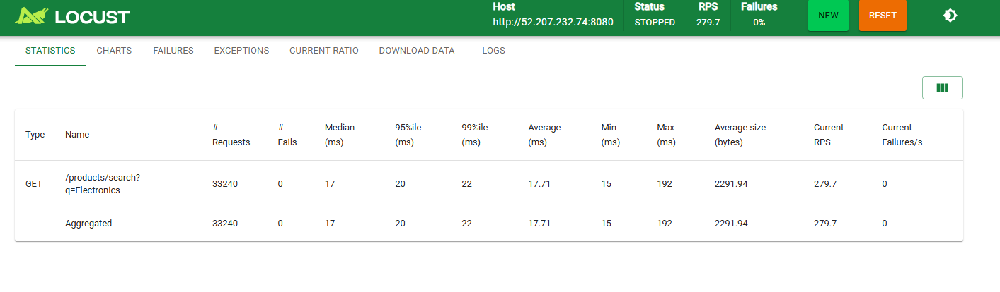
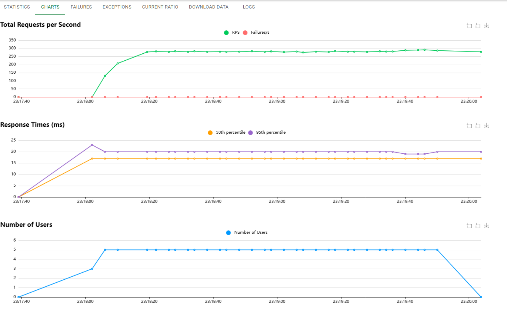
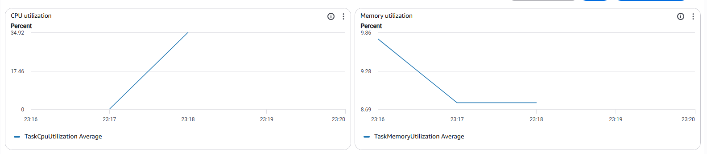
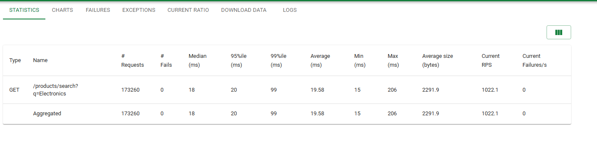
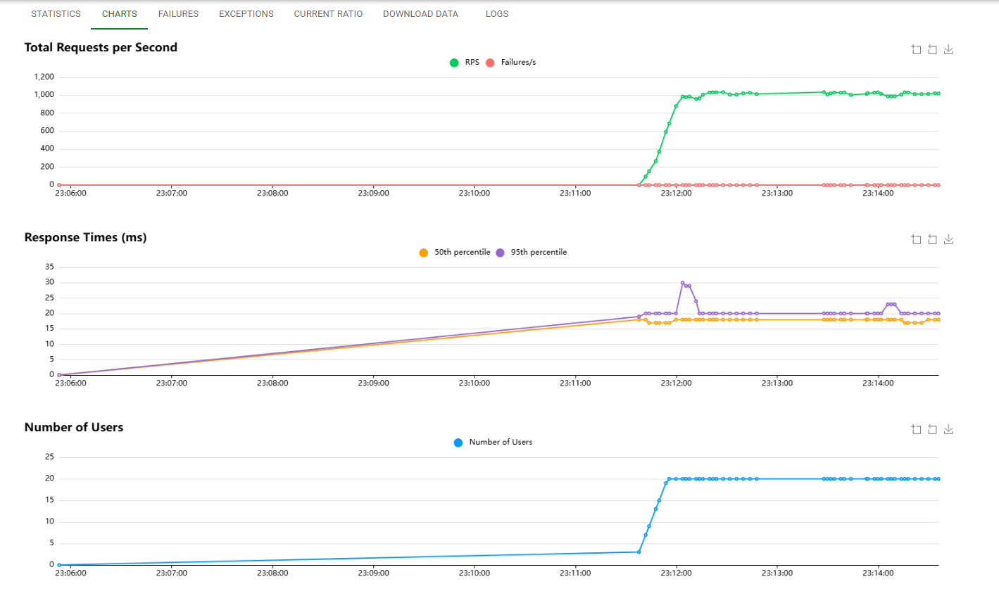

# Part II Report
## Identifying Performance Bottlenecks in Product Search Service

---

## 1. Objective

The goal of this experiment was to determine whether performance degradation in our product search service is caused by inefficient code or by insufficient compute resources.

The service:

- Runs on ECS Fargate
- 256 CPU units (0.25 vCPU)
- 512 MB memory
- 1 task instance
- Loads 100,000 products into memory at startup
- Each search request checks exactly 100 products before stopping
- Each request performs fixed bounded work, simulating an AI-style compute workload.

---

## 2. Test Setup

Load testing was performed using Locust with FastHttpUser.

Two tests were executed:

**Test 1 – Baseline**
- 5 users
- Duration: 2 minutes

**Test 2 – Breaking Point**
- 20 users
- Duration: 3 minutes

Metrics monitored:
- Locust response times and RPS
- ECS CPU utilization
- ECS Memory utilization

---

## 3. Test 1 – 5 Users (Baseline)

** Locust Statistics**

Key results:
- RPS: ~279
- Median latency: 17 ms
- 95th percentile: 20 ms
- Failures: 0

**ECS CPU Utilization and Memory Utilization**

CPU peaked around 34%

Memory stable around 9–10%

### Analysis

At 5 users:
- CPU remained well below saturation
- Memory remained steady
- Latency was low and stable
- No errors or request drops

The system handled this load comfortably. There was significant compute headroom remaining.

---

## 4. Test 2 – 20 Users (Breaking Point)

**Locust Statistics**

Key results:
- RPS: ~1022
- Median latency: 18 ms
- 95th percentile: 20 ms
- 99th percentile: 99 ms
- Max latency: 206 ms
- Failures: 0

> **Important observation:** The 99th percentile latency increased significantly.

**ECS CPU Utilization and Memory Utilization**

CPU reached ~94%

Memory remained around 10%

---

## 5. What Happened When Load Increased?

When users increased from 5 to 20:
- Requests per second increased nearly 4×
- CPU utilization increased from ~34% to ~94%
- Memory usage remained nearly constant
- Tail latency increased significantly

The system became CPU-bound. Even though median latency stayed low, the 99th percentile rose sharply, indicating CPU saturation effects under peak concurrency. This is a classic symptom of compute resource exhaustion.

---

## 6. Is This an Optimization Problem or a Scaling Problem?

We gathered the following evidence:

**Evidence 1: Fixed Bounded Work**

Each request intentionally checks exactly 100 products. The computation per request is constant and already bounded. There is no unbounded loop or algorithmic inefficiency.

**Evidence 2: CPU Saturation**

CPU reached ~94% under 20 users. This indicates compute exhaustion.

**Evidence 3: Memory Stability**

Memory remained around 10% under both loads. This proves:
- No memory leak
- No memory pressure
- No scaling issue related to RAM

**Evidence 4: Linear Scaling Pattern**

RPS increased proportionally with users. CPU increased proportionally with load. This shows the system is behaving predictably and efficiently — the limitation is hardware capacity.

**Conclusion:**
This is not a code optimization problem. This is a compute scaling problem.

---

## 7. Using Metrics to Make Scaling Decisions

From ECS metrics:
- CPU utilization is the first resource to saturate.
- Memory remains far from limits.
- Response time degradation correlates directly with CPU saturation.

Therefore, if CPU consistently exceeds ~80–90% under expected traffic, we should scale compute resources.

Possible scaling actions:

**Vertical scaling:**
- Increase CPU from 256 to 512 units

**Horizontal scaling:**
- Increase task count from 1 to multiple tasks
- Add load balancing

Because the workload is inherently compute-heavy and bounded, adding more CPU is the correct solution. Code optimization would not meaningfully reduce cost per request, since each request intentionally performs fixed computation.

---

## 8. Creative Stress Testing Performed

Beyond baseline tests, the following were evaluated:
- Monitored percentile latency rather than only average
- Observed CPU-to-latency correlation
- Compared behavior under 4× load increase
- Verified bounded iteration behavior (exactly 100 products checked)

This confirmed the system was compute-bound and not algorithmically inefficient. The increase in 99th percentile latency at high CPU demonstrates realistic tail behavior under saturation.

---

## 9. Final Conclusion

This experiment demonstrated:
- The system performs well under moderate load.
- Performance degradation begins when CPU approaches saturation.
- Memory does not become a limiting factor.
- The bottleneck is compute capacity.
- The correct solution is scaling resources, not rewriting code.

This exercise shows how CloudWatch metrics can be used to distinguish between:
- Inefficient code
- Resource exhaustion

In this case, metrics clearly indicate a compute-bound system that requires scaling.
