# Part III: Horizontal Scaling with Auto Scaling

## Objective

The objective of Part III was to eliminate the bottleneck discovered in Part II by deploying the same Go-based product search service using horizontal scaling with ECS Fargate, an Application Load Balancer, and Auto Scaling.

The service logic remained unchanged:
- 100,000 in-memory products
- Linear search checking 100 products per request
- Same load test that previously broke the system

The goal was to demonstrate that horizontal scaling allows the system to handle the load that previously caused performance degradation.

---

## Architecture Overview

The deployed infrastructure included:

**1. Application Load Balancer (ALB)**
- Distributes incoming HTTP requests
- Routes traffic to healthy ECS tasks
- Performs health checks on `/health`

**2. Target Group**
- Target type: IP (required for Fargate)
- Protocol: HTTP
- Port: 8080
- Health check path: `/health`
- Health check interval: 30 seconds
- Healthy threshold: 2 consecutive successes

**3. ECS Service with Auto Scaling**
- Metric: Average CPU Utilization
- Initial target: 70%
- Min tasks: 2
- Max tasks: 4
- Cooldown: 300 seconds

---

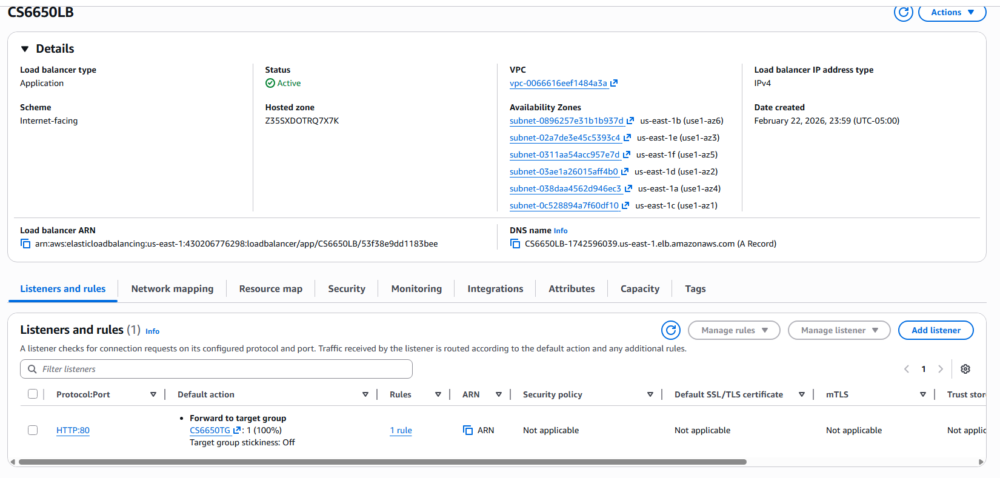
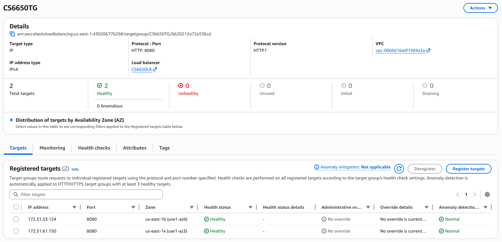
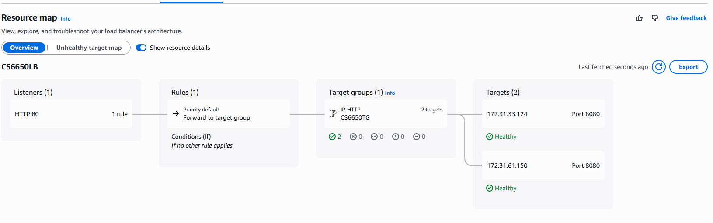
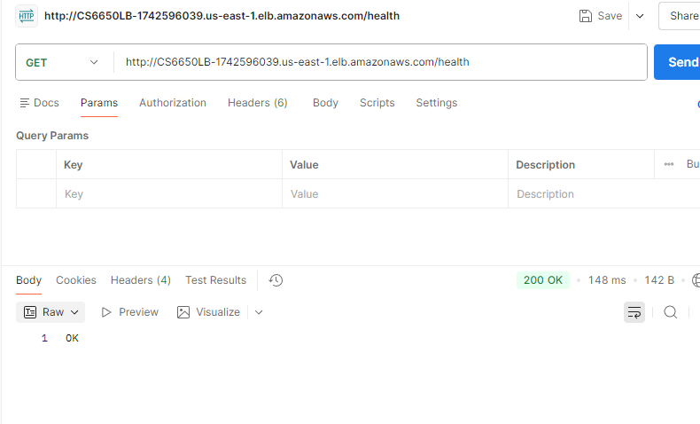

## Baseline: 20 Users (70% CPU Target)

### Test Configuration

- Users: 20
- Duration: 3 minutes
- CPU target: 70%

### Observations

**CPU Utilization**
- Peak CPU per task: ~58–60%
- Did not cross 70%

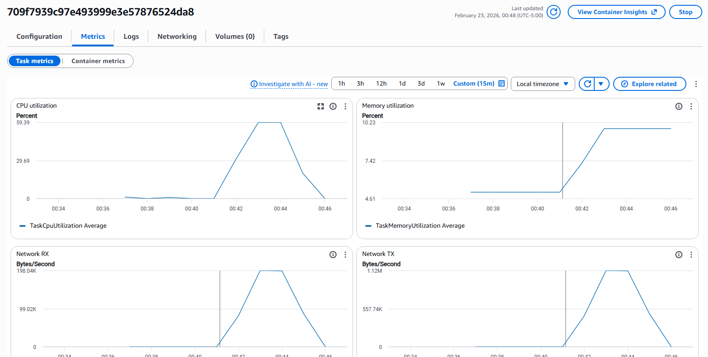
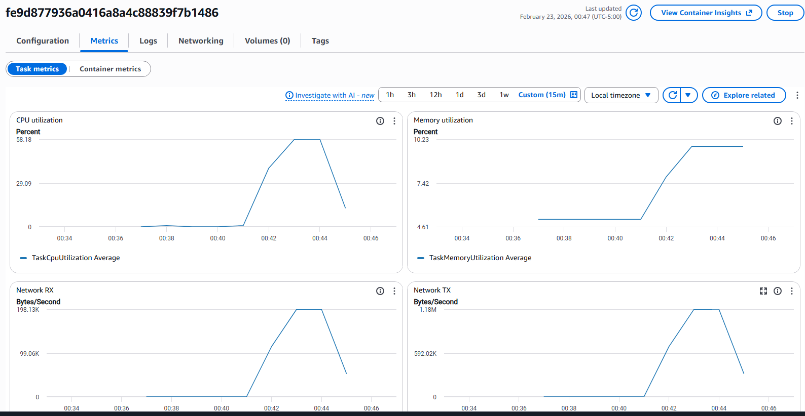

**Task Count**
- Remained at 2 tasks
- No scaling event occurred

**Target Group**
- 2 healthy targets
- No new registrations

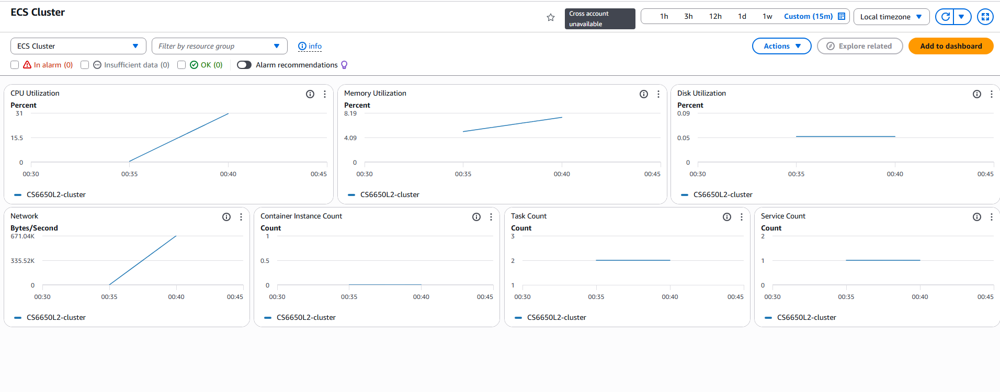

**Load Test Results**
- RPS ≈ 1066
- Average latency ≈ 19 ms
- Failures: 0

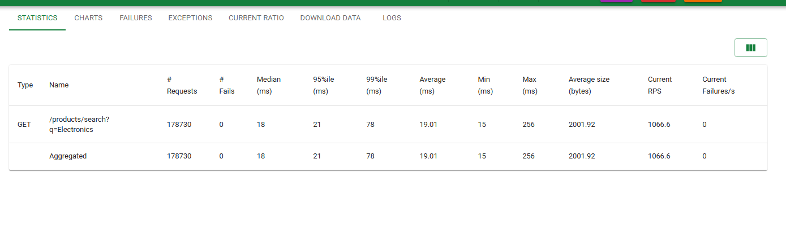
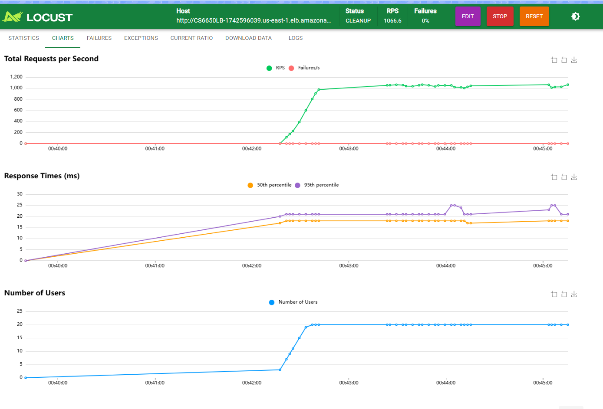

### Conclusion

Since CPU never exceeded the 70% threshold, auto scaling did not trigger. This behavior was correct and expected. The system already had sufficient capacity with two tasks.

---

## Scaling Experiment: 50 Users (45% CPU Target)

To force scaling behavior, the CPU target was lowered to 45%.

### Test Configuration

- Users: 50
- Duration: 3 minutes
- CPU target: 45%

### Load Test Results

- Peak RPS ≈ 2177
- Total requests: 336,650
- Median latency: 19 ms
- 95th percentile: 41 ms
- 99th percentile: 110 ms
- Failures: 0

### CPU Triggered Scaling

CPU per task increased significantly:
- Task CPU peaked around 75%
- Another task peaked around 89%
- This exceeded the 45% threshold.

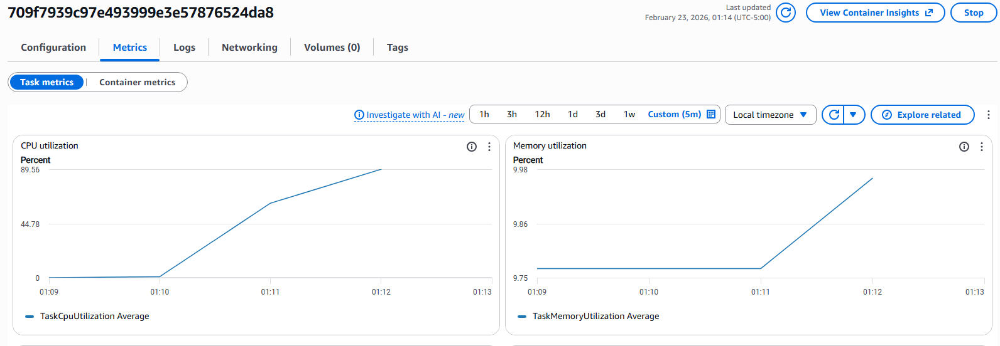

### Auto Scaling Behavior

ECS Service Overview showed:
- Desired tasks: 4
- Running tasks: 4
- Previously: 2 tasks
- Newly created: 2 additional tasks

### Target Group Update

After scaling:
- Total targets: 4
- Healthy: 4
- Unhealthy: 0

This confirms 2 new tasks were launched, 2 new targets were registered, and health checks passed successfully.

### System Behavior During Scaling

Sequence of events:
1. User load increased to 50
2. CPU crossed 45%
3. Auto Scaling policy triggered
4. ECS launched 2 new tasks
5. Target Group registered new IP addresses
6. ALB redistributed traffic
7. Latency stabilized
8. No failures occurred

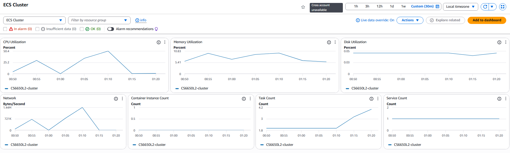

This demonstrates reactive horizontal elasticity.

---

## Resilience Testing

To validate fault tolerance, one ECS task was manually stopped during active load.

### Failure Injection

While the 50-user load was running:
- One task was manually stopped
- Status transitioned to Deactivating → Stopped

### Target Group Reaction

Target group showed:
- 1 target in "Draining"
- 4 healthy
- 0 unhealthy

This proves the load balancer gracefully deregistered the stopped task and active connections were drained properly.

### Automatic Replacement

ECS detected desired count mismatch and:
- Launched a new task
- Registered new IP in target group
- Restored total healthy targets

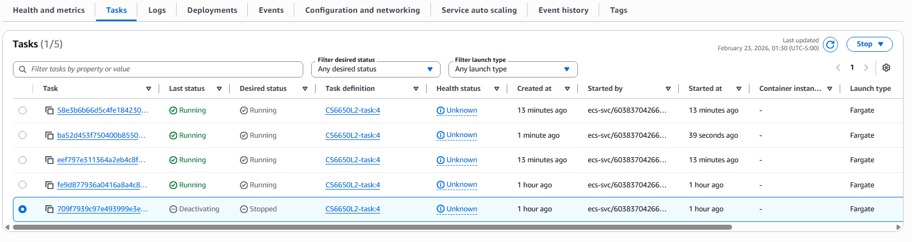
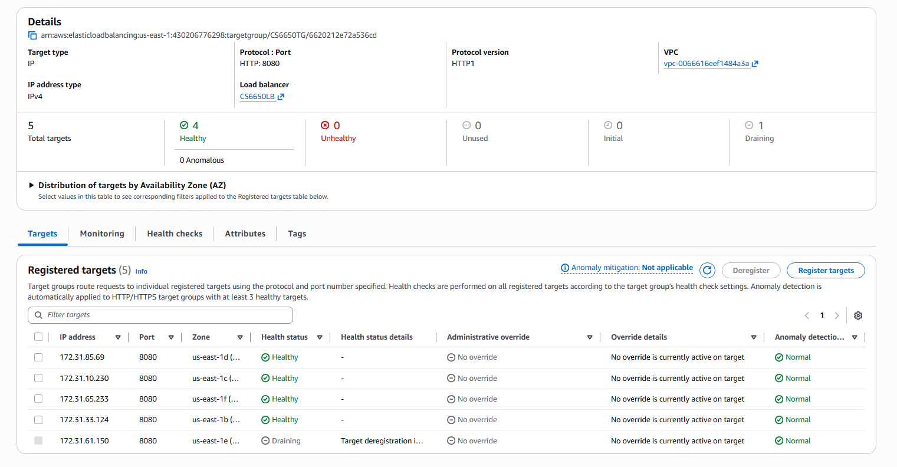
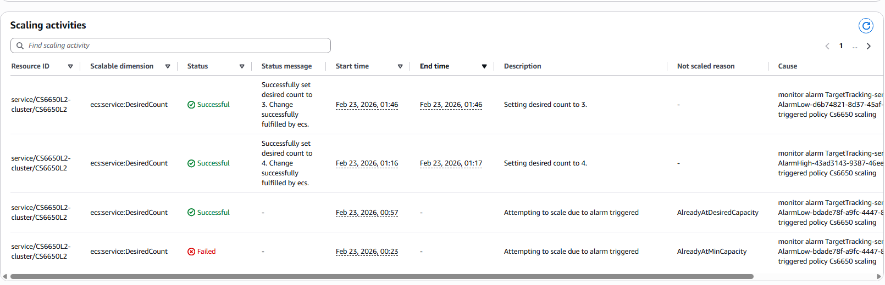
### Load Continuity

Locust metrics showed:
- RPS remained stable (~2177)
- Failures = 0
- No latency spike

This confirms zero downtime during instance failure.

---

## How Horizontal Scaling Solved the Part II Bottleneck

**In Part II:**
- Single task handled all requests
- CPU saturated
- Response times increased dramatically
- System broke under load

**In Part III:**
- Load distributed across multiple tasks
- CPU per instance reduced
- Auto Scaling added capacity dynamically
- Latency remained stable
- Zero failures occurred

The bottleneck was compute capacity. Horizontal scaling solved it by distributing load.

---

## Role of Each Component

**Application Load Balancer**
- Distributes traffic across healthy tasks
- Performs health checks
- Removes unhealthy instances automatically

**Target Group**
- Maintains registered backend instances
- Tracks health status
- Handles connection draining

**Auto Scaling**
- Monitors CPU utilization
- Adds tasks when threshold exceeded
- Removes tasks when load decreases
- Maintains desired count

Together, these components create an elastic and resilient system.

---

## Horizontal vs Vertical Scaling Trade-offs

**Horizontal Scaling**

Advantages:
- Fault tolerant
- Scales dynamically
- Handles instance failure gracefully
- Cloud-native approach

Disadvantages:
- More infrastructure complexity
- Requires load balancing
- Slightly higher networking overhead

**Vertical Scaling**

Advantages:
- Simpler configuration
- No load balancer needed

Disadvantages:
- Single point of failure
- Limited scaling ceiling
- Requires downtime for resizing

Modern distributed systems prefer horizontal scaling because it enables elasticity and resilience.

---

## Predicted Scaling Behavior

- **CPU Target = 70%:** Scaling triggers only under heavy sustained load
- **CPU Target = 50%:** Scaling triggers earlier, more aggressive expansion
- **CPU Target = 90%:** Risk of latency spikes before scaling

- **Gradual load increases:** Smooth scaling behavior
- **Sudden spikes:** Short latency increase until new tasks become healthy

---

## Creative Stress Testing Performed

To demonstrate deep understanding, the following were performed:
- Baseline test (20 users)
- Forced scaling test (50 users, 45% threshold)
- Manual failure injection
- Observed connection draining
- Validated automatic replacement
- Compared latency across scenarios

This validated:
- Elastic scaling
- High availability
- Self-healing behavior
- Proper ALB integration

---

## Final Conclusion

The service that broke in Part II now:
- Handles more than 2× the original load
- Scales from 2 to 4 tasks automatically
- Replaces failed instances automatically
- Maintains zero downtime
- Keeps latency stable
- Demonstrates true cloud-native horizontal elasticity

This approach is foundational to modern distributed systems because it enables systems to scale dynamically, recover automatically, and maintain availability under stress.
