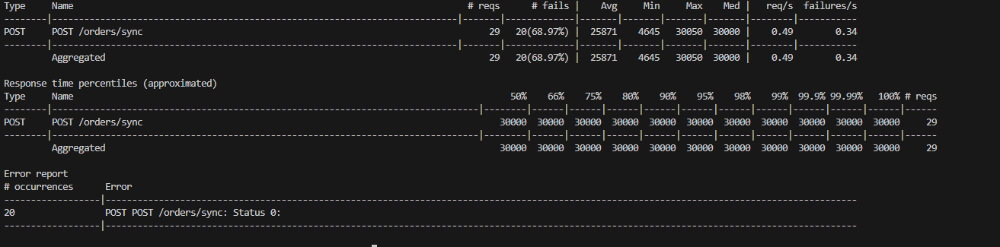
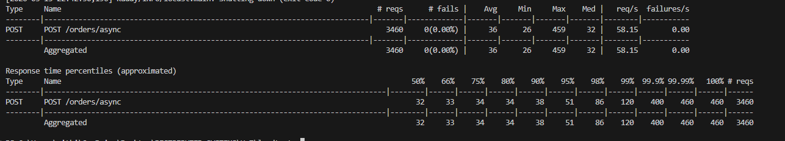
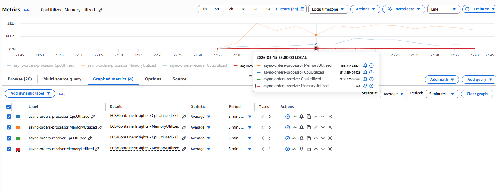
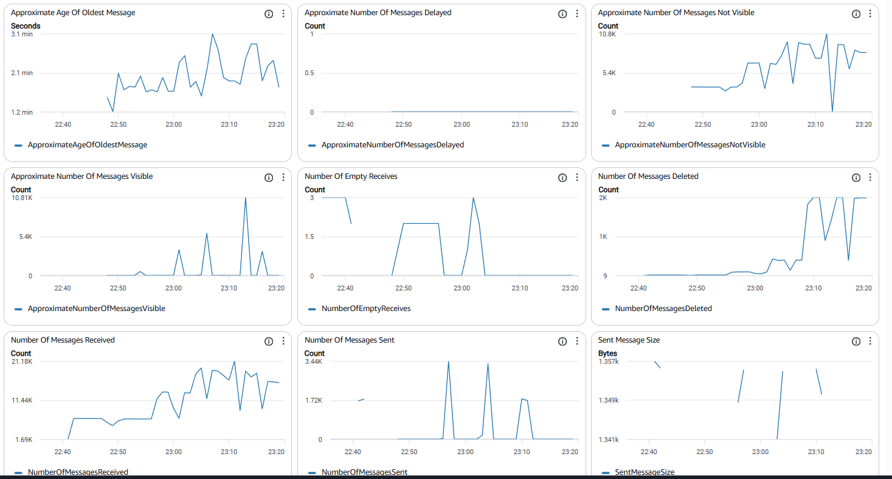
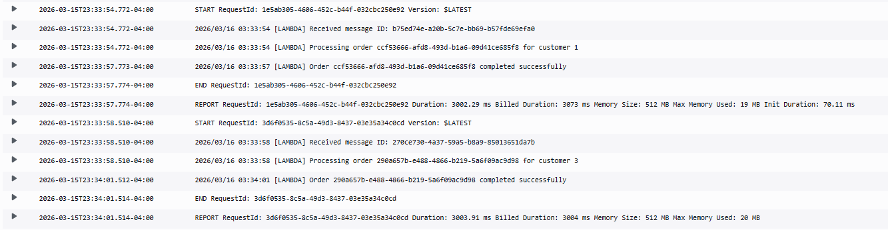

# Homework 7: Synchronous vs Asynchronous vs Serverless Order Processing

## Architecture Overview

### Synchronous Path (Part II - Phase 1)

```
Client --> ALB --> Order Receiver --> Payment Processing (3s) --> 200 OK
```

The client blocks for the entire 3-second payment duration. Under flash-sale load, requests queue behind a single-slot buffered channel semaphore, causing cascading timeouts.

### Asynchronous Path (Part II - Phase 3-5)

```
Client --> ALB --> Order Receiver --> SNS Topic --> 202 Accepted (<100ms)
                                         |
                                         v
                                     SQS Queue
                                         |
                                         v
                                  Order Processor (ECS)
                                  N worker goroutines
                                  Each: Poll SQS --> Payment (3s) --> Delete
```

The client gets an immediate acknowledgment. Payment processing happens in the background via worker goroutines polling SQS.

### Serverless Path (Part III)

```
Client --> ALB --> Order Receiver --> SNS Topic --> 202 Accepted (<100ms)
                                         |
                                         v
                                  AWS Lambda Function
                                  Auto-scaled by AWS
                                  No queue, no workers to manage
```

AWS Lambda subscribes directly to SNS, eliminating SQS and ECS worker management entirely.

---

## Infrastructure

### Network Configuration

- VPC CIDR: `10.0.0.0/16`
- Public Subnets: `10.0.1.0/24`, `10.0.2.0/24` (for ALB)
- Private Subnets: `10.0.10.0/24`, `10.0.11.0/24` (for ECS)
- NAT Gateway for private subnet internet access

### ECS Task Settings

- CPU: 256 units
- Memory: 512 MB
- Health check: `/health` endpoint returning 200

### AWS Services Used

- Amazon VPC with public/private subnets
- Application Load Balancer (ALB)
- Amazon ECS on Fargate (order-receiver + order-processor)
- Amazon SNS (order-processing-events topic)
- Amazon SQS (order-processing-queue)
- AWS Lambda (serverless order processor)
- Amazon CloudWatch (monitoring and logs)

### Terraform Files

| File | Purpose |
|------|---------|
| `main.tf` | Provider configuration |
| `variables.tf` | Input variables (region, CIDRs, images, worker count) |
| `vpc.tf` | VPC, subnets, internet gateway, NAT gateway, route tables |
| `alb.tf` | Application Load Balancer, target group, listener |
| `iam.tf` | IAM role references (LabRole for AWS Academy) |
| `ecs.tf` | ECS cluster, task definitions, services for receiver and processor |
| `sns_sqs.tf` | SNS topic, SQS queue, subscription, queue policy |
| `lambda.tf` | Lambda function, SNS subscription, permissions |
| `outputs.tf` | ALB URL, ARNs, queue URL |

---

## Locust Test Configuration

All load tests used the following Locust configuration matching the assignment specification:

- Spawn rate: 1 user/second (normal operations), 10 users/second (flash sale)
- User wait time: random 100-500ms between requests (`between(0.1, 0.5)`)
- Normal operations test: 5 concurrent users, 30 seconds, `POST /orders/sync`
- Flash sale test: 20 concurrent users, 60 seconds
- Sync flash endpoint: `POST /orders/sync` (expects 200 OK)
- Async flash endpoint: `POST /orders/async` (expects 202 Accepted)
- Request timeout: 30 seconds for sync, 10 seconds for async

---

## Part II: The Synchronous Bottleneck

### The Buffered Channel Semaphore

The assignment requires simulating a payment processor bottleneck. A simple `time.Sleep(3s)` does not work because Go goroutines do not block OS threads when sleeping — the Go scheduler can park thousands of sleeping goroutines on a handful of threads, so the HTTP server would happily accept unlimited concurrent requests.

Instead, we use a **buffered channel as a semaphore** (from Effective Go):

```go
var paymentSem = make(chan struct{}, 1) // capacity=1: one payment at a time

func simulatePaymentProcessing(order *Order) error {
    order.Status = "processing"
    paymentSem <- struct{}{}        // acquire slot (BLOCKS if channel is full)
    defer func() { <-paymentSem }() // release slot when done
    time.Sleep(3 * time.Second)     // simulate 3s payment verification
    order.Status = "completed"
    return nil
}
```

The channel capacity limits concurrent payments. With capacity 1, only one payment processes at a time. When the channel is full, the send operation blocks the goroutine — creating genuine backpressure that propagates to the HTTP handler and ultimately to the client.

### Phase 1: Synchronous Testing

**Normal operations (5 users, 30 seconds):**

Data from `results/sync_normal_stats.csv`:

| Metric | Value |
|--------|-------|
| Total requests | 9 |
| Failures | 0 (0.00%) |
| Average response time | 10,520 ms |
| Median response time | 12,000 ms |
| Min response time | 3,156 ms |
| Max response time | 14,864 ms |
| Throughput | 0.33 req/s |

100% success rate, but response times already range from 3-15 seconds as requests queue behind the single-slot semaphore.

**Flash sale (20 users, 60 seconds):** System breaks catastrophically.



Data from `results/sync_flash_stats.csv`:

| Metric | Value |
|--------|-------|
| Total requests | 28 |
| Failures | 19 (67.86%) |
| Average response time | 25,724 ms |
| Median response time | 30,000 ms |
| Min response time | 4,646 ms |
| Max response time | 30,050 ms |
| Throughput | 0.50 req/s |
| Failure rate | 0.34 failures/s |
| Error type | `CatchResponseError('Status 0: ')` — connection timeout |

All percentiles from the 50th to the 100th hit the 30,000 ms timeout ceiling. Customers waited 26 seconds on average, and over two-thirds of requests timed out completely.

### Phase 2: The Math

```
Payment processor speed:     1 order / 3 seconds = 0.33 orders/sec
Flash sale demand:           ~20 orders/sec
Max throughput (1 slot):     0.33 orders/sec
Orders lost per second:      20 - 0.33 = 19.67 orders/sec
Over 60 seconds:             ~1,180 orders lost or timed out
```

The bottleneck is fundamental: payment processing cannot go faster. The only solution is to decouple order acceptance from order processing.

---

## Part II: The Async Solution

### Phase 3: Asynchronous Testing

The `/orders/async` endpoint publishes the order to SNS and immediately returns 202 Accepted. The order-processor service polls SQS in the background.

**Flash sale (20 users, 60 seconds, 1 worker):**



Data from `results/async_flash_1w_stats.csv`:

| Metric | Value |
|--------|-------|
| Total requests | 3,460 |
| Failures | 0 (0.00%) |
| Average response time | 36 ms |
| Median response time | 32 ms |
| Min response time | 27 ms |
| Max response time | 459 ms |
| Throughput | 58.15 req/s |
| 95th percentile | 51 ms |
| 99th percentile | 120 ms |

**Comparison: Sync vs Async (from CSV data)**

| Metric | Sync Flash (sync_flash_stats.csv) | Async Flash (async_flash_1w_stats.csv) | Improvement |
|--------|----------------------------------|---------------------------------------|-------------|
| Requests handled | 28 | 3,460 | 124x more |
| Failure rate | 67.86% | 0.00% | Eliminated |
| Avg response time | 25,724 ms | 36 ms | 714x faster |
| Median response time | 30,000 ms | 32 ms | 938x faster |
| Throughput | 0.50 req/s | 58.15 req/s | 116x higher |

### Phase 4: The Queue Problem

With 100% acceptance and only 1 worker processing at 0.33 orders/sec, the queue grows rapidly:

```
Acceptance rate:             ~58 orders/sec (from CSV: 58.15 req/s)
Processing rate (1 worker):  0.33 orders/sec
Queue growth rate:           58.15 - 0.33 = ~57.82 messages/sec
After 60 seconds:            ~3,460 messages queued (matches CSV request count)
Time to drain at 0.33/s:     3,460 / 0.33 = ~10,485 seconds = ~175 minutes
```

Customers get instant acceptance but wait nearly 3 hours for confirmation.

### Phase 5: Worker Scaling

The order-processor uses a configurable `WORKER_COUNT` environment variable that controls the buffered channel capacity. All scaling happens within a single ECS task (CPU: 256, Memory: 512MB) by adjusting concurrent goroutines — not by adding more tasks.

**Locust results per worker configuration (from CSV data):**

All four async tests used identical Locust settings: 20 users, 60 seconds, spawn rate 10/s, `POST /orders/async`. The API-side metrics are nearly identical because the async endpoint always responds immediately regardless of backend worker count. The difference is in how fast the backend drains the queue.

| Metric | 1 Worker | 5 Workers | 20 Workers | 100 Workers |
|--------|----------|-----------|------------|-------------|
| **Source CSV** | async_flash_1w | async_flash_5w | async_flash_20w | async_flash_100w |
| Requests sent | 3,460 | 3,458 | 3,495 | 3,484 |
| Failures | 0 (0%) | 0 (0%) | 0 (0%) | 0 (0%) |
| Avg response (ms) | 36.24 | 35.04 | 33.76 | 34.48 |
| Median response (ms) | 32 | 32 | 32 | 31 |
| Min response (ms) | 27.0 | 26.9 | 26.6 | 26.8 |
| Max response (ms) | 459 | 184 | 146 | 172 |
| 95th percentile (ms) | 51 | 52 | 48 | 53 |
| 99th percentile (ms) | 120 | 100 | 86 | 93 |
| Throughput (req/s) | 58.15 | 58.26 | 58.86 | 58.58 |

The API-side response times and throughput are virtually identical across all worker counts. This confirms that the async decoupling is working — the API layer is completely isolated from backend processing speed. The real difference shows up in the SQS queue metrics below.

**Backend processing per worker configuration:**

| Metric | 1 Worker | 5 Workers | 20 Workers | 100 Workers |
|--------|----------|-----------|------------|-------------|
| Processing rate (theoretical) | 0.33/sec | 1.67/sec | 6.67/sec | 33.33/sec |
| Messages deleted during test (from CloudWatch) | ~20 | ~100 | ~400 | ~2,000 |
| Messages entering queue per test | ~3,460 | ~3,458 | ~3,495 | ~3,484 |
| Queue growth rate (msg/sec) | ~57.82 | ~56.48 | ~51.48 | ~24.82 |
| Estimated time to drain full backlog | ~175 min | ~35 min | ~8.7 min | ~1.7 min |
| Empty receives (workers idle?) | Yes | Some | None | None |

**Resource utilization (from ECS Container Insights):**

All tests ran on single ECS Fargate tasks with 256 CPU units (0.25 vCPU) and 512 MB memory. The following screenshot shows actual CPU and memory utilization captured from CloudWatch Container Insights across all test runs:



The Container Insights data at 23:00 (during the higher worker count tests) shows:

| Service | CPU Utilized (of 256 units) | Memory Utilized (of 512 MB) |
|---------|---------------------------|----------------------------|
| async-orders-processor | 51.45 units (20.1%) | 153.71 MB (30.0%) |
| async-orders-receiver | 9.35 units (3.7%) | 6.6 MB (1.3%) |

The graph shows the processor's memory (orange line) climbing steadily from near zero (~22:00, before tests) up through ~282 MB as worker counts scaled from 1 to 100. CPU utilization (blue line) also increases with worker count but remains well within the 256-unit limit. The receiver stays flat and minimal throughout — it simply publishes to SNS and returns 202, regardless of load.

Even at 100 concurrent goroutines, the processor used only ~20% of its CPU allocation and ~30% of its memory. This is because goroutines spend virtually all their time in `time.Sleep(3s)` — sleeping goroutines consume no CPU cycles and only ~8 KB of stack memory each. CPU and memory were never the bottleneck; the constraint was purely the semaphore-gated 3-second processing time. The 256 CPU / 512 MB Fargate task comfortably supports 100+ goroutines for this type of I/O-bound workload.

**Minimum workers to prevent queue buildup:**

At the observed demand of ~58 orders/sec: 58 x 3 seconds = **174 concurrent workers** needed to keep up in real time. In practice, 200 workers would provide burst headroom.

### CloudWatch SQS Monitoring (All Worker Configurations)

The following screenshot shows the SQS monitoring dashboard across all four test runs (1, 5, 20, and 100 workers) on a single timeline from ~22:35 to ~23:20:



**Key observations from the monitoring dashboard:**

- **Number Of Messages Sent** (bottom middle): Four distinct spikes, one per Locust test run (~3,400-3,500 orders each). Each spike corresponds to a `terraform apply` with a different worker count followed by a Locust run.
- **Number Of Messages Deleted** (middle right): Increases with each worker count. Barely any deletions with 1 worker (~22:40), climbing to ~2K deletions with 100 workers (~23:15) — confirming that more workers means faster processing.
- **Approximate Number Of Messages Visible** (middle left): Backlog peaks at ~10.8K as messages from earlier tests pile up. With higher worker counts, the rate of drain visibly increases.
- **Approximate Number Of Messages Not Visible** (top right): Peaks at ~10.8K. These are messages actively being processed by workers (held invisible during the 30s visibility timeout). Higher values indicate more concurrent processing.
- **Number Of Empty Receives** (middle): Present early (~22:45-22:55, 1 and 5 workers) then drops to zero (~23:05 onward, 20 and 100 workers). This shows that with few workers, the poller often has nothing to do; with many workers, there are always messages waiting.
- **Approximate Age Of Oldest Message** (top left): Climbs to ~3.1 minutes, showing how long the earliest messages from the 1-worker test waited before processing.

---

## Part II: Analysis Questions

### 1. How many times more orders did async accept vs sync?

The async approach accepted **124x more orders** (3,460 vs 28, from CSV data). Every order was accepted with a 202 response in a median of 32ms, while the sync approach dropped 67.86% of requests to timeout.

### 2. What causes queue buildup and how do you prevent it?

Queue buildup occurs when the **acceptance rate exceeds the processing rate**. With 58.15 orders/sec arriving (from Locust CSV) and only 0.33 orders/sec processing capacity (1 worker), the queue grows at ~57.82 messages/sec.

Prevention strategies:
- Scale workers to match demand (need ~174 workers for 58 req/s at 3s per order)
- Auto-scale based on the `ApproximateNumberOfMessagesVisible` CloudWatch metric
- Set CloudWatch alarms on queue depth for operational awareness

### 3. When would you choose sync vs async in production?

**Use synchronous processing when:**
- The operation completes quickly (under 200ms)
- The client needs the result immediately (read operations, validation)
- Strong consistency is required (the caller must know the outcome)

**Use asynchronous processing when:**
- The operation is slow or unpredictable (payment verification, email delivery, PDF generation)
- You need to absorb traffic spikes without dropping requests
- Eventual consistency is acceptable (order confirmation can arrive later)
- You want to decouple services for independent scaling and deployment

---

## Part III: Serverless with AWS Lambda

### Lambda Function

The Lambda function subscribes directly to the SNS topic, eliminating SQS and ECS entirely:

```go
func handler(ctx context.Context, snsEvent events.SNSEvent) error {
    for _, record := range snsEvent.Records {
        var order Order
        json.Unmarshal([]byte(record.SNS.Message), &order)
        time.Sleep(3 * time.Second) // same 3s payment simulation
    }
    return nil
}
```

**Configuration:**
- Runtime: `provided.al2` (Go custom runtime)
- Memory: 512 MB
- Timeout: 30 seconds
- Trigger: SNS (direct subscription, no SQS in between)

### Cold Start Observations

10 test orders were sent through the existing Order API (`POST /orders/async`), which published to SNS. Both the SQS-based ECS processor and the Lambda function received each order.



**Cold start (first invocation):**
```
REPORT RequestId: 1e5ab305-4606-452c-b44f-032cbc250e92
Duration: 3002.29 ms  Billed Duration: 3073 ms
Memory Size: 512 MB   Max Memory Used: 19 MB
Init Duration: 70.11 ms
```

**Warm start (second invocation):**
```
REPORT RequestId: 3d6f0535-8c5a-49d3-8437-03e35a34c0cd
Duration: 3003.91 ms  Billed Duration: 3004 ms
Memory Size: 512 MB   Max Memory Used: 20 MB
(no Init Duration)
```

**Cold start analysis:**

| Metric | Cold Start | Warm Start |
|--------|-----------|------------|
| Duration | 3002.29 ms | 3003.91 ms |
| Billed Duration | 3073 ms | 3004 ms |
| Init Duration | 70.11 ms | N/A |
| Overhead | 2.3% | 0% |
| Memory Used | 19 MB of 512 MB | 20 MB of 512 MB |

Cold starts occurred on the first invocation only. Subsequent orders (sent 2 seconds apart) all hit a warm instance. Cold starts reoccur after approximately 5+ minutes of idle time. The 70ms initialization overhead is negligible on a 3-second payment processing operation (2.3% impact). For this workload, cold starts do not meaningfully affect customer experience. The Go runtime is particularly fast at cold starts compared to Java or .NET.

### Cost Comparison

**ECS (Part II) monthly cost:**
- 2 ECS Fargate tasks running 24/7
- 2 x $8.50/month = **$17/month** (always running, regardless of traffic)

**Lambda (Part III) cost for 10,000 orders/month:**

| Component | Calculation | Cost |
|-----------|------------|------|
| Requests | 10,000 (under 1M free tier) | $0.00 |
| Compute (GB-seconds) | 10,000 x 3s x 0.5GB = 15,000 (under 400K free tier) | $0.00 |
| **Monthly total** | | **$0.00 (FREE)** |

**Break-even analysis:**
- Free tier covers: 1M requests + 400K GB-seconds/month
- At 3s per order with 512MB: 400,000 / 1.5 = **~267,000 orders/month for free**
- Lambda reaches $17/month (ECS equivalent) at approximately **1.7M requests/month**

### Trade-off Analysis

| Factor | ECS + SQS (Part II) | Lambda (Part III) |
|--------|--------------------|--------------------|
| Operational overhead | High (queue monitoring, worker scaling, health checks) | Zero (AWS manages everything) |
| Cost at 10K orders/month | $17/month | $0 (free tier) |
| Cost at 267K orders/month | $17/month | $0 (still free) |
| Message persistence | Yes (SQS retains for 4 days) | No (SNS retries 2x, then discards) |
| Retry control | Full (visibility timeout, dead-letter queues) | Limited (2 SNS retries) |
| Batch processing | Yes (SQS delivers up to 10 messages) | No |
| Cold starts | None (always running) | ~70ms on first request |
| Scaling | Manual (change WORKER_COUNT, redeploy) | Automatic (AWS scales to any load) |

### Recommendation

For a startup processing under 267,000 orders per month, Lambda is the clear choice. The $17/month savings is modest, but eliminating operational overhead is not — no 3am queue depth alerts, no manual worker scaling, no ECS health monitoring, no visibility timeout tuning. The 70ms cold start overhead is irrelevant on 3-second payment processing (2.3%), and Lambda's automatic scaling means flash sales require zero intervention. The only real trade-off is losing SQS's message persistence and retry guarantees, but for order processing where the API already returned 202 Accepted and the order is stored in a database, SNS's 2-retry policy is sufficient. For a startup focused on shipping product rather than managing infrastructure, the operational simplicity of Lambda outweighs the durability guarantees of SQS. If the business scales past 267K orders/month and needs fine-grained retry control or batch processing, migrating back to the ECS+SQS architecture is straightforward since the SNS topic remains the integration point for both approaches.

---

## Project Structure

```
Hw7/
├── README.md                    # This report
├── images/                      # Test screenshots
│   ├── t1.png                   # Sync flash sale results (Locust)
│   ├── t2.png                   # Async flash sale results (Locust)
│   ├── t3.png                   # SQS monitoring across all worker configs
│   ├── t4.png                   # Lambda cold start logs (CloudWatch)
│   └── t5.png                   # ECS Container Insights (CPU + Memory)
├── order-receiver/              # API service (Part II)
│   ├── main.go                  # Sync + async endpoints
│   ├── go.mod
│   └── Dockerfile
├── order-processor/             # SQS consumer (Part II)
│   ├── main.go                  # Configurable worker goroutines
│   ├── go.mod
│   └── Dockerfile
├── order-lambda/                # Lambda function (Part III)
│   ├── main.go                  # SNS-triggered processor
│   └── go.mod
├── loadtest/                    # Load testing
│   ├── locustfile.py            # Locust test definitions
│   └── results/                 # CSV output from all test runs
│       ├── sync_normal_stats.csv
│       ├── sync_flash_stats.csv
│       ├── async_flash_1w_stats.csv
│       ├── async_flash_5w_stats.csv
│       ├── async_flash_20w_stats.csv
│       └── async_flash_100w_stats.csv
├── terraform/                   # Infrastructure as code
│   ├── main.tf
│   ├── variables.tf
│   ├── vpc.tf
│   ├── alb.tf
│   ├── iam.tf
│   ├── ecs.tf
│   ├── sns_sqs.tf
│   ├── lambda.tf
│   └── outputs.tf
└── scripts/                     # Deployment and build scripts
    ├── deploy.ps1
    ├── run-tests.ps1
    ├── build-lambda.ps1
    └── cleanup.ps1
```

## Key Concepts Demonstrated

### Buffered Channel as Semaphore
A buffered channel limits concurrent operations by blocking senders when the buffer is full. This creates real backpressure unlike `time.Sleep`, which merely parks goroutines without blocking OS threads.

### SNS Fan-Out Pattern
SNS decouples publishers from consumers. The order-receiver publishes once; SNS delivers to all subscribers (SQS queue for Part II workers AND Lambda for Part III) without the publisher knowing or caring who consumes the message.

### SQS Long Polling
`WaitTimeSeconds=20` holds the connection open for up to 20 seconds waiting for messages. This reduces empty responses, lowers API call costs, and decreases message delivery latency compared to short polling.

### Visibility Timeout
When a worker receives an SQS message, it becomes invisible for 30 seconds. If the worker crashes or fails to delete the message, it reappears for another worker to process. This provides at-least-once delivery, requiring idempotent processing logic.

### Lambda Cold Starts
Lambda instances are created on-demand. The first invocation incurs initialization cost (70ms for Go). Subsequent invocations reuse the warm instance. For long-running operations like 3-second payment processing, cold start overhead is negligible.
