# HW8 Step I — MySQL Integration for Shopping Cart Persistence

**Nithish Reddy Vemula** · CS 6650 Distributed Systems · March 22, 2026

---

## 1. Infrastructure and Schema Design

### 1.1 RDS MySQL Deployment

I extended my HW5 Terraform configuration by adding a new `rds` module alongside the existing `network`, `ecr`, `ecs`, and `logging` modules. The RDS instance runs MySQL 8.0 on `db.t3.micro` (Free Tier eligible) with 20 GB of gp2 storage. It sits in the default VPC's private subnets and is not publicly accessible — a dedicated security group allows inbound connections on port 3306 exclusively from the ECS task security group. This means no external client can reach the database directly; only the Fargate containers have access.

A custom parameter group sets `max_connections=150` (sufficient for multiple ECS tasks sharing the pool) and `innodb_lock_wait_timeout=5` to fail fast under contention rather than blocking for the default 50 seconds. The instance uses `skip_final_snapshot = true` and `deletion_protection = false` for easy teardown, and backups are disabled since this is an assignment environment.

The ECS task definition was extended to inject five environment variables — `DB_HOST`, `DB_PORT`, `DB_NAME`, `DB_USER`, `DB_PASSWORD` — so the Go application discovers the RDS endpoint at runtime without hardcoded connection strings. The network module was also updated to export `vpc_id`, which the RDS module needs for its security group.

My initial `terraform apply` failed because the password contained `@`, which AWS RDS prohibits. After fixing the password, the second apply completed the remaining resources successfully:

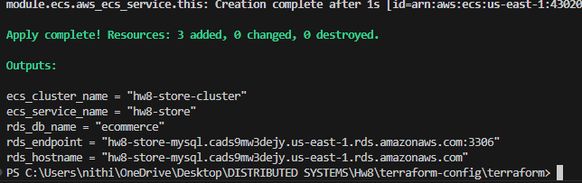

### 1.2 Database Schema

I chose a **two-table normalized design**: `shopping_carts` and `cart_items`.

**Table structure:**

`shopping_carts` stores one row per cart with `cart_id` (AUTO_INCREMENT PK), `customer_id`, `created_at`, and `updated_at`. `cart_items` stores one row per product-in-cart with `item_id` (AUTO_INCREMENT PK), `cart_id` (FK), `product_id`, `quantity`, `added_at`, and `updated_at`.

**Why two tables instead of one?** A single denormalized table (repeating customer_id on every item row) would create update anomalies and make "count all carts for customer X" expensive. The normalized design keeps cart metadata separate from line items. A customer history query (`WHERE customer_id = ?`) is a clean single-table index scan with no duplicates.

**Alternative considered:** I could have stored items as a JSON array column on `shopping_carts`, similar to a document store approach. This would give single-row reads but makes partial updates expensive (full row rewrite to add one item) and prevents MySQL from indexing individual product lookups. The relational approach is more natural for MySQL's query planner and supports the concurrent modification patterns required.

**Index strategy** — three indexes beyond primary keys:

- `idx_customer_id` on `shopping_carts(customer_id)` — enables customer purchase history queries without a full table scan.
- `idx_cart_id` on `cart_items(cart_id)` — the JOIN key for cart retrieval. Without this, every GET request scans the entire `cart_items` table.
- `uk_cart_product` (UNIQUE) on `cart_items(cart_id, product_id)` — prevents duplicate product entries and powers the `INSERT ... ON DUPLICATE KEY UPDATE` upsert, so adding an existing product increments its quantity atomically.

**Data integrity:** The foreign key `fk_cart_items_cart` references `shopping_carts(cart_id)` with `ON DELETE CASCADE`, preventing orphaned item rows. InnoDB's row-level locking ensures concurrent modifications to different carts never block each other — only two transactions touching the same cart will serialize.

---

## 2. API Implementation

### 2.1 Endpoints

All three shopping cart endpoints are MySQL-backed, while the original HW5 product endpoints remain in-memory (unchanged):

- **POST /shopping-carts** — Inserts a row into `shopping_carts` and returns the auto-generated `cart_id`. Single INSERT, no transaction needed. Returns 201.
- **GET /shopping-carts/{id}** — Uses a `LEFT JOIN` between `shopping_carts` and `cart_items` to fetch the cart and all its items in a single query. The LEFT JOIN ensures an empty cart (no items) still returns the cart metadata rather than a 404. Returns 200 with the full cart object, or 404 if the cart doesn't exist.
- **POST /shopping-carts/{id}/items** — Uses a transaction wrapping three operations: (1) verify cart exists, (2) upsert item via `INSERT ... ON DUPLICATE KEY UPDATE quantity = quantity + VALUES(quantity)`, and (3) touch the cart's `updated_at`. The transaction ensures atomicity — if the cart is deleted between the check and the insert, InnoDB's FK constraint catches it and the transaction rolls back. Returns 204 on success.

### 2.2 Smoke Test — Endpoint Verification

**Cart creation** — POST /shopping-carts returns 201 with the auto-generated cart ID:

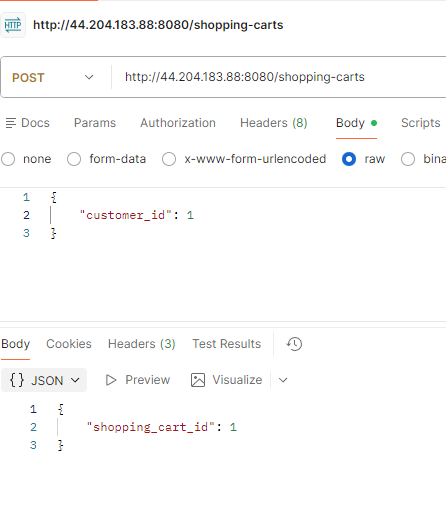

**Adding items** — POST /shopping-carts/1/items with product_id 42 and quantity 2 returns 204 No Content:

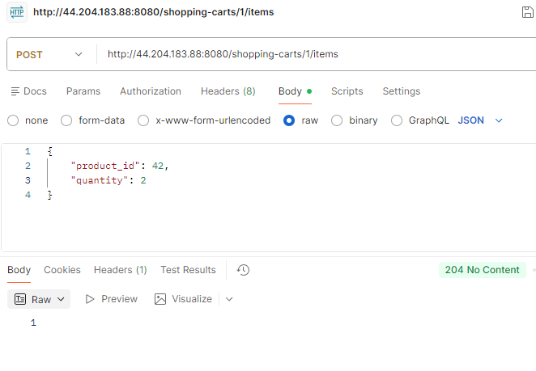

**Cart retrieval with items** — GET /shopping-carts/1 returns the full cart with all items via the LEFT JOIN. The response shows cart_id 1, customer_id 1, and one item with product_id 42 and quantity 5 (the result of multiple add operations accumulating via the upsert). Response time: 21ms at 200 OK:

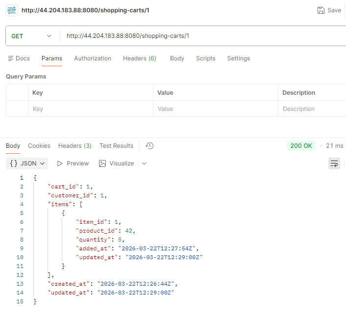

**Error handling** — GET for non-existent cart 99999 returns a structured 404 error with `error`, `message`, and `details` fields in 26ms:

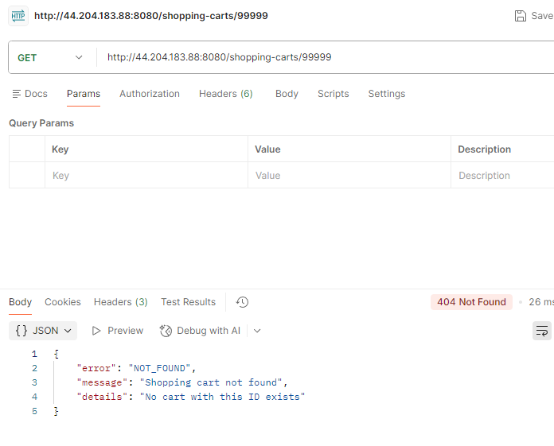

### 2.3 Connection Pool Configuration

The Go `database/sql` pool is configured with `MaxOpenConns=20`, `MaxIdleConns=10`, `ConnMaxLifetime=5min`, and `ConnMaxIdleTime=1min`. With `db.t3.micro`'s 150 max_connections, capping at 20 per ECS task supports up to 7 concurrent tasks before pool exhaustion. The 10 idle connections avoid TCP handshake overhead on the hot path. `ConnMaxLifetime=5min` recycles connections to gracefully handle RDS maintenance events or DNS changes.

### 2.4 Error Handling and Input Validation

Every handler validates input ranges (IDs ≥ 1, quantities ≥ 1) and returns structured JSON errors with `error`, `message`, and `details` fields. All SQL queries use parameterized placeholders (`?`) to prevent injection. The `AddItemToCart` function uses `strings.Contains(err.Error(), "CART_NOT_FOUND")` to distinguish a missing cart (404) from a database failure (500).

A health endpoint at `GET /health` pings the MySQL connection to verify the database is reachable, which is useful for debugging ECS task startup against the RDS instance.

---

## 3. Performance Testing and Results

### 3.1 150-Operation Test Results

The required test ran 150 sequential operations — 50 create, 50 add items, 50 get cart — completing in 14.8 seconds (well within the 5-minute window). All 150 operations succeeded with zero failures.

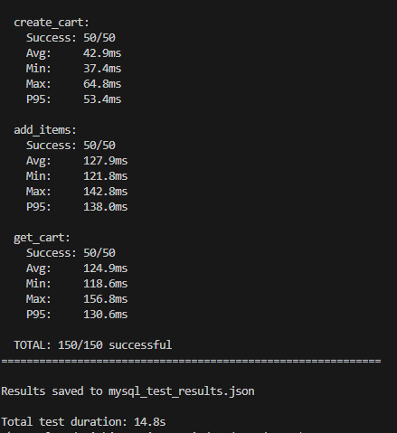

| Operation | Count | Avg (ms) | Min (ms) | Max (ms) | P50 (ms) | P95 (ms) | Std Dev |
|-----------|-------|----------|----------|----------|----------|----------|---------|
| create_cart | 50 | 42.93 | 37.40 | 64.81 | 41.87 | 53.38 | 5.17 |
| add_items | 50 | 127.86 | 121.84 | 142.84 | 127.20 | 138.02 | 4.36 |
| get_cart | 50 | 124.87 | 118.62 | 156.80 | 123.57 | 130.61 | 5.53 |

**Key observations:**

Cart creation is the fastest operation at ~43ms average, which makes sense — it's a single INSERT into `shopping_carts` with no joins or transactions. The low standard deviation (5.17ms) indicates consistent performance with minimal variance.

Adding items is the slowest at ~128ms average. This is expected because it wraps three database operations inside a transaction: a SELECT to verify the cart exists, an INSERT/UPDATE upsert on `cart_items`, and an UPDATE to touch the cart's `updated_at` timestamp. Each round-trip to RDS adds ~40ms of network latency, and the transaction itself adds coordination overhead.

Cart retrieval averages ~125ms, which is close to the add_items cost despite being a single query. The LEFT JOIN between `shopping_carts` and `cart_items` is efficient at the database level (the `idx_cart_id` index makes it a range scan), but the response includes serializing the full cart with all items into JSON and transmitting it back over the network. The one outlier at 156.80ms likely corresponds to a brief network jitter or garbage collection pause.

**Note on sequential test latency:** These numbers (~43–128ms) are higher than the Locust results below because Python's `urllib` opens a new TCP connection for each request, paying the handshake cost every time. Locust reuses connections via HTTP keep-alive, eliminating that overhead.

### 3.2 Locust Load Testing

I ran three Locust load tests at increasing concurrency levels to observe how the MySQL-backed API scales under sustained load.

**Light load (10 users):** The system handled 3,576 requests at 30.7 RPS with 0% failures. All three endpoints performed consistently — create cart averaged 21.35ms (P95: 24ms), get cart averaged 19.52ms (P95: 22ms), and add items averaged 22.85ms (P95: 26ms). The charts show throughput stabilizing quickly at ~30 RPS with flat response times after the initial ramp-up spike.

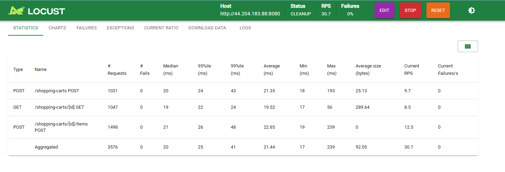
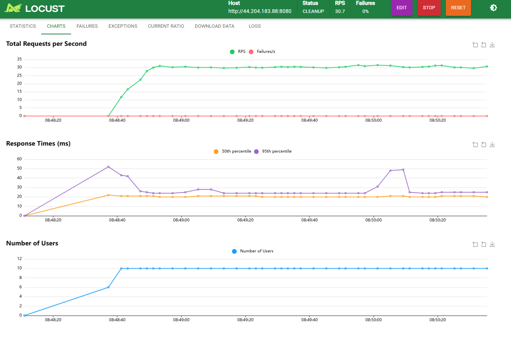

**Medium load (50 users):** Throughput scaled nearly linearly to 152.4 RPS across 17,603 total requests with 0% failures. Average response times barely increased — aggregated avg was 22.98ms (P95: 26ms, P99: 59ms). The max latency did jump to 634ms on the add-items endpoint, indicating occasional pool contention, but the median held steady at 22ms. The charts show throughput climbing quickly to ~150 RPS and holding flat.

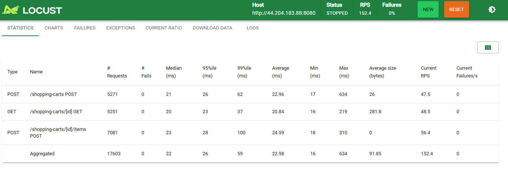
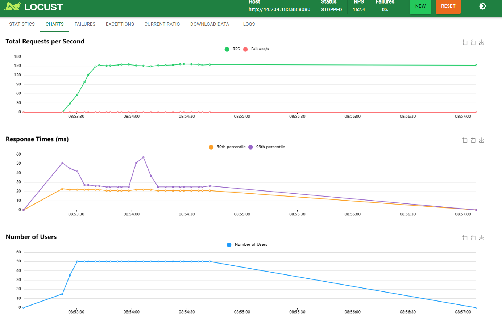

**Heavy load (100 users):** The system reached 302.8 RPS across 32,928 requests with still 0% failures. The median response time remained remarkably stable at 22ms, but the tail latency exploded — P99 hit 480ms and maximum response times reached 6,662–7,031ms across all endpoints. The average was pulled up to 45.98ms by these outliers. This is the classic connection pool queueing effect: most requests get a pool connection instantly (hence the stable 22ms median), but when all 20 connections are busy, some requests queue for seconds. The charts confirm this — the P50 line stays flat at ~22ms while the P95 line rises, and the RPS tooltip shows a peak of 271.5 RPS settling to ~300 RPS steady-state.

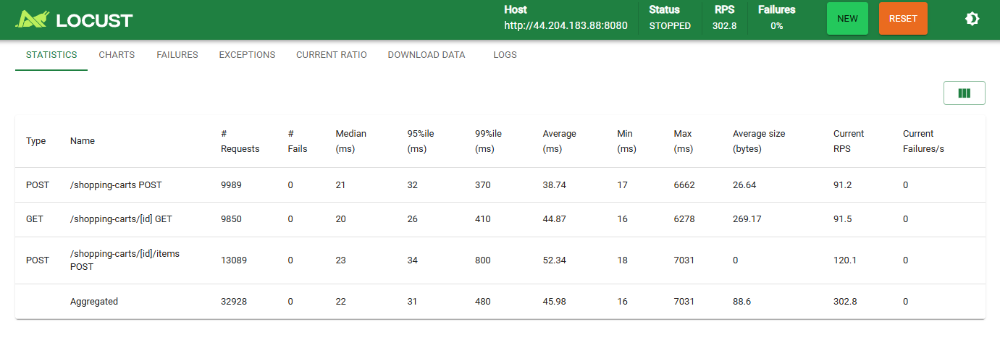
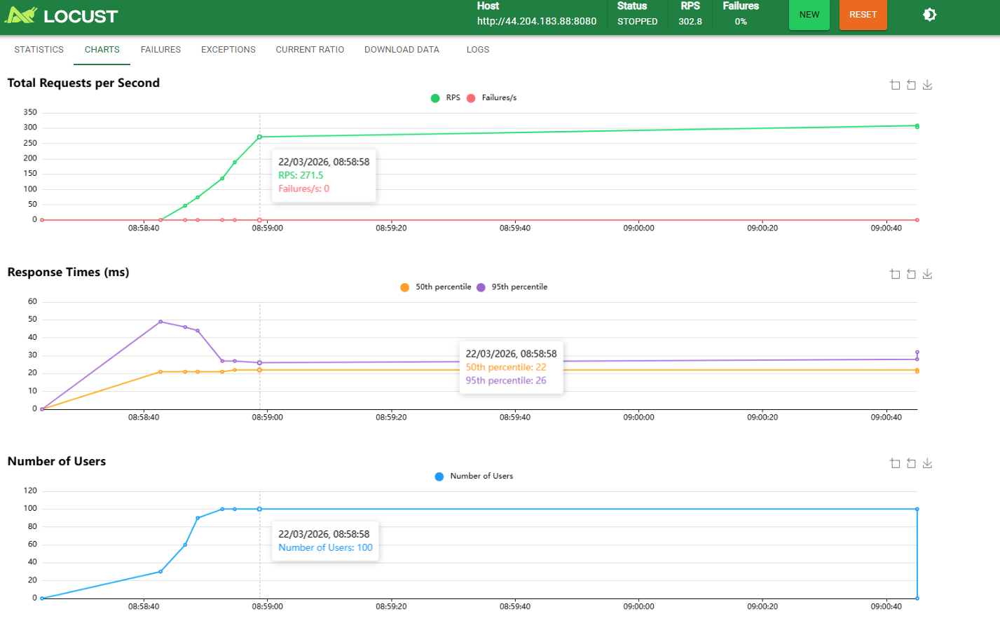

### 3.3 HW5 vs HW8 Comparison

| Aspect | HW5 (In-memory) | HW8 (MySQL) |
|--------|-----------------|-------------|
| Storage | Go `map` with `sync.RWMutex` | Amazon RDS MySQL 8.0 |
| Persistence | None — data lost on restart | Durable across restarts |
| Read latency (median) | Sub-millisecond | ~20ms (Locust) / ~125ms (sequential) |
| Write latency (median) | Sub-millisecond | ~21-23ms (Locust) / ~43-128ms (sequential) |
| Concurrency model | RWMutex (in-process) | InnoDB row-level locks (cross-process) |
| Data integrity | None (no constraints) | FK constraints, cascading deletes |
| Max throughput tested | N/A | 302.8 RPS at 100 users, 0% failure |

The dominant performance cost in HW8 is the network round-trip between the ECS Fargate task and the RDS instance. With HTTP keep-alive (Locust), the median is a consistent ~20ms across all load levels. Without keep-alive (sequential Python test), each request pays ~40ms of TCP handshake overhead on top of the query. The actual MySQL query execution time is negligible (sub-millisecond for indexed lookups), as confirmed by the RDS ReadLatency/WriteLatency metrics peaking at only 3–4ms.

---

## 4. CloudWatch Monitoring

### 4.1 RDS Metrics

The RDS monitoring dashboard reveals clear activity patterns corresponding to the Locust test phases:

**CPUUtilization** spiked to ~20% during the heavy-load test (around 08:55–09:00) from a baseline of ~1.8%. This is modest for a `db.t3.micro` — the database was handling 300 RPS worth of inserts, upserts, and joins without approaching CPU saturation.

**DatabaseConnections** peaked at 11 concurrent connections, which is well below the pool's `MaxOpenConns=20` ceiling. This indicates that even at 100 concurrent Locust users, the Go connection pool was efficiently multiplexing — 11 active MySQL connections served 302.8 HTTP requests/second. The spiky pattern shows connections being opened and returned to the pool in bursts matching the request waves.

**FreeStorageSpace** remained stable at ~18.4 GB throughout testing, as expected for the small data volumes in this assignment.

**FreeableMemory** fluctuated between ~54 MB and ~108 MB. The drops correspond to InnoDB buffer pool activity during test load — MySQL caches table pages and index pages in memory during heavy read/write activity, then releases them during quiet periods.

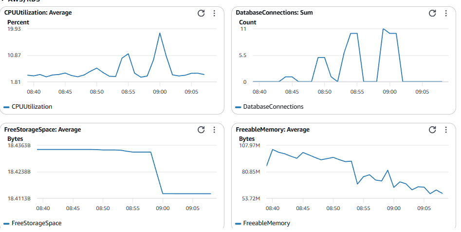

**Read/Write Latency and I/O:** The detailed I/O metrics confirm that MySQL's internal performance is excellent. ReadLatency peaked at ~4ms and WriteLatency peaked at ~3.1ms — both negligible compared to the end-to-end response times. WriteIOPS peaked at ~223 during heavy load, and WriteThroughput peaked at ~837 KB/s. The bursty pattern across all six metrics shows clear correlation with the three Locust test phases.

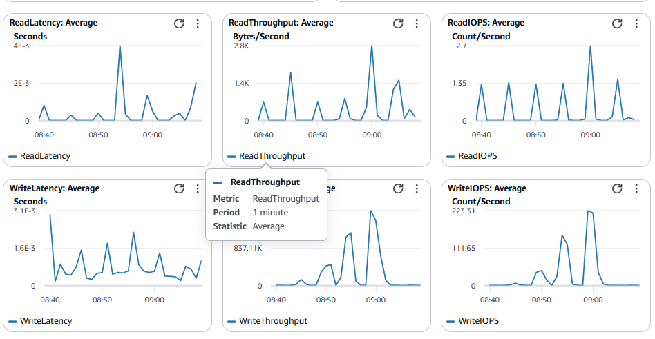

### 4.2 ECS Metrics

The ECS Fargate task (256 CPU units, 512 MB memory) showed dramatic CPU spikes that correlate directly with the Locust test phases. CPUUtilization (green line) sat near 0% at idle, spiked to ~24% during the medium-load test (around 08:50), and peaked at ~48.3% during the heavy-load test (around 09:00). Between test runs, CPU dropped back to baseline almost instantly. This confirms that the Go server is genuinely CPU-active during high-throughput periods — goroutine scheduling, JSON serialization/deserialization, HTTP connection handling, and MySQL driver work all contribute. At ~48% of 256 CPU units during 302.8 RPS, there is still headroom, but CPU would become a bottleneck before the database does if load continued to increase.

MemoryUtilization (orange line) stayed nearly flat at ~2% throughout all tests — approximately 10 MB of the 512 MB allocation. The Go server's memory footprint is minimal: the in-memory product map, the MySQL connection pool buffers, and in-flight goroutine stacks. Even at 100 concurrent users, memory did not meaningfully increase, which confirms that Go's goroutine model is memory-efficient and the connection pool does not allocate large per-connection buffers.

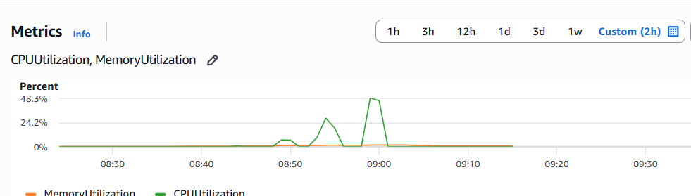

---

## 5. Key Challenges and Learning

**RDS password constraints:** My first `terraform apply` failed because the password contained `@`, which AWS RDS prohibits. The error message was clear ("Only printable ASCII characters besides '/', '@', '\"', ' ' may be used"), and switching to an alphanumeric password resolved it immediately. Because the first apply had already created 9 of 12 resources before failing, the second apply only needed to create the remaining 3 (RDS instance, ECS task definition, and ECS service).

**204 No Content and empty response bodies:** The `POST /shopping-carts/{id}/items` endpoint correctly returns 204 (no body), but my initial performance test script assumed every response had a JSON body and crashed with `JSONDecodeError`. The fix was checking if the response body is empty before parsing. This highlights the importance of handling all HTTP status codes correctly in test harnesses, not just 200.

**ECS-to-RDS startup race:** The ECS task boots in seconds, but RDS provisioning takes 5–10 minutes. Without the retry loop (30 attempts × 2s), the Go server would crash on startup before MySQL is ready. The retry pattern with backoff is essential for any service that depends on an external database.

**Connection pool efficiency under load:** The most interesting finding was that 11 MySQL connections handled 302.8 HTTP RPS at 100 concurrent users. The pool's `MaxOpenConns=20` was never saturated — Go's `database/sql` pool efficiently recycles connections, so each connection serves many sequential requests. The tail latency at 100 users (P99: 480ms, max: 7s) comes from HTTP-level queueing in goroutines waiting for pool slots, not from MySQL contention.

**CPU is the ECS bottleneck, not memory:** The CloudWatch metrics revealed that under heavy load, ECS CPU hit ~48% while memory stayed at ~2%. This was counterintuitive — I expected the database I/O to dominate and CPU to be idle. But at 302.8 RPS, the Go server is doing significant work in goroutine scheduling, HTTP parsing, JSON encoding, and MySQL driver protocol handling. Scaling horizontally (adding more ECS tasks) would distribute this CPU load while the RDS instance, which peaked at only ~20% CPU, could comfortably handle the additional connections.

**Sequential vs keep-alive latency gap:** The 150-operation test (Python urllib, no keep-alive) showed 43–128ms response times, while Locust (HTTP keep-alive) showed ~20ms medians. The difference is entirely TCP handshake overhead — each new connection costs ~20–30ms. This reinforces why connection reuse matters at both the HTTP layer (keep-alive) and the database layer (connection pooling).

**What I would do differently:** If optimizing for production, I would add Redis as a read-through cache in front of MySQL for cart retrieval. The write-path would go to MySQL and invalidate the cache. This would bring read latency back to sub-millisecond while keeping MySQL as the durable source of truth — essentially combining HW5's speed with HW8's persistence. I would also consider increasing `MaxOpenConns` to 40–50 to reduce tail latency at 100+ concurrent users, since the RDS instance can handle it (connections only peaked at 11 of the current 20 limit).
