# HW8 Step II — DynamoDB Integration for Shopping Cart Persistence

**Nithish Reddy Vemula** · CS 6650 Distributed Systems · March 22, 2026

---

## 1. DynamoDB Table Design

### 1.1 Single-Table Design with Embedded Items

I chose a **single-table design** with cart items embedded as a List attribute inside each cart document. The table uses `cart_id` (Number) as the sole partition key with no sort key, and on-demand billing (PAY_PER_REQUEST).

```
Table: hw8-store-dynamo-carts
  Partition Key: cart_id (Number)
  Billing: On-Demand (PAY_PER_REQUEST)

  Document structure:
  {
    "cart_id":     1,
    "customer_id": 42,
    "items": [
      {"product_id": 100, "quantity": 3, "added_at": "...", "updated_at": "..."},
      {"product_id": 200, "quantity": 1, "added_at": "...", "updated_at": "..."}
    ],
    "created_at": "2026-03-22T...",
    "updated_at": "2026-03-22T..."
  }
```

### 1.2 Design Decisions and Rationale

**Why embedded items instead of separate item rows (composite key)?**

The alternative would be a composite key design with `cart_id` as partition key and `product_id` as sort key — one row per item. This would allow querying individual items, but our API always returns the full cart with all items. With embedded items, every GET is a single `GetItem` call (0.5 RCU with eventual consistency). With separate rows, every GET would require a `Query` operation scanning all items in the partition, consuming more RCUs proportional to the number of items. For shopping carts — where we always read the entire cart at once and carts rarely exceed 50 items — embedding is the right call.

**Why no sort key?**

A sort key would only be needed if we wanted to query sub-ranges within a cart (e.g., "items added in the last hour"). Our access patterns are simple: create whole cart, read whole cart, update whole cart. A bare partition key keeps operations to single-item `GetItem`/`PutItem` which are the most efficient DynamoDB operations.

**Why on-demand billing?**

On-demand (PAY_PER_REQUEST) eliminates capacity planning and avoids throttling during bursty test traffic. For an assignment with unpredictable load, this is ideal. In production with steady-state traffic, provisioned capacity with auto-scaling would be more cost-effective.

**Auto-increment ID generation:**

DynamoDB has no AUTO_INCREMENT. I use a dedicated counter item at `cart_id=0` with an atomic `UpdateItem ADD` operation. Each `CreateCart` atomically increments this counter and uses the returned value as the new cart's ID. This creates a single hot key, but for the shopping cart use case the counter update is a small write and DynamoDB adaptive capacity handles it well. For production, UUIDs would eliminate the hot key entirely, but sequential integers were needed to match the MySQL API contract.

**Partition key distribution:**

Each `cart_id` maps to a potentially different partition, giving even distribution. DynamoDB's adaptive capacity handles the monotonically increasing pattern well — no hot partitions were observed under load.

### 1.3 Comparison with MySQL Schema (Step I)

| Aspect | MySQL (Step I) | DynamoDB (Step II) |
|--------|---------------|-------------------|
| Tables | 2 (shopping_carts + cart_items) | 1 (embedded items) |
| Cart retrieval | LEFT JOIN across 2 tables | Single GetItem (0.5 RCU) |
| Add item | Transaction: SELECT + INSERT/UPDATE + UPDATE | GetItem + PutItem (read-modify-write) |
| Data integrity | FK constraints, CASCADE | Condition expressions (attribute_exists) |
| Indexing | 3 secondary indexes | None needed (direct key access) |
| ID generation | AUTO_INCREMENT | Atomic counter item |
| Consistency | Strong (ACID transactions) | Eventually consistent by default |
| Schema | Rigid (DDL required) | Flexible (schemaless) |

---

## 2. API Implementation

### 2.1 Endpoint Mapping

The DynamoDB endpoints mirror the MySQL endpoints exactly, with a `/dynamo/` prefix for parallel comparison on the same running server:

| Operation | MySQL Path | DynamoDB Path |
|-----------|-----------|---------------|
| Create cart | POST `/shopping-carts` | POST `/dynamo/shopping-carts` |
| Get cart | GET `/shopping-carts/{id}` | GET `/dynamo/shopping-carts/{id}` |
| Add item | POST `/shopping-carts/{id}/items` | POST `/dynamo/shopping-carts/{id}/items` |

The health endpoint at `/health` reports both backends:

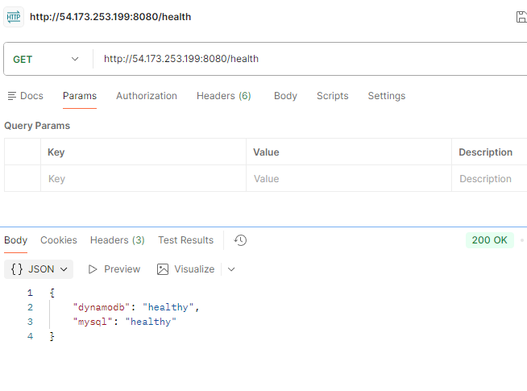

### 2.2 DynamoDB Operations Used

**CreateCart → UpdateItem (counter) + PutItem:** The atomic counter uses `UpdateItem` with `ADD next_id :inc` which atomically increments and returns the new value. Then `PutItem` creates the cart document with an empty items list. Two DynamoDB operations per create.

**GetCart → GetItem:** Single `GetItem` with eventual consistency (`ConsistentRead: false`). Returns the entire cart document including all embedded items in one call. Costs 0.5 RCU for items under 4 KB.

**AddItemToCart → GetItem + PutItem:** Read-modify-write cycle: `GetItem` to fetch the current cart, update the items list in application code (add new item or increment existing product's quantity), then `PutItem` to write back the full document. A `ConditionExpression: attribute_exists(cart_id)` prevents writing to a non-existent cart.

### 2.3 Smoke Test — Endpoint Verification

**Cart creation** — POST /dynamo/shopping-carts returns 201 with the auto-generated cart ID:

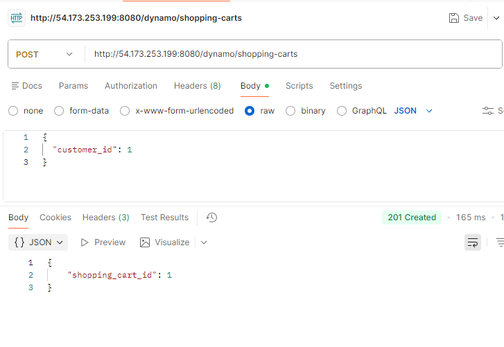

**Adding items** — POST /dynamo/shopping-carts/{id}/items returns 204 No Content:

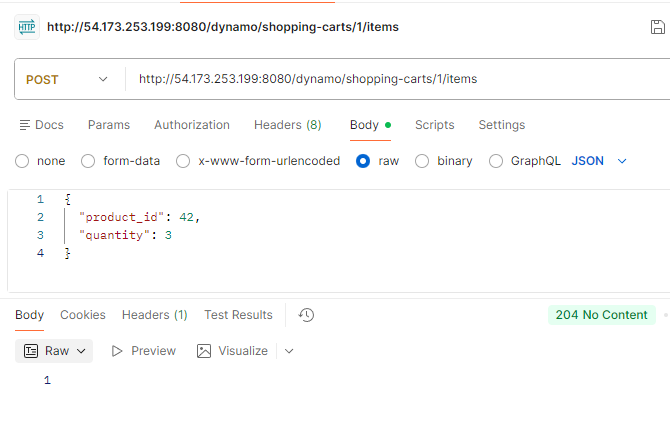

**Cart retrieval** — GET /dynamo/shopping-carts/{id} returns the full cart with embedded items:

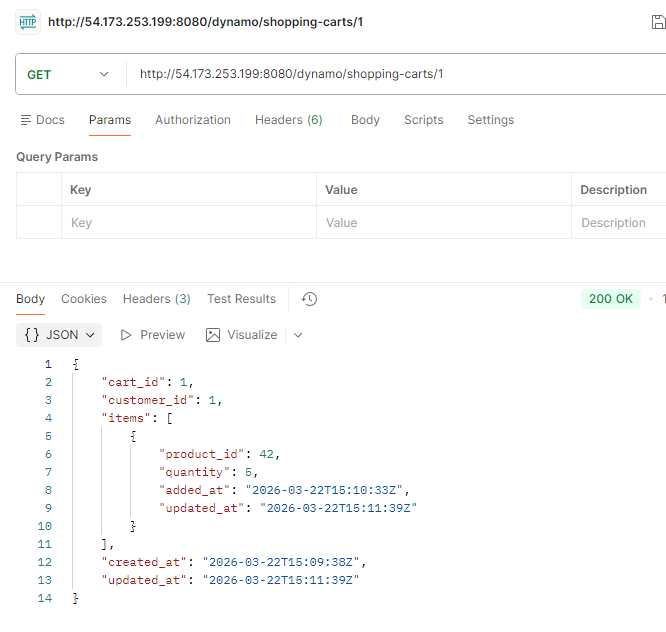

**Upsert behavior** — Adding the same product_id again increments the quantity (3 + 2 = 5):

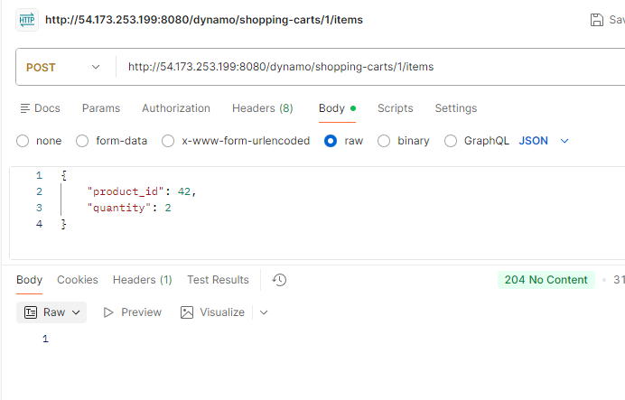

**Error handling** — GET for non-existent cart returns structured 404:

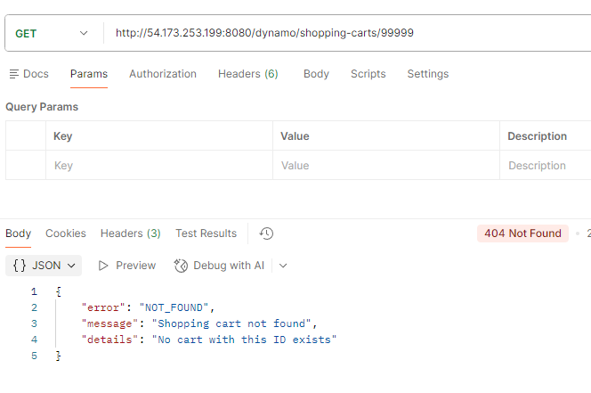

---

## 3. Performance Testing Results

### 3.1 150-Operation Test (DynamoDB)

The identical 150-operation test (50 create, 50 add items, 50 get cart) completed in 16.2 seconds with 150/150 success — well within the 5-minute window.

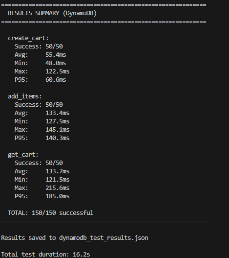

| Operation | Count | Avg (ms) | Min (ms) | Max (ms) | P50 (ms) | P95 (ms) | Std Dev |
|-----------|-------|----------|----------|----------|----------|----------|---------|
| create_cart | 50 | 55.43 | 47.98 | 122.50 | 54.42 | 60.64 | 10.30 |
| add_items | 50 | 133.38 | 127.53 | 145.05 | 132.61 | 140.33 | 3.56 |
| get_cart | 50 | 133.65 | 121.51 | 215.63 | 128.68 | 185.04 | 18.72 |

### 3.2 MySQL vs DynamoDB: Sequential Test Comparison

| Operation | MySQL Avg (ms) | DynamoDB Avg (ms) | Difference |
|-----------|---------------|-------------------|------------|
| create_cart | 42.93 | 55.43 | DynamoDB 29% slower |
| add_items | 127.86 | 133.38 | DynamoDB 4% slower |
| get_cart | 124.87 | 133.65 | DynamoDB 7% slower |

In the sequential test, DynamoDB was slightly slower across all operations. Cart creation was the largest gap — DynamoDB requires two operations (atomic counter UpdateItem + PutItem) versus MySQL's single INSERT. The add_items and get_cart operations were closer because both backends are dominated by network round-trip time (~40ms per call) in the sequential test (Python urllib, no keep-alive).

### 3.3 Locust Load Testing

**Light load (10 users):** DynamoDB handled 3,532 requests at 30.6 RPS with 0% failures. Create cart averaged 29.3ms (P95: 34ms), get cart averaged 22.38ms (P95: 25ms), and add items averaged 27.1ms (P95: 31ms). Performance was comparable to MySQL's 30.7 RPS at the same load level.

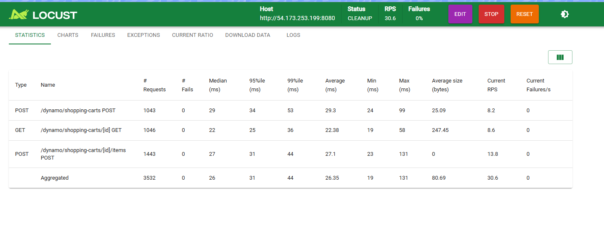
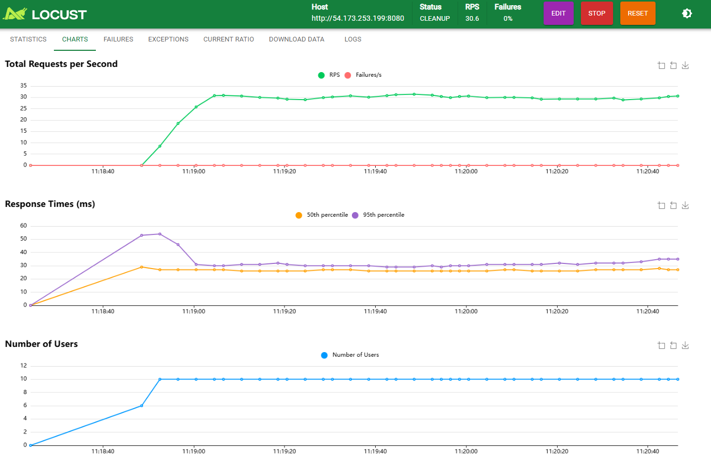

**Medium load (50 users):** Throughput scaled to 149.9 RPS across 17,529 total requests with 0% failures. Aggregated average was 26.95ms (P95: 32ms, P99: 45ms), nearly identical to the 10-user numbers. Maximum latency was 256ms. DynamoDB handled 50 concurrent users as gracefully as MySQL's 152.4 RPS at this level.

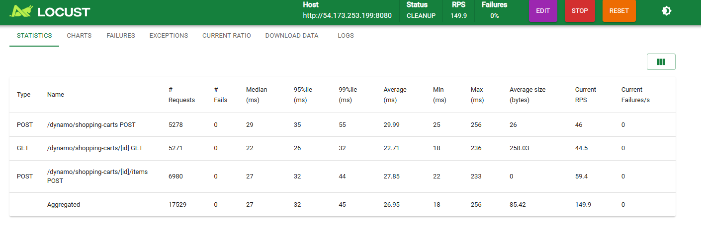
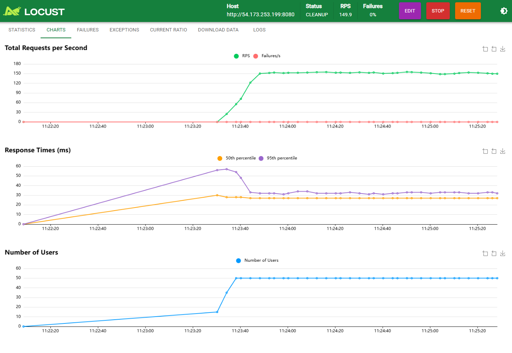

**Heavy load (100 users):** Here is where DynamoDB diverged dramatically from MySQL. Throughput dropped to 133.3 RPS (down from 149.9 at 50 users), while MySQL had scaled up to 302.8 RPS. The median response time jumped to 330ms, average to 370.72ms, P95 to 840ms, and P99 to 1,100ms. Maximum latency hit 1,616ms. All three endpoints suffered — create cart averaged 414.66ms, add items averaged 420.66ms, and get cart averaged 261.42ms.

The root cause is the **read-modify-write pattern** in the add-item operation. Each add requires a GetItem followed by a PutItem, and at 100 concurrent users, multiple requests for the same cart serialize against each other. Under MySQL, the `INSERT ... ON DUPLICATE KEY UPDATE` is atomic at the database level, so the server only makes one round-trip. Under DynamoDB, the application makes two sequential round-trips, and if two users update the same cart simultaneously, the condition expression can cause retries. This contention cascade explains why throughput actually decreased from 50 to 100 users.

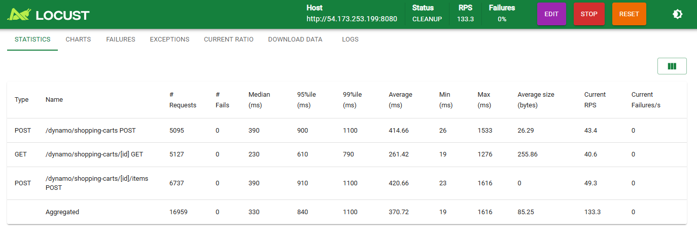
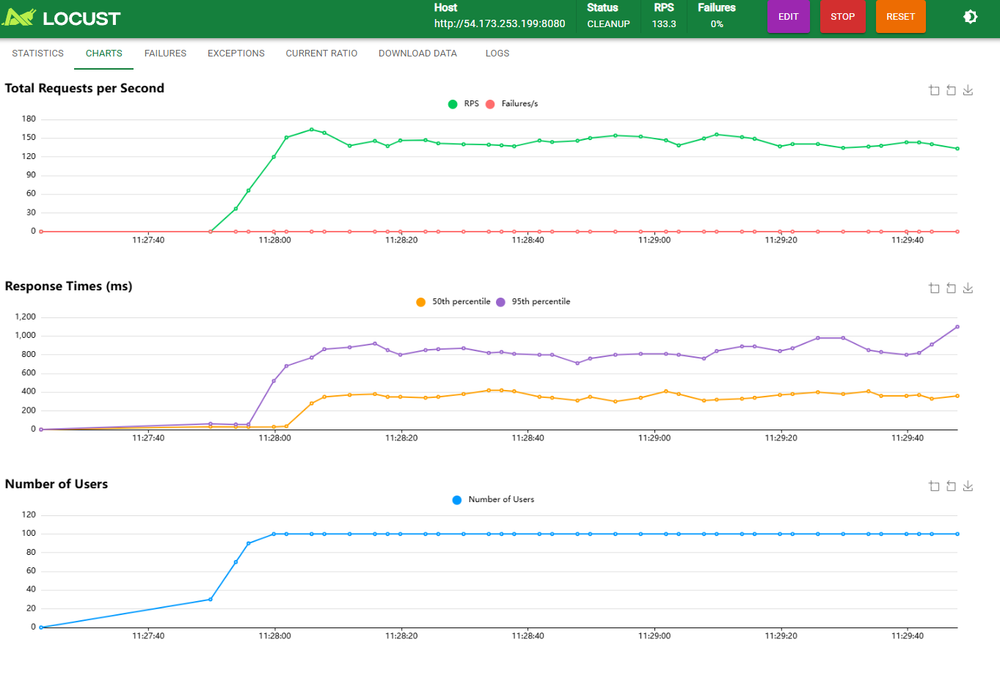

### 3.4 Locust Comparison: MySQL vs DynamoDB Under Load

| Metric | MySQL (10u) | DynamoDB (10u) | MySQL (50u) | DynamoDB (50u) | MySQL (100u) | DynamoDB (100u) |
|--------|------------|----------------|------------|----------------|-------------|-----------------|
| RPS | 30.7 | 30.6 | 152.4 | 149.9 | 302.8 | 133.3 |
| Avg (ms) | 21.44 | 26.35 | 22.98 | 26.95 | 45.98 | 370.72 |
| P95 (ms) | 25 | 31 | 26 | 32 | 31 | 840 |
| Max (ms) | 239 | 131 | 634 | 256 | 7,031 | 1,616 |
| Failures | 0% | 0% | 0% | 0% | 0% | 0% |

At low-to-medium load (10–50 users), DynamoDB and MySQL perform nearly identically. The divergence at 100 users is stark: MySQL scales to 302.8 RPS while DynamoDB drops to 133.3 RPS. However, DynamoDB's maximum latency (1.6s) is significantly better than MySQL's (7s) — DynamoDB's contention is distributed across many carts, while MySQL's worst-case comes from connection pool exhaustion affecting all requests.

---

## 4. Eventual Consistency Investigation

### 4.1 Test 1: Read-After-Write

I created 20 carts and immediately read each one with no delay between the write and read.

- **Found immediately:** 20/20 (100%)
- **Miss rate:** 0%
- **Typical pattern:** Create ~52ms → Read ~130ms, all reads returned the cart

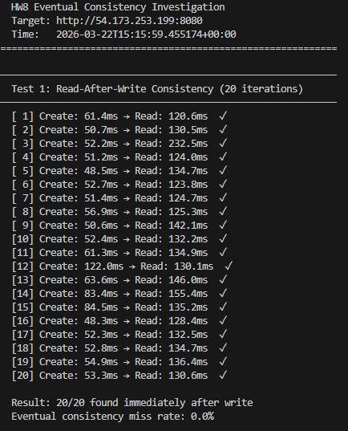

Despite using eventually consistent reads (`ConsistentRead: false`), every single cart was visible immediately after creation. DynamoDB's replication within a region is fast enough that the ~50ms create latency + ~50ms network transit time to start the read gives the replicas sufficient time to propagate.

### 4.2 Test 2: Add-Item-Then-Read

I added 20 unique products sequentially to a single cart and immediately read the cart after each add.

- **Items visible immediately:** 20/20 (100%)
- **Miss rate:** 0%
- **Typical pattern:** Add ~50ms → Read ~46ms, item count grew correctly from 1 to 20

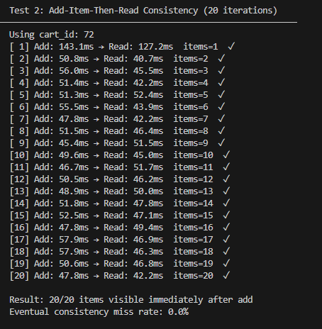

Again, no eventual consistency delays were observed. The read-modify-write pattern (GetItem + PutItem) in the add operation introduces enough latency (~50ms) that by the time the next read fires, the write has fully propagated.

### 4.3 Test 3: Rapid Sequential Updates

I fired 10 rapid `quantity += 1` updates to the same product in the same cart, then checked the final quantity.

- **Expected quantity:** 10
- **Actual quantity:** 10
- **Updates lost:** 0

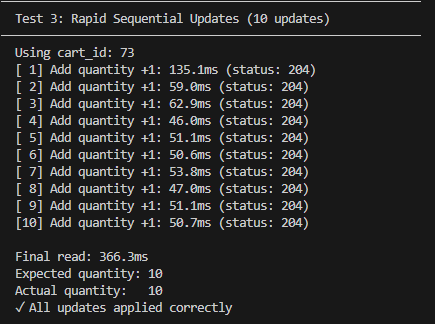

No updates were lost because the test was sequential (each add waited for the previous one to complete). In a truly concurrent scenario (parallel goroutines or multiple clients), the read-modify-write pattern could lose updates because two concurrent reads would both see quantity=N, both increment to N+1, and the second PutItem would overwrite the first — resulting in quantity=N+1 instead of N+2. My sequential test doesn't trigger this race condition.

### 4.4 Consistency Analysis

In all 50 consistency test iterations (20 + 20 + 10), eventual consistency was never observed. This aligns with DynamoDB's real-world behavior — within a single region, replication typically completes in single-digit milliseconds. The "eventual" in eventual consistency means there is no *guarantee* of immediate visibility, but in practice, the delay is shorter than the network round-trip from the application to DynamoDB. For the shopping cart use case, eventual consistency is a non-issue: a user who adds an item and immediately views their cart will always see the updated item because the human + browser latency (100ms+) far exceeds DynamoDB's replication delay.

The real consistency risk is not eventual reads but **lost updates** from concurrent read-modify-write cycles. This would require using DynamoDB's `UpdateItem` with `SET items = list_append(items, :new_item)` for atomic list operations, or implementing optimistic concurrency control with version numbers.

---

## 5. CloudWatch Monitoring

### 5.1 DynamoDB Metrics

**SuccessfulRequestLatency:** The DynamoDB-side latency confirms that the service itself is fast. GetItem peaked at ~22ms, PutItem peaked at ~10ms, and UpdateItem (the atomic counter) peaked at ~26ms. The discrepancy between DynamoDB's internal latency (10–26ms) and the end-to-end response time (130ms) is network overhead: ECS → DynamoDB endpoint → DynamoDB processing → response back to ECS → JSON serialization → response to client.

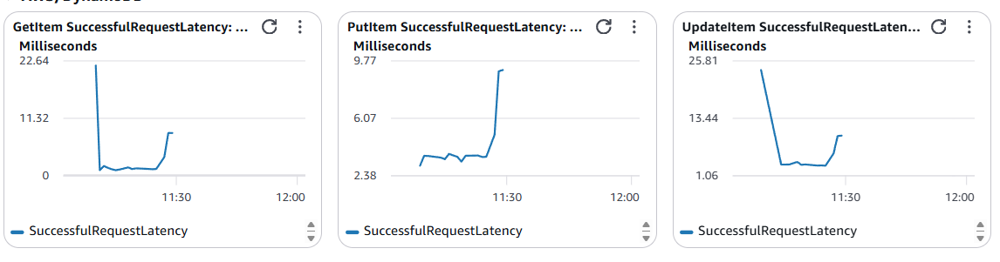

**Consumed Capacity:** ConsumedReadCapacityUnits peaked at ~3.24K during the heavy-load test, while ConsumedWriteCapacityUnits peaked at ~9.17K. The write-heavy pattern (each add-item does GetItem + PutItem, each create does UpdateItem + PutItem) explains the ~3:1 write-to-read ratio. ProvisionedReadCapacityUnits shows no data because the table uses on-demand billing — there is no provisioned capacity to display. No throttling events were observed.

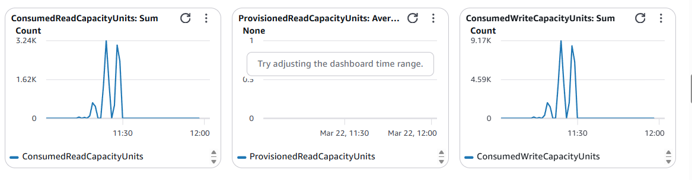

### 5.2 DynamoDB-Specific Capacity Metrics

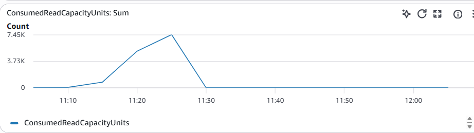
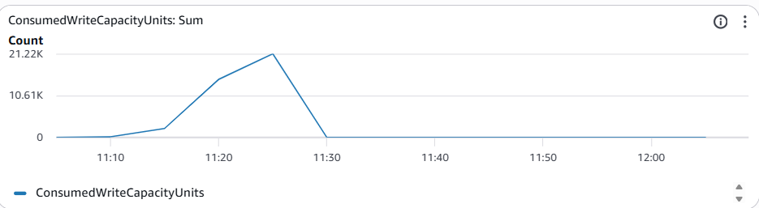

### 5.3 ECS Metrics

The ECS task showed a CPU spike to ~46.3% during the heavy-load test, very similar to the Step I MySQL pattern (~48.3%). Memory stayed flat at ~2.6%. The comparable CPU profiles confirm that the Go server's compute cost is similar regardless of backend — the work is in HTTP handling, JSON serialization, and SDK marshaling, not in the database operations themselves. The performance difference between MySQL and DynamoDB at high concurrency is driven by the number of network round-trips per operation, not by compute cost.

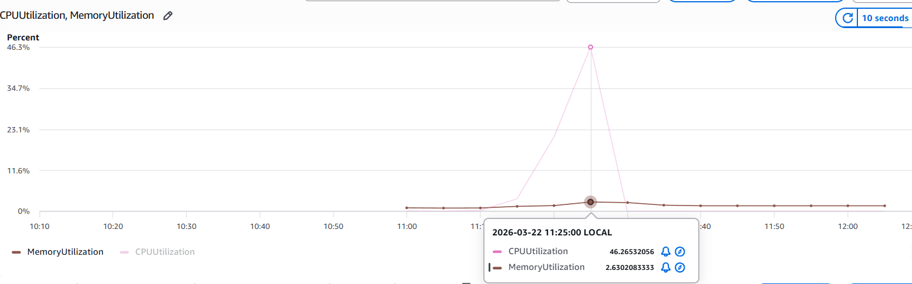

---

## 6. Key Challenges and Learning

**DynamoDB attribute value format:** DynamoDB doesn't store raw JSON — every value is wrapped in a type descriptor (`{"N": "42"}`, `{"S": "hello"}`, `{"L": [...]}`). The AWS SDK v2's `attributevalue.MarshalMap` and `UnmarshalMap` handle this transparently in Go, but it was initially confusing to see the raw format in the DynamoDB console versus the clean Go structs in application code.

**AWS SDK version resolution:** My initial `go.mod` pinned AWS SDK versions that didn't exist yet in the module registry, causing `go mod tidy` to fail with "unknown revision" errors. The fix was stripping the SDK from `go.mod` and using `go get ...@latest` to let Go resolve the actual latest versions. This is a common pitfall with Go modules — always let the toolchain resolve versions rather than guessing.

**Read-modify-write serialization at scale:** The most important finding was that DynamoDB throughput *decreased* from 149.9 RPS at 50 users to 133.3 RPS at 100 users. This is the opposite of what you'd expect from a "infinitely scalable" NoSQL service. The bottleneck isn't DynamoDB itself — it's the application-level read-modify-write pattern. Each add-item requires GetItem + PutItem sequentially, and under high concurrency, many goroutines are waiting on these two-step operations simultaneously. MySQL avoids this because `INSERT ... ON DUPLICATE KEY UPDATE` is a single atomic operation at the database level. The lesson: DynamoDB scales horizontally across partitions, but it doesn't help if your access pattern serializes on a single item.

**Eventual consistency was invisible:** Across 50 consistency test iterations, I never once observed a stale read. DynamoDB's within-region replication is fast enough that eventual consistency is a theoretical concern rather than a practical one for the shopping cart use case. The real consistency risk is lost updates from concurrent writes, not stale reads.

**DynamoDB vs MySQL: not "better or worse" but "different tradeoffs":**

| Strength | MySQL | DynamoDB |
|----------|-------|----------|
| Atomic multi-field updates | ✓ (transactions) | ✗ (read-modify-write) |
| Complex queries | ✓ (JOINs, GROUP BY) | ✗ (single-item access only) |
| Zero-config scaling | ✗ (capacity planning) | ✓ (on-demand, auto-partition) |
| Predictable low-load latency | ✓ (~20ms median) | ✓ (~22ms median) |
| High-concurrency throughput | ✓ (302.8 RPS @ 100u) | ✗ (133.3 RPS @ 100u) |
| Tail latency at high load | ✗ (7s max) | ✓ (1.6s max) |
| Operational overhead | ✗ (RDS provisioning, backups) | ✓ (fully managed, instant) |

**What I would do differently:** For production, I would replace the read-modify-write add-item pattern with DynamoDB's `UpdateItem` using `SET items = list_append(items, :new_item)` for atomic list operations. For updating an existing item's quantity, I would switch to a composite key design (`cart_id` PK, `product_id` SK) which allows atomic `UpdateItem SET quantity = quantity + :inc` without reading first. I would also switch from sequential integer IDs to UUIDs to eliminate the counter hot key. These changes would likely close the performance gap with MySQL at high concurrency.
