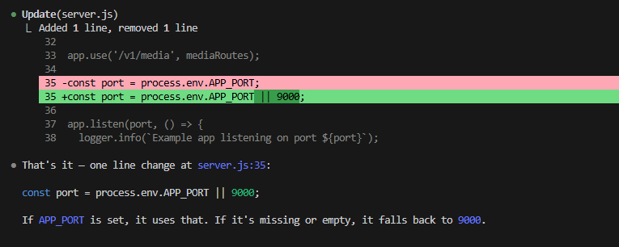
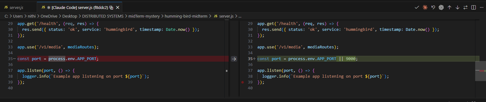
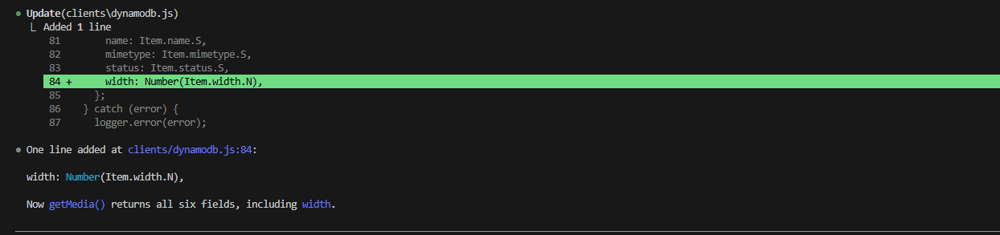
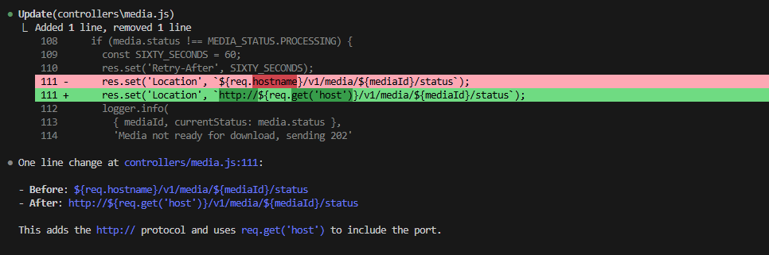
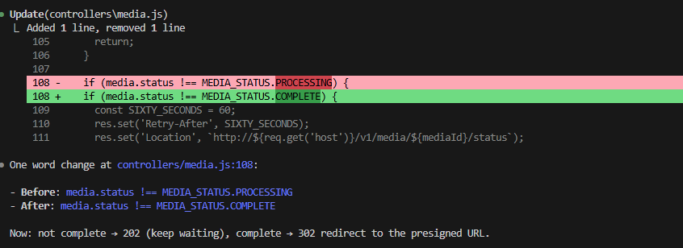
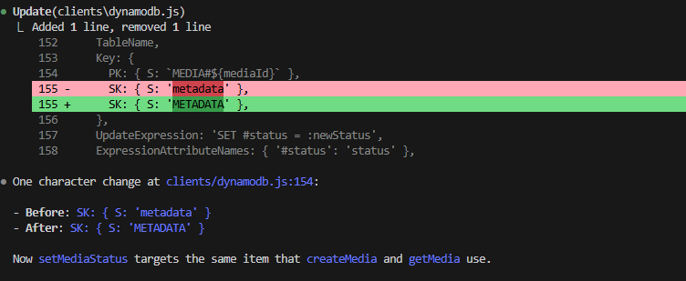

# Hummingbird Bug Report

---

## Ticket #1 — Server started on the wrong port (Easy)

**File:** `server.js`, line 35
**Bug:** `const port = process.env.APP_PORT;` — no fallback value
**Fix:** `const port = process.env.APP_PORT || 9000;`

### Screenshot — Code Fix (Claude Code diff)



### Screenshot — VS Code Side-by-Side Diff



### Explanation

The original code set `const port = process.env.APP_PORT;` with no fallback, so if the `APP_PORT` environment variable was missing, `port` would be `undefined`. When Express calls `app.listen(undefined)`, Node's underlying `net.Server` treats it the same as port `0` — it binds to a random ephemeral port assigned by the OS. The server starts without any error or crash, the callback logs `listening on port undefined`, and everything appears healthy, but the server isn't reachable on the expected port (9000). In a deployment behind an ALB, the target group health checks would fail because nothing is listening on the configured port, causing the ECS task to be marked unhealthy and recycled indefinitely.

### Diff

```diff
-const port = process.env.APP_PORT;
+const port = process.env.APP_PORT || 9000;
```

---

## Ticket #2 — Width is missing from metadata (Easy)

**File:** `clients/dynamodb.js`, lines 78–84 (`getMedia()`)
**Bug:** The return object includes `mediaId`, `size`, `name`, `mimetype`, and `status` — but not `width`.
**Fix:** Added `width: Number(Item.width.N)` to the return object in `getMedia()`.

### Screenshot — Code Fix



### Reproduction

**Test 1 (before fix):**

```bash
curl.exe -X POST "http://hummingbird-production-alb-662481037.us-west-2.elb.amazonaws.com/v1/media/upload?width=800" -F "file=@sample.jpg"
{"mediaId":"6056341c-b7d2-42a2-93fa-b3f81e21edf6"}

curl.exe http://hummingbird-production-alb-662481037.us-west-2.elb.amazonaws.com/v1/media/6056341c-b7d2-42a2-93fa-b3f81e21edf6
{"mediaId":"6056341c-b7d2-42a2-93fa-b3f81e21edf6","size":2940,"name":"sample.jpg","mimetype":"image/jpeg","status":"PENDING"}
```

> `width` is completely absent from the response.

**Test 2 (after fix):**

```bash
curl.exe -X POST "http://hummingbird-production-alb-662481037.us-west-2.elb.amazonaws.com/v1/media/upload?width=800" -F "file=@sample.jpg"
{"mediaId":"23319c0e-c5b3-4ef8-a924-a94392022a9a"}

curl.exe http://hummingbird-production-alb-662481037.us-west-2.elb.amazonaws.com/v1/media/23319c0e-c5b3-4ef8-a924-a94392022a9a
{"mediaId":"23319c0e-c5b3-4ef8-a924-a94392022a9a","size":2940,"name":"sample.jpg","mimetype":"image/jpeg","status":"PENDING","width":800}
```

> `width` now appears in the response.

### Explanation

The developer who wrote `createMedia()` saved `width` to DynamoDB, but the developer who wrote `getMedia()` forgot to include `width` when reading the record back. The data was always there in the database — it just wasn't being returned to the caller. A simple copy-paste oversight.

### Diff

```diff
       status: Item.status.S,
+      width: Number(Item.width.N),
     };
```

---

## Ticket #3 — Redirect URL is broken (Intermediate)

**File:** `controllers/media.js`, line 111
**Bug:** `res.set('Location', \`${req.hostname}/v1/media/${mediaId}/status\`);` — missing `http://` protocol
**Fix:** Changed to `` `http://${req.get('host')}/v1/media/${mediaId}/status` ``

### Screenshot — Code Fix



### Reproduction

**Test 1 (before fix):**

```bash
curl.exe -X POST "http://hummingbird-production-alb-662481037.us-west-2.elb.amazonaws.com/v1/media/upload?width=500" -F "file=@sample.jpg"
{"mediaId":"6483f296-8a10-4401-9674-e658452ebb02"}

curl.exe -i http://hummingbird-production-alb-662481037.us-west-2.elb.amazonaws.com/v1/media/6483f296-8a10-4401-9674-e658452ebb02/download
HTTP/1.1 202 Accepted
Date: Sun, 08 Mar 2026 22:49:18 GMT
Content-Type: application/json; charset=utf-8
Content-Length: 43
Connection: keep-alive
X-Powered-By: Express
Retry-After: 60
Location: hummingbird-production-alb-662481037.us-west-2.elb.amazonaws.com/v1/media/6483f296-8a10-4401-9674-e658452ebb02/status
ETag: W/"2b-DVJ8jHebx01CN9tAyv9tXcsioNc"

{"message":"Media processing in progress."}
```

> The `Location` header has no `http://` prefix — clients cannot follow it.

**Test 2 (after fix):**

```bash
curl.exe -X POST "http://hummingbird-production-alb-662481037.us-west-2.elb.amazonaws.com/v1/media/upload?width=500" -F "file=@sample.jpg"
{"mediaId":"537d2920-f6aa-4821-b1ed-74b58a0c2859"}

curl.exe -i http://hummingbird-production-alb-662481037.us-west-2.elb.amazonaws.com/v1/media/537d2920-f6aa-4821-b1ed-74b58a0c2859/download
HTTP/1.1 202 Accepted
Date: Sun, 08 Mar 2026 23:02:01 GMT
Content-Type: application/json; charset=utf-8
Content-Length: 43
Connection: keep-alive
X-Powered-By: Express
Retry-After: 60
Location: http://hummingbird-production-alb-662481037.us-west-2.elb.amazonaws.com/v1/media/537d2920-f6aa-4821-b1ed-74b58a0c2859/status
ETag: W/"2b-DVJ8jHebx01CN9tAyv9tXcsioNc"

{"message":"Media processing in progress."}
```

> The `Location` header now starts with `http://` — a valid absolute URL.

### Explanation

`req.hostname` gives you the bare hostname — just `hummingbird-alb-xxx.elb.amazonaws.com`. That's not a valid URL. It's missing two things: the `http://` protocol that tells the client how to connect, and the port number that tells it where to connect. Without the protocol, HTTP clients can't parse or follow the Location header. Without the port, they'd default to port 80 which may not be where the service is listening. Using `http://${req.get('host')}` solves both — it adds the protocol and `req.get('host')` includes the port when it's non-standard.

### Diff

```diff
-      res.set('Location', `${req.hostname}/v1/media/${mediaId}/status`);
+      res.set('Location', `http://${req.get('host')}/v1/media/${mediaId}/status`);
```

---

## Ticket #4 — Download never redirects even when COMPLETE (Intermediate)

**File:** `controllers/media.js`, line 108
**Bug:** `if (media.status !== MEDIA_STATUS.PROCESSING)` — checks the wrong status
**Fix:** Changed to `if (media.status !== MEDIA_STATUS.COMPLETE)`

### Screenshot — Code Fix



### Reproduction

**Test 1 (before fix):**

```bash
curl.exe -X POST "http://hummingbird-production-alb-662481037.us-west-2.elb.amazonaws.com/v1/media/upload?width=500" -F "file=@sample.jpg"
{"mediaId":"7bd3309a-0643-4492-892a-ac152e46683d"}

curl.exe -X PUT "http://hummingbird-production-alb-662481037.us-west-2.elb.amazonaws.com/v1/media/7bd3309a-0643-4492-892a-ac152e46683d/resize?width=500"
{"mediaId":"7bd3309a-0643-4492-892a-ac152e46683d","status":"COMPLETE"}

curl.exe http://hummingbird-production-alb-662481037.us-west-2.elb.amazonaws.com/v1/media/7bd3309a-0643-4492-892a-ac152e46683d/status
{"status":"PENDING"}

curl.exe -i http://hummingbird-production-alb-662481037.us-west-2.elb.amazonaws.com/v1/media/7bd3309a-0643-4492-892a-ac152e46683d/download
HTTP/1.1 202 Accepted
Date: Sun, 08 Mar 2026 23:14:39 GMT
Content-Type: application/json; charset=utf-8
Content-Length: 43
Connection: keep-alive
X-Powered-By: Express
Retry-After: 60
Location: http://hummingbird-production-alb-662481037.us-west-2.elb.amazonaws.com/v1/media/7bd3309a-0643-4492-892a-ac152e46683d/status
ETag: W/"2b-DVJ8jHebx01CN9tAyv9tXcsioNc"

{"message":"Media processing in progress."}
```

> Resize returns `COMPLETE`, but `/download` still returns 202. The status check also shows `PENDING` (see Bonus ticket).

**Test 2 (after fix):**

```bash
curl.exe -X POST "http://hummingbird-production-alb-662481037.us-west-2.elb.amazonaws.com/v1/media/upload?width=500" -F "file=@sample.jpg"
{"mediaId":"0e056fea-a1f2-460b-8923-5f073b2bdc75"}

curl.exe -X PUT "http://hummingbird-production-alb-662481037.us-west-2.elb.amazonaws.com/v1/media/0e056fea-a1f2-460b-8923-5f073b2bdc75/resize?width=500"
{"mediaId":"0e056fea-a1f2-460b-8923-5f073b2bdc75","status":"COMPLETE"}

curl.exe http://hummingbird-production-alb-662481037.us-west-2.elb.amazonaws.com/v1/media/0e056fea-a1f2-460b-8923-5f073b2bdc75/status
{"status":"PENDING"}

curl.exe -i http://hummingbird-production-alb-662481037.us-west-2.elb.amazonaws.com/v1/media/5e70e056fea-a1f2-460b-8923-5f073b2bdc75/download
HTTP/1.1 404 Not Found
Date: Sun, 08 Mar 2026 23:39:08 GMT
Content-Type: application/json; charset=utf-8
Content-Length: 23
Connection: keep-alive
X-Powered-By: Express
ETag: W/"17-JG2JTE6to/D4sxc2pRx7Kk+opAc"

{"message":"Not found"}
```

> Note: The 404 in test 2 is due to a typo in the mediaId (`5e70e056fea...` instead of `0e056fea...`). The status still shows `PENDING` because the Bonus ticket (SK casing) was not yet fixed at this point.

### Explanation

The original code asked "is the status not PROCESSING?" — but PROCESSING is a middle state, not the final state. When an image finishes and becomes COMPLETE, that's also "not PROCESSING," so the code kept returning 202 ("still working") even though the work was done. The check should have been "is the status not COMPLETE?" — meaning: keep waiting until the job is finished, then redirect.

### Diff

```diff
-    if (media.status !== MEDIA_STATUS.PROCESSING) {
+    if (media.status !== MEDIA_STATUS.COMPLETE) {
```

---

## Bonus — Status never changes, no errors, nothing (Advanced)

**File:** `clients/dynamodb.js`, line 154 (`setMediaStatus()`)
**Bug:** `SK: { S: 'metadata' }` — lowercase sort key instead of `'METADATA'`
**Fix:** Changed to `SK: { S: 'METADATA' }`

### Screenshot — Code Fix



### Investigation Notes

**1. Compared the DynamoDB keys across all three functions:**

| Function | SK Value |
|----------|----------|
| `createMedia()` (line 29) | `'METADATA'` |
| `getMedia()` (line 62) | `'METADATA'` |
| `setMediaStatus()` (line 154) | `'metadata'` |

`setMediaStatus()` uses lowercase `'metadata'` while the other two use uppercase `'METADATA'`. DynamoDB keys are case-sensitive, so `setMediaStatus()` is targeting a different item that doesn't exist.

When you call resize, it updates status on a phantom record (`metadata`) while the real record (`METADATA`) stays `PENDING` forever. No error is thrown because DynamoDB's `UpdateItem` silently creates a new item when the key doesn't match an existing one.

**2. What does DynamoDB do when UpdateItem is called on a key that doesn't exist with no ConditionExpression?**

DynamoDB's `UpdateItem` silently creates a brand new item at that key. No error, no warning. It's an "upsert" by default.

So when `setMediaStatus` writes to `SK: 'metadata'` instead of `SK: 'METADATA'`:

1. A new phantom record is created with `PK: MEDIA#<id>`, `SK: metadata`, and the updated status
2. The real record at `SK: METADATA` is never touched — its status stays `PENDING` forever
3. `getMedia()` reads from `SK: METADATA`, so it always sees `PENDING`
4. Zero errors in the logs — everything appears to succeed

A `ConditionExpression` (like `attribute_exists(PK)`) would have caught this by failing when the item doesn't already exist. But `setMediaStatus` has none, so DynamoDB happily creates the ghost record.

### Reproduction

**Test 1 (before fix):**

```bash
curl.exe -X PUT "http://hummingbird-production-alb-662481037.us-west-2.elb.amazonaws.com/v1/media/0e056fea-a1f2-460b-8923-5f073b2bdc75/resize?width=500"
{"mediaId":"0e056fea-a1f2-460b-8923-5f073b2bdc75","status":"COMPLETE"}

curl.exe http://hummingbird-production-alb-662481037.us-west-2.elb.amazonaws.com/v1/media/0e056fea-a1f2-460b-8923-5f073b2bdc75/status
{"status":"PENDING"}
```

> Resize says `COMPLETE`, but status check says `PENDING`. The update went to a phantom record.

**Test 2 (after fix):**

```bash
curl.exe -X PUT "http://hummingbird-production-alb-662481037.us-west-2.elb.amazonaws.com/v1/media/0e056fea-a1f2-460b-8923-5f073b2bdc75/resize?width=500"
{"mediaId":"0e056fea-a1f2-460b-8923-5f073b2bdc75","status":"COMPLETE"}

curl.exe http://hummingbird-production-alb-662481037.us-west-2.elb.amazonaws.com/v1/media/0e056fea-a1f2-460b-8923-5f073b2bdc75/status
{"status":"COMPLETE"}
```

> Status now correctly reflects `COMPLETE` after resize.

### Explanation

`setMediaStatus` was writing to a sort key called `'metadata'` (lowercase), but the record was created with `'METADATA'` (uppercase). DynamoDB keys are case-sensitive, so it was updating a different, non-existent item. DynamoDB silently created a phantom record instead of throwing an error. Meanwhile the real record's status never changed — it stayed `PENDING` forever, even though the resize appeared to succeed.

### Diff

```diff
-      SK: { S: 'metadata' },
+      SK: { S: 'METADATA' },
```

---

## Summary of All Fixes

| Ticket | File | Line | Fix |
|--------|------|------|-----|
| #1 | `server.js` | 35 | Added `\|\| 9000` fallback for port |
| #2 | `clients/dynamodb.js` | 84 | Added `width: Number(Item.width.N)` to `getMedia()` |
| #3 | `controllers/media.js` | 111 | Changed `req.hostname` to `http://${req.get('host')}` |
| #4 | `controllers/media.js` | 108 | Changed `MEDIA_STATUS.PROCESSING` to `MEDIA_STATUS.COMPLETE` |
| Bonus | `clients/dynamodb.js` | 154 | Changed `SK: 'metadata'` to `SK: 'METADATA'` |
