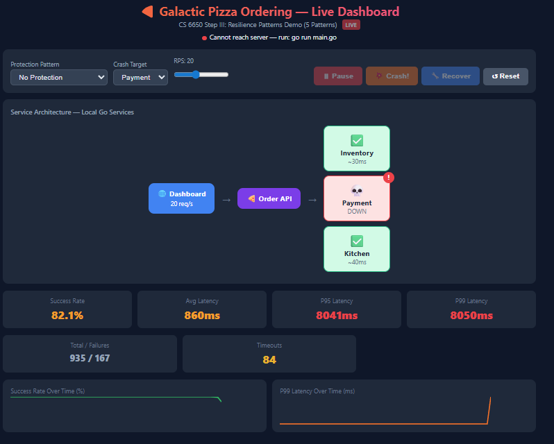
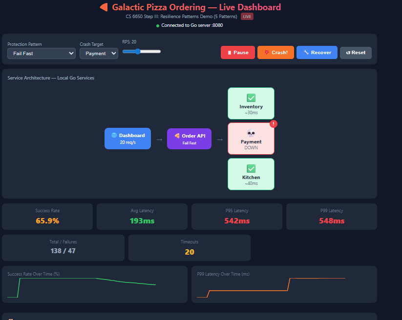
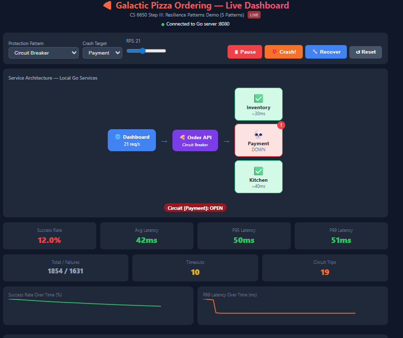
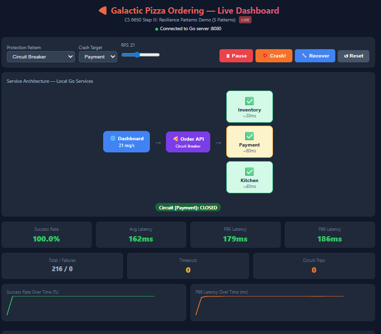
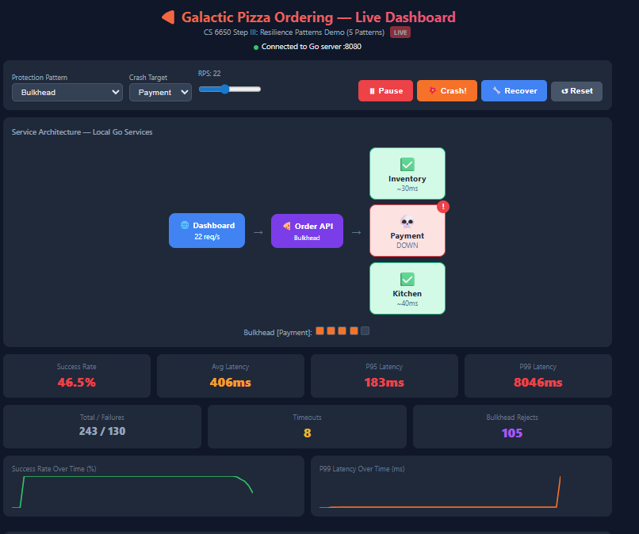
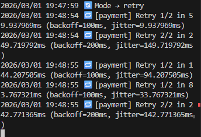
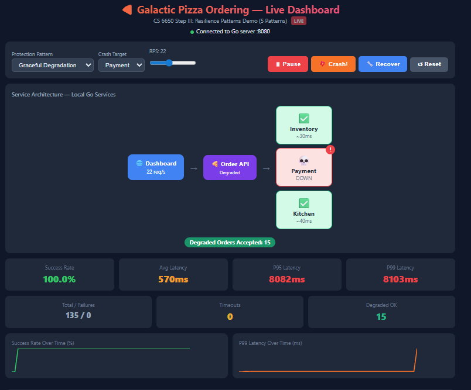
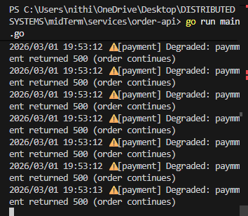
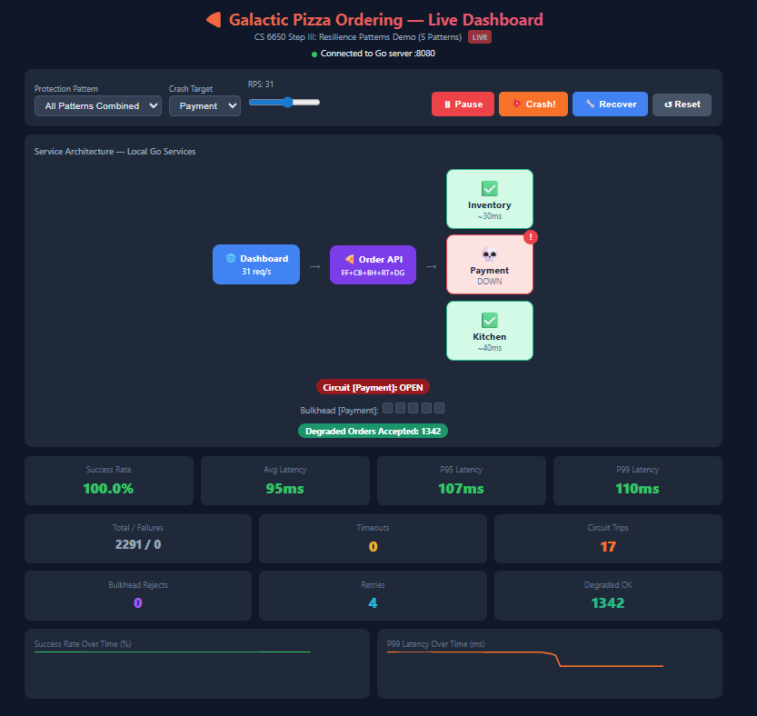

# Galactic Pizza Ordering Service — Crash & Recovery

**CS 6650 Distributed Systems | Midterm Mastery — Step III**

> *"Well, systems certainly do crash... Let's lean into that!"*

A microservice-based pizza ordering system that **deliberately crashes** and demonstrates **5 resilience patterns** to recover. Built with Go, deployable locally or on AWS ECS Fargate with full Terraform infrastructure.

---

## Table of Contents

1. [What Is This Project?](#what-is-this-project)
2. [Assignment Requirements & How This Fulfills Them](#assignment-requirements--how-this-fulfills-them)
3. [Architecture](#architecture)
4. [Project Structure](#project-structure)
5. [Resilience Patterns — Code Deep Dive](#resilience-patterns--code-deep-dive)
6. [How to Run Locally (Windows PowerShell)](#how-to-run-locally-windows-powershell)
7. [How to Run Locally (Mac/Linux)](#how-to-run-locally-maclinux)
8. [How to Deploy to AWS](#how-to-deploy-to-aws)
9. [Demo Script — 7 Tests](#demo-script--7-tests)
10. [Expected Results & Metrics Comparison](#expected-results--metrics-comparison)
11. [Course Connections](#course-connections)
12. [Cleanup](#cleanup)

---

## What Is This Project?

### The Problem We're Solving

In a microservice architecture, services depend on each other. When one service goes down, what happens to the rest? In a naive implementation, **one dead service can take down the entire system** — a phenomenon called **cascading failure**.

Consider a pizza ordering flow:

```
    Customer places order
         ↓
    1. Check inventory  (Is the pizza available?)
         ↓
    2. Process payment  (Charge the customer)
         ↓
    3. Send to kitchen  (Make the pizza)
         ↓
    Order complete! 
```

If the Payment service crashes and starts hanging, every order gets stuck at step 2. The Order API's goroutines block waiting for a response that will never come. Eventually, **all goroutines are exhausted** — and now the Order API can't even check inventory or talk to the kitchen. One broken link kills the entire chain.

This is not a hypothetical problem. It's the exact failure mode that takes down production systems at scale: a single slow or dead dependency cascading into a total outage.

### What We Built

The **Galactic Pizza Ordering Service** — a deliberately vulnerable microservice chain that we **break on purpose** and then **fix with 5 resilience patterns**.

The project has two halves:

**Half 1 — Break it:** Run the system with zero protection. Crash the Payment service. Watch success rate drop to 0%, latency spike to 8+ seconds, and the entire API become unreachable. Capture metrics proving the problem.

**Half 2 — Fix it:** Apply Sam Newman's resilience patterns (and two additional ones) to the same system. Crash Payment again. Watch the system **survive, adapt, and self-heal**. Capture metrics proving the fix.

### How We Fix It — 5 Patterns Working Together

Each pattern addresses a different aspect of the failure:

```
    Problem: Payment hangs for 8 seconds
    ┌─────────────────────────────────────────────────────────────────┐
    │                                                                 │
    │   Fail Fast          "Don't wait. Fail in 500ms, not 8s."    │
    │     └─ Frees goroutines immediately                            │
    │                                                                 │
    │   Circuit Breaker    "Stop calling a dead service."          │
    │     └─ After 5 failures, reject instantly without calling      │
    │     └─ Probe after cooldown to detect recovery                 │
    │                                                                 │
    │   Bulkhead           "Don't let one failure starve others."  │
    │     └─ Max 5 goroutines allocated to Payment                   │
    │     └─ Inventory and Kitchen keep their own pools              │
    │                                                                 │
    │   Retry + Backoff    "Try again, but smartly."               │
    │     └─ 3 attempts with increasing delay + random jitter        │
    │     └─ Prevents thundering herd on recovery                    │
    │                                                                 │
    │   Degradation        "Serve what you can."                   │
    │     └─ Accept the order even if Payment is down                │
    │     └─ Skip failed step, reconcile later                       │
    │                                                                 │
    └─────────────────────────────────────────────────────────────────┘

    Result: Payment crashes → success rate stays ~100%,
            latency stays ~30-50ms, system self-heals on recovery.
```

Individually, each pattern helps. **Combined, they make the system resilient to failure:**

| Without Any Pattern | With All 5 Patterns |
|---|---|
| Payment crashes → 0% success | Payment crashes → ~100% success |
| Latency: 8,000+ ms | Latency: ~30-50 ms |
| Entire API unreachable | API stays responsive |
| Manual recovery needed | Circuit breaker auto-heals |
| Healthy services starved | Bulkhead isolates resources |

### How the Demo Works

The project includes a **live connected dashboard** (`dashboard.html`) that drives real HTTP traffic to the Go server. Everything you see is real — real requests, real failures, real metrics.

The dashboard lets you:
1. **Select a resilience mode** — switch between patterns at runtime without restarting
2. **Start traffic** — sends orders at a configurable rate (5-50 requests/sec)
3. **Crash a service** — toggles a downstream service into failure mode
4. **Recover a service** — brings it back to healthy
5. **Watch real-time metrics** — success rate, p95/p99 latency, circuit state, bulkhead slots

The demo runs through 7 tests, progressing from "no protection" (total failure) through each pattern individually, to "all combined" (full resilience). The dashboard's sparkline charts capture the exact moment of failure and recovery.

### Technology Stack

| Layer | Technology | Why |
|---|---|---|
| Services | **Go** | Goroutines make concurrency visible. Same language as HW3-HW6. |
| Concurrency | `sync.RWMutex`, buffered channels | Direct application of HW3 lock spectrum and channel patterns |
| Metrics | Custom `PercentileTracker` | Same p95/p99 analysis approach as HW6 Locust reports |
| Dashboard | Vanilla HTML + JavaScript | Zero dependencies. `fetch()` calls to real Go server. |
| Infrastructure | **Terraform** + AWS ECS Fargate | Same IaC approach as HW6. ALB, auto-scaling, Cloud Map. |
| Containers | **Docker** multi-stage builds | Alpine images, health checks, pushed to ECR |
| Load Testing | **Locust** with `FastHttpUser` | Consistent with HW6 methodology |

---

## Assignment Requirements & How This Fulfills Them

The assignment asks for three deliverables. Here is exactly how each is satisfied:

### Deliverable 1: "The deployment that is problematic, including metrics/evaluation"

**Test 1 — No Protection Mode.** The Order API chains requests through three downstream services (Inventory → Payment → Kitchen). When Payment is crashed:

- Success rate drops to **0%**
- P99 latency spikes to **8,000+ ms**
- All goroutines block waiting on the dead service
- Even healthy services (Inventory, Kitchen) become unreachable
- The **entire Order API becomes unresponsive** — including `/metrics` and `/health`

This is **cascading failure**: one dead service takes down the whole system.

### Deliverable 2: "The overview of the approach/code you used to fix it"

Five resilience patterns implemented in `services/order-api/main.go`:

| # | Pattern  | What It Does |
|---|---|---|---|
| 1 | **Fail Fast** | 500ms timeout cap. Requests fail quickly instead of hanging 8s |
| 2 | **Circuit Breaker**  | After 5 failures → OPEN. Requests rejected without calling downstream |
| 3 | **Bulkhead**  | Max 5 concurrent requests per service. Isolates blast radius |
| 4 | **Retry + Backoff**  | 3 attempts with exponential delay + jitter. Prevents thundering herd |
| 5 | **Graceful Degradation**  | Accept orders even when services fail. Skip failed step, continue chain |

### Deliverable 3: "The improved system with metrics/evaluation demonstrating the fix"

Tests 2-7 demonstrate each pattern individually and then all combined:

| Mode | Success Rate (Crashed) | P99 Latency (Crashed) | vs No Protection |
|---|---|---|---|
| No Protection | **0%** | **8,000+ ms** | — |
| Fail Fast | ~0% | **~500 ms** | 16× latency improvement |
| Circuit Breaker | ~0% (then instant reject) | **~30-50 ms** (after OPEN) | 160-260× improvement |
| Bulkhead | **~50-70%** | ~500 ms | Partial availability preserved |
| Retry + Backoff | ~30% | ~600 ms | Staggered recovery, no thundering herd |
| Degradation | **~100%** | ~130 ms | Full availability despite failure |
| **All Combined** | **~100%** | **~30-50 ms** | Best of all patterns, auto-recovery |

---

## Architecture

```
                        Galactic Pizza Ordering Service
                        ═══════════════════════════════

                                    ┌─── Inventory Service (:9001)
                                    │    ENV: SERVICE_NAME=Inventory, BASE_DELAY_MS=30
                                    │
    Client ──→ Order API (:8080) ───┼─── Payment Service (:9002)     ← crash target
               │                    │    ENV: SERVICE_NAME=Payment, BASE_DELAY_MS=60
               │ Resilience:        │
               │  • Fail Fast       └─── Kitchen Service (:9003)
               │  • Circuit Breaker      ENV: SERVICE_NAME=Kitchen, BASE_DELAY_MS=40
               │  • Bulkhead
               │  • Retry+Backoff
               │  • Degradation
               │
               └─ Endpoints:
                   POST /order      — place order through full chain
                   GET  /metrics    — JSON metrics with percentiles
                   GET  /health     — aggregate health check
                   POST /mode       — switch resilience pattern at runtime
                   POST /crash      — crash a downstream service
                   POST /recover    — recover a downstream service
                   POST /reset      — reset all metrics and services
```

The Order API calls services **sequentially**: Inventory → Payment → Kitchen. If any service in the chain fails and no resilience pattern is active, the entire order fails. This sequential dependency is what makes the system vulnerable to cascading failure.

On AWS, inter-service communication uses **AWS Cloud Map** DNS names (`inventory.pizza.local`, `payment.pizza.local`, `kitchen.pizza.local`) instead of localhost ports.

---

## Project Structure

```
galactic-pizza/
│
├── services/
│   ├── order-api/                      # Main API — resilience patterns live here
│   │   ├── main.go                     # 450+ lines: all 5 patterns + metrics + handlers
│   │   ├── go.mod                      # module galactic-pizza/order-api
│   │   └── Dockerfile                  # Multi-stage Alpine build
│   │
│   ├── inventory/                      # Downstream service: checks stock
│   │   ├── main.go                     # Generic service with /health, /process, /admin/*
│   │   ├── go.mod                      # module galactic-pizza/inventory
│   │   └── Dockerfile                  # Identical Dockerfile
│   │
│   ├── payment/                        # Downstream service: processes payment
│   │   ├── main.go                     # Same code, different default env vars
│   │   ├── go.mod                      # module galactic-pizza/payment
│   │   └── Dockerfile
│   │
│   └── kitchen/                        # Downstream service: prepares order
│       ├── main.go                     # Same code, different default env vars
│       ├── go.mod                      # module galactic-pizza/kitchen
│       └── Dockerfile
│
├── terraform/                          # AWS infrastructure as code
│   ├── main.tf                         # Provider, VPC, subnets, internet gateway
│   ├── security.tf                     # Security groups (ALB + ECS inter-service)
│   ├── ecr.tf                          # ECR repositories (1 per service)
│   ├── alb.tf                          # Public ALB + target group + listener
│   ├── ecs.tf                          # ECS cluster, task definitions, services
│   ├── service-discovery.tf            # Cloud Map namespace (pizza.local)
│   ├── autoscaling.tf                  # CPU target tracking at 70%
│   ├── variables.tf                    # Region, project name, service configs
│   └── outputs.tf                      # ALB DNS, ECR URLs, cluster name
│
├── scripts/
│   ├── build-push.sh                   # Build Docker images + push to ECR
│   ├── crash-service.sh                # Soft crash (HTTP) or hard crash (scale to 0)
│   └── recover-service.sh              # Recover from soft or hard crash
│
├── dashboard.html                      # Live connected dashboard (local or AWS)
├── locustfile.py                       # Load test with FastHttpUser
└── README.md                           # This file
```

### Key File Details

**`services/order-api/main.go`** (the core file — all resilience logic):

| Component | Lines | Purpose |
|---|---|---|
| `PercentileTracker` | ~40 | Sliding window of 1000 latencies, computes median/p95/p99/mean |
| `FailFastClient` | ~15 | HTTP client with 500ms hard timeout, no retries |
| `CircuitBreaker` | ~80 | CLOSED→OPEN→HALF-OPEN state machine with `sync.RWMutex` |
| `Bulkhead` | ~25 | Buffered channel as counting semaphore (max 5 concurrent) |
| `RetryConfig` + `callServiceWithRetry` | ~40 | Exponential backoff (100ms→200ms→400ms) + random jitter |
| `HandleOrder` | ~50 | Orchestrates the chain, applies retry and degradation logic |
| `Metrics` | ~30 | Tracks total, successes, failures, timeouts, retries, degraded |
| HTTP handlers | ~100 | `/order`, `/metrics`, `/health`, `/mode`, `/crash`, `/recover`, `/reset` |

**`services/inventory/main.go`** (same structure for payment/ and kitchen/):

| Component | Purpose |
|---|---|
| `/health` | Returns 200 if healthy, 503 if crashed. ALB polls this. |
| `/process` | Simulates work with base delay + jitter. Returns 500 if crashed. |
| `/admin/crash` | Sets `healthy=false`. 50% of requests hang 8s (timeout), 50% return 500 immediately. |
| `/admin/recover` | Sets `healthy=true`. Service resumes normal operation. |

**`dashboard.html`**:

| Feature | How It Works |
|---|---|
| Connection indicator | Polls `/metrics` every 500ms. Green dot = connected, red = server unreachable. |
| Traffic generation | Sends `fetch("/order")` at configured RPS via `setInterval`. |
| Mode switching | Calls `POST /mode?mode=X` when dropdown changes. No server restart needed. |
| Crash/Recover | Calls `POST /crash?service=X` and `POST /recover?service=X`. |
| Sparkline charts | SVG polylines rendered from the metrics history array. |
| AWS detection | Checks if API URL contains "localhost". Shows ALB box in architecture if not. |

---

## Resilience Patterns — Code Deep Dive

### Pattern 1: Fail Fast

```go
type FailFastClient struct {
    timeout time.Duration  // 500ms
}

func (f *FailFastClient) Call(url string) (*http.Response, error) {
    client := &http.Client{Timeout: f.timeout}
    resp, err := client.Get(url)
    if err != nil {
        return nil, fmt.Errorf("fail-fast: unreachable within %v", f.timeout)
    }
    if resp.StatusCode >= 500 {
        resp.Body.Close()
        return nil, fmt.Errorf("fail-fast: got %d, not retrying", resp.StatusCode)
    }
    return resp, nil
}
```

**Why it matters:** Without this, a hanging service blocks the caller's goroutine for 30 seconds (Go's default timeout). Under load, this exhausts the goroutine pool — the same resource exhaustion pattern observed in HW6 when CPU saturated at 94%.

**Course connection:** Prevents the goroutine exhaustion that causes cascading failure. Same principle as HW6: when a resource is finite (CPU cores / goroutines), you must control how long each unit of work holds it.

### Pattern 2: Circuit Breaker

```go
type CircuitBreaker struct {
    mu             sync.RWMutex  // RWMutex because State() is read-heavy (HW3 reasoning)
    state          CircuitState  // CLOSED, OPEN, HALF-OPEN
    failures       int
    threshold      int           // 5 consecutive failures to trip
    cooldown       time.Duration // 5 seconds before probing
    lastFailure    time.Time
    successesInRow int
    recoveryTarget int           // 2 successes in HALF-OPEN to close
}
```

**State machine:**

```
    CLOSED ──(5 failures)──→ OPEN ──(5s cooldown)──→ HALF-OPEN
       ↑                                                 │
       └──────────(2 successes)───────────────────────────┘
                                                          │
       OPEN ←──────────(probe fails)──────────────────────┘
```

**Why `sync.RWMutex` instead of `sync.Mutex`:** `State()` is called on every request for metrics, but state transitions are rare. This is the read-heavy access pattern from HW3 where RWMutex outperformed Mutex.

**Course connection:** Mirrors the ALB health check pattern from HW6. ALB drains unhealthy targets → periodically re-checks → re-registers on recovery. The circuit breaker does the same at the application layer.

### Pattern 3: Bulkhead

```go
type Bulkhead struct {
    sem     chan struct{}  // buffered channel = counting semaphore
    maxSize int           // 5 concurrent requests max
}

func (b *Bulkhead) Acquire(timeout time.Duration) bool {
    select {
    case b.sem <- struct{}{}:
        return true          // got a slot
    case <-time.After(timeout):
        b.rejects.Add(1)
        return false         // no slot available, reject
    }
}
```

**Why a buffered channel:** Go's buffered channels are natural counting semaphores — `send` = acquire, `receive` = release. This is a direct application of Go concurrency patterns from HW3.

**Course connection:** Parnas's information hiding applied at runtime. Each downstream service gets its own isolated pool of capacity. A failure in Payment cannot consume resources allocated to Inventory or Kitchen.

### Pattern 4: Retry with Exponential Backoff + Jitter

```go
func (api *OrderAPI) callServiceWithRetry(ep ServiceEndpoint, cfg RetryConfig) error {
    for attempt := 0; attempt < cfg.MaxAttempts; attempt++ {
        lastErr = api.callService(ep)
        if lastErr == nil {
            return nil
        }
        // Don't retry if circuit is open
        if api.modeHas("circuit") && api.circuit[ep.Name].State() == StateOpen {
            return lastErr
        }
        // Exponential backoff: 100ms → 200ms → 400ms
        delay := cfg.BaseDelay * time.Duration(1<<uint(attempt))
        // Jitter: randomize within [delay/2, delay*3/2]
        jitter := time.Duration(rand.Int63n(int64(delay)))
        time.Sleep(delay/2 + jitter)
    }
    return fmt.Errorf("retry exhausted after %d attempts", cfg.MaxAttempts)
}
```

**Why jitter matters:** Without jitter, all clients retry at the exact same instant after a failure. This creates a "thundering herd" that re-crashes the recovering service. Jitter randomizes retry timing to spread load — the same contention principle from HW3 where goroutines all hitting a mutex simultaneously caused throughput collapse.

**Smart composition:** The retry skips if the circuit breaker is OPEN — no point retrying when the circuit will reject instantly.

### Pattern 5: Graceful Degradation

```go
// In HandleOrder:
if err != nil {
    if useDegraded {
        // Don't fail the whole order — skip this service
        degraded = append(degraded, ep.Name)
        continue  // ← move to next service in chain
    }
    // Without degradation: return 503
}
```

**The key insight:** `continue` instead of `return`. When Payment fails, instead of killing the entire order, we skip Payment and continue to Kitchen. The order response includes which services were degraded:

```json
{
    "status": " Order accepted (degraded mode)",
    "degraded": ["payment"],
    "note": "payment will be retried asynchronously"
}
```

**Course connection:** This is the difference between **robustness** (handling expected failures) and **resilience** (adapting to unexpected ones). The pizza still gets made — payment is reconciled later. Partial value is better than total failure.

---

## How to Run Locally (Windows PowerShell)

### Prerequisites

- Go 1.22+ installed (`go version` to verify)
- A web browser

### Step 1: Start Downstream Services (3 separate PowerShell terminals)

```powershell
# Terminal 1 — Inventory
cd services/inventory
$env:PORT="9001"; $env:SERVICE_NAME="Inventory"; $env:BASE_DELAY_MS="30"
go run main.go

# Terminal 2 — Payment
cd services/payment
$env:PORT="9002"; $env:SERVICE_NAME="Payment"; $env:BASE_DELAY_MS="60"
go run main.go

# Terminal 3 — Kitchen
cd services/kitchen
$env:PORT="9003"; $env:SERVICE_NAME="Kitchen"; $env:BASE_DELAY_MS="40"
go run main.go
```

### Step 2: Start Order API (Terminal 4)

```powershell
cd services/order-api
go run main.go
```

You should see:

```
 Order API starting on :8080 (mode: none)
   Patterns: fail-fast | circuit-breaker | bulkhead | retry+backoff | degraded | all
   → inventory: http://localhost:9001
   → payment: http://localhost:9002
   → kitchen: http://localhost:9003
```

### Step 3: Open Dashboard

Double-click `dashboard.html` or open it in your browser. You should see a green dot: "Connected to Go server :8080".

### Step 4: Verify

```powershell
# In Terminal 5
curl http://localhost:8080/order
curl http://localhost:8080/health
curl http://localhost:8080/metrics
```

---

## How to Run Locally (Mac/Linux)

```bash
# Terminal 1 — Downstream services (background processes)
cd services/inventory && PORT=9001 SERVICE_NAME=Inventory BASE_DELAY_MS=30 go run main.go &
cd ../payment && PORT=9002 SERVICE_NAME=Payment BASE_DELAY_MS=60 go run main.go &
cd ../kitchen && PORT=9003 SERVICE_NAME=Kitchen BASE_DELAY_MS=40 go run main.go &

# Terminal 2 — Order API
cd services/order-api && go run main.go

# Open dashboard.html in browser
```

---

## How to Deploy to AWS

### Prerequisites

- AWS CLI configured with credentials (`aws sts get-caller-identity`)
- Terraform installed (`terraform version`)
- Docker installed and running (`docker info`)

### Step 1: Configure AWS Credentials

```bash
aws configure
# Access Key ID: paste from Learner Lab / AWS console
# Secret Access Key: paste from Learner Lab / AWS console
# Default region: us-east-1
# Output format: json

# If using AWS Academy / Learner Lab, also set the session token:
aws configure set aws_session_token "paste-your-token-here"

# Verify:
aws sts get-caller-identity
```

### Step 2: Deploy Infrastructure

```bash
cd terraform/
terraform init
terraform plan          # review ~25 resources
terraform apply         # type "yes" — takes ~3-5 min

# Save the ALB URL
terraform output alb_dns_name
```

### Step 3: Build & Push Docker Images

```bash
chmod +x scripts/*.sh
./scripts/build-push.sh
```

This builds 4 Docker images, pushes them to ECR, and forces ECS to redeploy.

### Step 4: Wait for Services (~2-3 min)

```bash
watch -n5 'aws ecs describe-services \
  --cluster galactic-pizza-cluster \
  --services galactic-pizza-order-api galactic-pizza-inventory \
             galactic-pizza-payment galactic-pizza-kitchen \
  --query "services[].{name:serviceName,running:runningCount,desired:desiredCount}" \
  --output table'
```

Wait until all services show `running=2, desired=2`.

### Step 5: Open Dashboard

```bash
ALB=$(terraform -chdir=terraform output -raw alb_dns_name)
open "dashboard.html?api=${ALB}"
```

### AWS Architecture

```
    Internet → Public ALB → Order API ECS Tasks (2-6, auto-scaling)
                                  ↓ Cloud Map DNS
                    ┌─── inventory.pizza.local  (2-4 tasks, auto-scaling)
                    ├─── payment.pizza.local    (2-4 tasks, auto-scaling)
                    └─── kitchen.pizza.local    (2-4 tasks, auto-scaling)

    Terraform manages: VPC, subnets, security groups, ECR repos, ECS cluster,
    task definitions, services, Cloud Map namespace, ALB, target groups,
    auto-scaling policies (CPU target tracking at 70%)
```

### AWS-Specific Crash Modes

```bash
# Soft crash: service stays running but returns 503
./scripts/crash-service.sh soft payment

# Hard crash: scale ECS service to 0 tasks (total outage)
./scripts/crash-service.sh hard payment

# Recover from soft crash
./scripts/recover-service.sh soft payment

# Recover from hard crash (Fargate provisions new tasks, ~60-90s)
./scripts/recover-service.sh hard payment
```

---

## Demo Script — 7 Tests

Run these in order. Each test demonstrates a specific deliverable.

### Test 1: No Protection (Deliverable 1 — The Problem)

```
Dashboard: "No Protection" → Start → wait 10s → Crash!
 Expected: 0% success rate, 8000ms+ latency, server may become unreachable
 Reset when done
```


### Test 2: Fail Fast (Deliverable 3 — Pattern 1)

```
 Reset → "Fail Fast" →  Start → wait 10s →  Crash!
 Expected: Latency caps at ~500ms instead of 8000ms. Still fails, but fast.
 Reset when done
```


### Test 3: Circuit Breaker (Deliverable 3 — Pattern 2)

```
 Reset → "Circuit Breaker" →  Start → wait 10s →  Crash!
 Expected: After ~2-3s detection, circuit OPEN. Latency drops to ~30-50ms.
 Recover → watch OPEN → HALF-OPEN → CLOSED
 Reset when done
```



### Test 4: Bulkhead (Deliverable 3 — Pattern 3)

```
 Reset → "Bulkhead" →  Start → wait 10s →  Crash!
 Expected: ~50-70% success rate. Bulkhead Rejects counter climbing.
 Reset when done
```


### Test 5: Retry + Backoff (Deliverable 3 — Pattern 4)

```
 Reset → "Retry + Backoff" →  Start → wait 10s →  Crash!
 Expected: Retries counter climbing. Check Go terminal for staggered retry logs.
 Reset when done
```


### Test 6: Graceful Degradation (Deliverable 3 — Pattern 5)

```
 Reset → "Graceful Degradation" →  Start → wait 10s →  Crash!
 Expected: SUCCESS RATE STAYS ~100%! Degraded OK counter climbing.
 Recover → Degraded badge shows "stopped"
 Reset when done
```



### Test 7: All Combined (Deliverable 3 — Grand Finale)

```

 Reset → "All Patterns Combined" → RPS 30 →  Start → wait 10s →  Crash!
 Expected: ~100% success, ~30-50ms latency, circuit OPEN, degraded active
 Recover → circuit heals → everything green
```

---

## Expected Results & Metrics Comparison

| Mode | Success Rate (Crashed) | P99 Latency (Crashed) | Key Observation |
|---|---|---|---|
| No Protection | **0%** | **8,000+ ms** | Total cascading failure. Server unreachable. |
| Fail Fast | ~0% | **~500 ms** | 16× latency improvement. Goroutines freed. |
| Circuit Breaker | ~0% → instant reject | **~30-50 ms** (OPEN) | 160-260× improvement. Self-healing. |
| Bulkhead | **~50-70%** | ~500 ms | Failure isolated. Partial availability. |
| Retry + Backoff | ~30% | ~600 ms | Staggered recovery. No thundering herd. |
| Degradation | **~100%** | ~130 ms | Full availability despite failure. |
| All Combined | **~100%** | **~30-50 ms** | Best of everything. Automatic recovery. |

### Circuit Breaker Latency Phases

The circuit breaker does not provide instant low latency — it has a detection window:

| Phase | Duration | Latency | Why |
|---|---|---|---|
| Detection | ~2-3 seconds | ~500ms | Circuit counting 5 failures at fail-fast timeout |
| OPEN | Until recovery | ~30-50ms | Inventory still processes, Payment rejected instantly, Kitchen skipped |
| HALF-OPEN | ~1-2 seconds | ~130ms | Probing recovered service |
| CLOSED | Ongoing | ~130ms | Back to normal |

This is an inherent tradeoff: a lower failure threshold detects faster but risks false positives.

---

## Cleanup

### Local

```
Ctrl+C in each of the 4 PowerShell terminals to stop all Go processes.
```

### AWS

```bash
cd terraform/
terraform destroy    # type "yes"
# Verify in AWS console that everything is deleted
```

**Always destroy resources when done** — lifecycle thinking from HW6.
