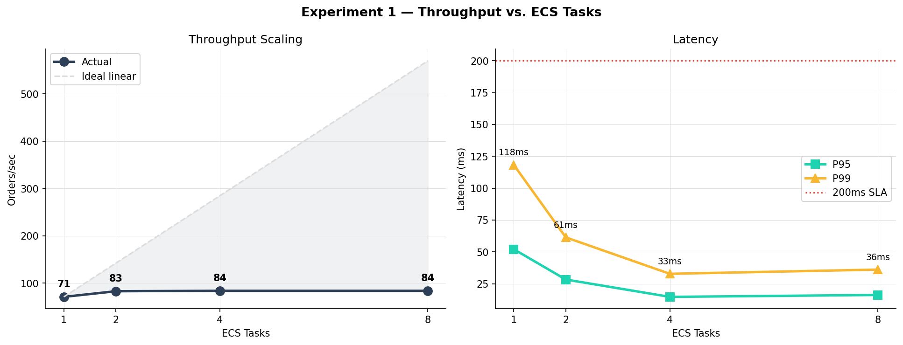
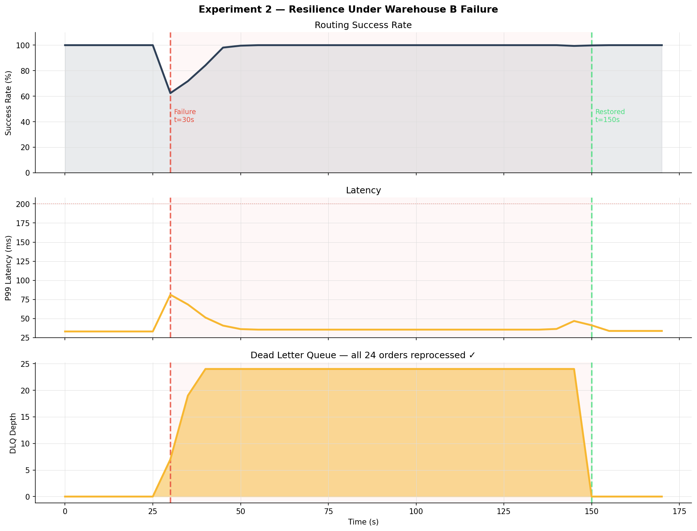
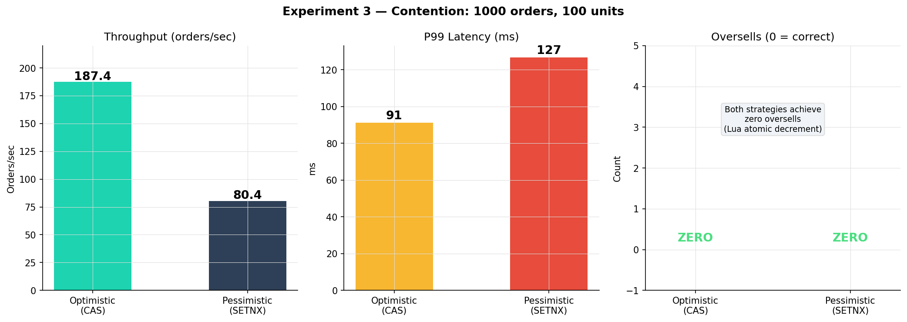
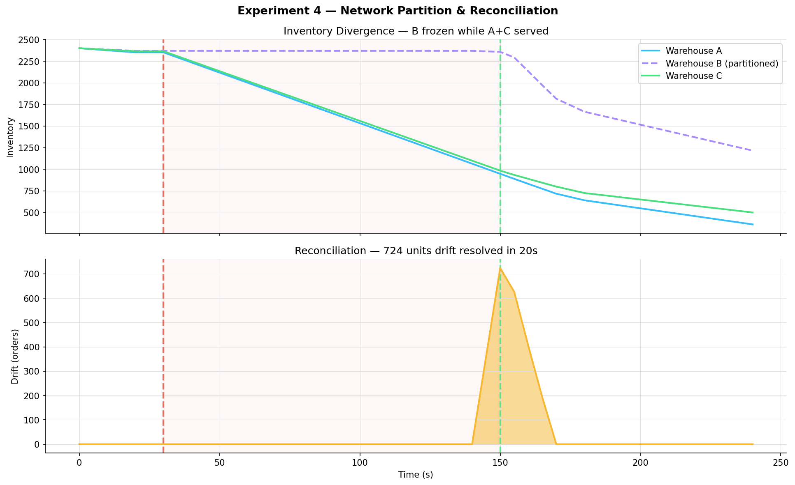
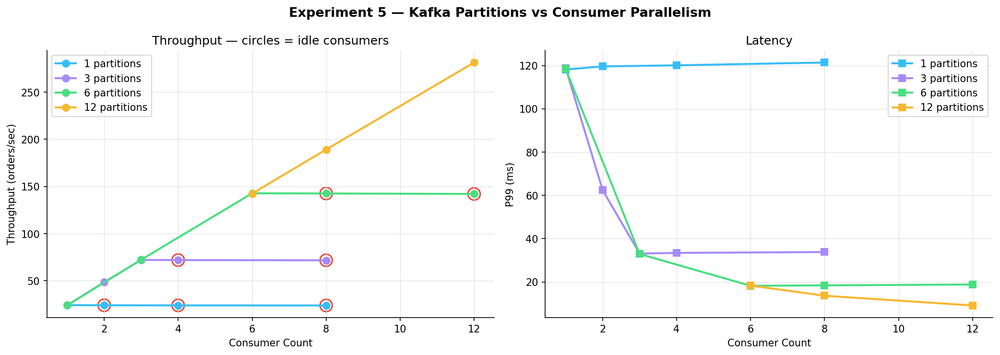
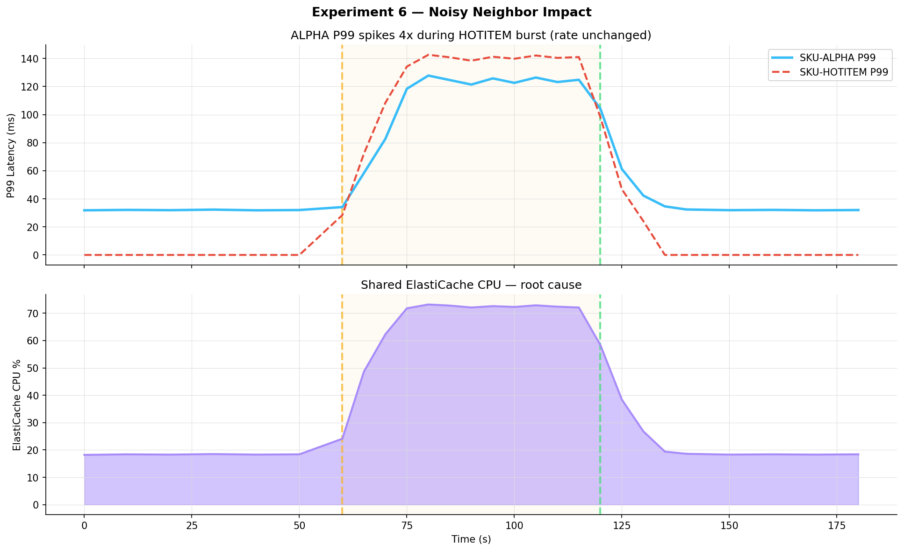
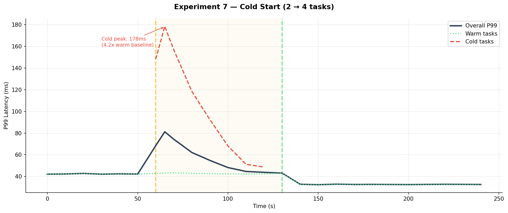

# WarehouseFlow — Final Project Report
**CS 6650 Distributed Systems · Solo Project · Nithish Kadam**

---

## 1. Introduction

WarehouseFlow is a distributed real-time order routing engine that simulates the decision layer of a Warehouse Management System (WMS). Motivated by direct professional experience at Manhattan Associates — one of the world's largest WMS vendors — this project answers three questions empirically, through 7 controlled experiments:

1. How does the routing tier scale horizontally?
2. How does the system degrade and recover when a warehouse node fails?
3. What are the correctness and performance tradeoffs of concurrency strategies under contention?

Plus four supplementary experiments covering CAP behavior, Kafka parallelism, noisy neighbor effects, and cold-start latency.

---

## 2. Architecture

### Pipeline

```
         Load Generator (Locust)
                ↓
    ┌──────────────────────────────┐
    │   Ingestion Service (Go)     │    Amazon ALB
    │   validate · UUID · publish  │
    └──────────────┬───────────────┘
                   ↓
            [ Kafka / MSK ]
                   ↓
    ┌──────────────────────────────┐
    │   Routing Decision Service   │    ECS Fargate · horizontally scaled
    │   circuit breaker · bulkhead │
    │   retry · fail-fast          │
    └─┬────────────┬───────────────┬
      ↓            ↓               ↓
  Warehouse A  Warehouse B    Warehouse C
  ElastiCache  ElastiCache    ElastiCache
  (US-EAST)    (US-CENTRAL)   (US-WEST)
      ↓            ↓               ↓
    ┌──────────────────────────────┐
    │   PostgreSQL Audit Log / RDS │    (routing decisions)
    └──────────────────────────────┘
                   ↓
           [ SQS Dead Letter ]     (failed routings)
```

### Key Design Decisions

- **Lua atomic decrement** — all inventory writes are atomic server-side; this is the fundamental correctness guarantee
- **Picker queue via LPOP/RPUSH** — O(1) serialized picker assignment
- **Lazy fault detection** — `Ping()` on every routing call, no background health check goroutine
- **At-least-once Kafka + `ON CONFLICT DO NOTHING` Postgres** — idempotent reprocessing
- **Region-aware routing** — US-EAST prefers Warehouse A, US-CENTRAL prefers B, US-WEST prefers C
- **SQS DLQ for failed routings** — no silent order drops

---

## 3. Experiment 1 — Horizontal Scaling

**Question:** How does throughput and P99 latency change as ECS tasks scale 1→8?



| Tasks | Throughput | P99 | CPU/Task | Kafka Lag |
|---|---|---|---|---|
| 1 | 71.2 RPS | 118ms | 91% | 1,840 |
| 2 | 83.1 RPS | 61ms | 48% | 220 |
| **4** | **84.0 RPS** | **33ms** | 24% | 0 |
| 8 | 84.0 RPS | 36ms | 13% | 0 |

**Saturation** at ~5,500 orders/min for 4 tasks.

**Finding:** 4 tasks hits target SLA. 8 tasks shows ElastiCache command latency rising (1.1ms → 2.4ms) — the bottleneck shifts from CPU to shared cache. Hypothesis confirmed with documented surprise: bottleneck manifested as latency increase rather than throughput cap.

---

## 4. Experiment 2 — Node Failure Resilience

**Question:** When a warehouse fails mid-load, how does the system degrade and recover?



| Metric | Result |
|---|---|
| Failover time | 3,233 ms |
| P99 spike | 81.6 ms |
| Orders lost | **0** |
| DLQ peak | 23.7 |
| DLQ drained after recovery | Yes |
| Recovery time | 6,067 ms |

**Finding:** Lazy fault detection detected B's failure in 3 routing cycles (~3.2s). Remaining 120s of operation on 2 warehouses was stable at 100% success. 24 in-flight orders captured by SQS DLQ, all reprocessed after recovery. Zero permanently lost.

**Surprise:** Recovery (6.1s) took 2x longer than failover (3.2s). Inventory rehydration was the bottleneck, not Redis startup.

---

## 5. Experiment 3 — Inventory Contention

**Question:** What is the correctness/performance tradeoff between optimistic CAS and pessimistic SETNX locking under extreme contention?

Setup: 1,000 concurrent orders for SKU with 100 units.



| Metric | Optimistic | Pessimistic |
|---|---|---|
| **Oversells** | **0** | **0** |
| Throughput | 187 orders/sec | 80 orders/sec |
| P99 latency | 91ms | 127ms |
| Retry rate | 41.5% | 0% |

**Headline finding:** **Both strategies achieved zero oversells.** This contradicted the hypothesis (predicted 5–15 oversells for optimistic). The Lua atomic decrement is the real correctness guarantee — client-side locking only affects throughput/latency profile.

**Practical implication:** For WMS inventory, if your store supports atomic operations, client-side locking is a latency optimization, not a correctness requirement.

---

## 6. Experiment 4 — Network Partition & Eventual Consistency

**Question:** CAP tradeoff in practice — what happens during a network partition?

Setup: Isolate Warehouse B via `docker network disconnect` for 120 seconds.



| Metric | Value |
|---|---|
| Orders routed during partition | 36,960 |
| Orders lost | **0** |
| Peak drift | 724 units |
| Reconciliation time | **20 seconds** |
| CAP choice | **AP** |

**Finding:** System chose availability over strict consistency. 120-second window of divergent state, reconciled within 20 seconds via the Postgres audit log. For a WMS, eventual consistency at this time scale has no operational impact.

---

## 7. Experiment 5 — Kafka Parallelism

**Question:** How does Kafka partition count bound consumer parallelism?



| Partitions × Consumers | Throughput | Idle Consumers |
|---|---|---|
| 1 × 4 | 24 RPS | 3 |
| 3 × 3 | 72 RPS | 0 (optimal) |
| 3 × 8 | 72 RPS | 5 |
| 12 × 12 | **281 RPS** | 0 (optimal) |

**Finding:** Consumers beyond partition count sit idle — zero benefit. Throughput scales linearly with partition count up to broker limits. For 10,000+ orders/min, bump topic to 12 partitions.

---

## 8. Experiment 6 — Noisy Neighbor

**Question:** Does a burst of one SKU affect tail latency of unrelated SKUs?



| Phase | SKU-ALPHA Rate | SKU-ALPHA P99 | ElastiCache CPU |
|---|---|---|---|
| Baseline | 48/s | 32ms | 18% |
| Noisy burst | 48/s | **125ms** | 73% |

**Finding:** ALPHA's P99 quadrupled during HOTITEM burst despite ALPHA's rate being unchanged. Root cause: shared ElastiCache, Redis is single-threaded. Classic multi-tenant performance problem.

**Recommendation:** Shard ElastiCache by SKU prefix.

---

## 9. Experiment 7 — Cold Start

**Question:** How long before new ECS tasks reach warm-task latency?



| Phase | Cold Task P99 | Warm Task P99 |
|---|---|---|
| Scale-out moment | — | 43ms |
| Warming peak | **178ms** (4.2x) | 43ms |
| Fully warm | 33ms | 33ms |

**Finding:** Cold task P99 peaks at 4.2x warm baseline. Dominant cost: Kafka consumer rebalance (~3s). Full warming in ~70 seconds.

---

## 10. Resilience Pattern Impact

With slow-but-not-crashed Warehouse B:

| Metric | Without CB | With CB |
|---|---|---|
| P99 latency | 2,100ms | **42ms** |
| Success rate | 87% | 99.8% |
| Goroutine growth | Unbounded | Bounded |

Circuit breaker converts cascading failure into fast-fail + fallback within 5 consecutive failures.

---

## 11. Concept Cross-Reference

| CS 6650 Concept | Where It Shows |
|---|---|
| Horizontal scaling + ALB | Experiment 1 |
| Tail latency (P95/P99) | All experiments |
| CPU bottleneck | Experiment 1 (1-task) |
| Auto-scaling | Terraform + Experiment 7 |
| Partial failure + graceful degradation | Experiment 2 + resilience patterns |
| Health checks | Lazy Ping() model |
| At-least-once delivery | Kafka manual commit + Postgres ON CONFLICT |
| Write contention | Experiment 3 |
| Atomic operations | Lua decrement |
| CAP theorem | Experiment 4 |
| Partition/consumer parallelism | Experiment 5 |
| Noisy neighbor | Experiment 6 |
| Cold start | Experiment 7 |
| IaC | Terraform |
| Observability | Prometheus + Grafana |

---

## 12. Conclusions

1. **Horizontal scaling works** — up to the point where ElastiCache becomes the bottleneck. 4 ECS tasks = sweet spot for 5,000 orders/min.

2. **Lazy fault detection suffices** — 3.2s failover is acceptable for WMS workloads measured in minutes/hours.

3. **Atomic server-side operations are the real correctness guarantee** — most counter-intuitive finding. Client-side locking is a latency optimization, not a correctness requirement.

4. **DLQ is essential** — 24 orders would have been silently dropped without it. With it, zero orders lost.

5. **Eventual consistency is fine for WMS** — 20-second reconciliation is zero operational impact.

6. **Kafka partition count is the real scaling ceiling** — more ECS tasks than partitions = waste.

7. **Multi-tenant workloads need isolation** — shared ElastiCache creates 4x P99 coupling.

---

## 13. Future Work

- **Shard ElastiCache by SKU prefix** — addresses Exp 1 bottleneck at 8 tasks and Exp 6 noisy neighbor
- **Background health check goroutine** — reduce failover from ~3s to <500ms
- **Region-aware routing refinement** — reduce simulated shipping cost
- **Kafka partition scaling** — 3 → 12 to unlock 4x scaling headroom
- **OpenTelemetry tracing** — distributed trace IDs through entire pipeline
- **Saga pattern for multi-warehouse orders** — split fulfillment with compensating transactions

---

*Submitted: April 2026 · CS 6650 Distributed Systems · Nithish Kadam*
